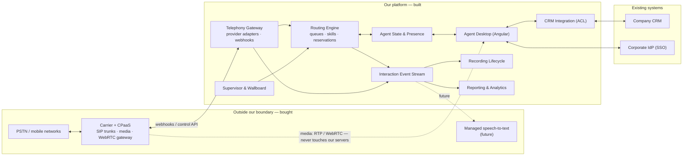

# 1. Requirement Analysis — In-House Call Center Platform

> **Author:** Solution Architect / System Analyst
> **Status:** Draft v1.0 — for stakeholder review
> **Reading note:** The brief we received is intentionally thin. Everything marked
> **[ASSUMPTION]** is something I decided in order to move forward. Each one maps to a
> question in [Stakeholder Questions](02-stakeholder-questions.md), and each one is cheap to
> change *now* and expensive to change *after* we sign a carrier contract.

---

## 1.1 The ask, restated

> "Stop paying a third-party call center tool. Build our own inbound + outbound calling
> platform. Plug it into our CRM. 50 agents now, 500+ later. Leave room for AI."

Restated as an engineering problem:

We are building a **contact routing and agent-productivity system** — not a telephony
system. That distinction is the single most important decision in this document.

| We build | We buy / rent |
| --- | --- |
| Routing engine: queues, skills, priorities, reservations | Carrier interconnect, SIP trunks, PSTN termination |
| Agent state machine & presence | Media path (RTP), codecs, echo cancellation, jitter buffers |
| Agent desktop (softphone UI) | WebRTC gateway, STUN/TURN |
| Supervisor tooling & reporting | Number provisioning, porting, emergency-services routing |
| CRM integration, screen-pop, dispositions | Carrier-grade DTMF, media capture for recording |
| Recording lifecycle, retention, redaction policy | Speech-to-text engine (future) |
| AI orchestration on top of call events | — |

**Rationale.** Carrier-grade media handling is a multi-team, multi-year problem with a
regulatory surface (emergency calling, lawful intercept, number portability) that has
nothing to do with our business. "Build our own platform" means **we own the logic and the
data**. It does not mean we terminate SIP on our own metal in year one. §1.9 (R-10) and the
[System Design](04-system-design.md) show how we keep the option to move to self-hosted
media later, and §5.7 of the [Scalability Plan](05-scalability-plan.md) states exactly when
that becomes worth doing.

---

## 1.2 Business goals & success metrics

| # | Business goal | Why it matters | Success metric |
| --- | --- | --- | --- |
| **G1** | Eliminate third-party licence cost | The stated trigger | Cost per agent per month ≤ 60% of current tool by end of year 1 **[ASSUMPTION: current cost is per-seat and is the main pain]** |
| **G2** | Own the customer-interaction data | Data is currently locked in a vendor; that blocks analytics and AI | 100% of call events + recordings in our own store, queryable within 5 min of call end |
| **G3** | Remove CRM ↔ phone friction | Agents re-key data and alt-tab today | Screen-pop on ≥ 95% of identified inbound calls in < 2 s; after-call work down 20% |
| **G4** | Scale 50 → 500+ agents without re-platforming | Stated growth trajectory | 10× headroom demonstrated with no component rewrite ([Scalability Plan](05-scalability-plan.md)) |
| **G5** | Be AI-**ready**, not AI-first | AI is stated as "eventually" | Every call emits a structured event stream + recording artifact an AI pipeline can consume with zero core changes |
| **G6** | Real service-level visibility | Supervisors need live control | Wallboard with < 2 s staleness; standard KPIs (SL, ASA, AHT, abandon %) available historically |

> **Caution on G1.** Replacing a per-seat licence with a per-minute carrier bill + cloud
> infrastructure + 2–3 engineers of permanent ownership is **not automatically cheaper**. I
> need current spend and call-minute volume to build the model. If the real driver is
> *control and data ownership* rather than cost, the MVP scope changes. See Q1–Q4.

---

## 1.3 Stakeholders

| Stakeholder | Role in the system | What they need | What they fear |
| --- | --- | --- | --- |
| **Agent** (50 → 500+) | Primary daily user | A phone that never drops, one screen, fast screen-pop, easy wrap-up | A flaky tool that makes them miss SLA and lose bonus |
| **Team lead / Supervisor** | Live floor management | Real-time queue + agent state, listen/whisper/barge, reassign | Discovering a queue backlog an hour late |
| **Contact-centre Manager / Ops** | Owns SLA and staffing | Historical reporting, forecasting inputs, self-service config | Depending on engineering for every routing tweak |
| **CRM / Sales & Support leadership** | Consumer of interaction data | Calls logged against the right customer, automatically | Dirty data, orphaned call logs |
| **IT / Infrastructure** | Network & endpoints | Predictable bandwidth, standard endpoints, SSO | WebRTC on a bad LAN generating "the phone is broken" tickets |
| **Security / Compliance / Legal** | Gatekeeper | Recording consent, PCI, residency, retention, access audit | Recording a card number and failing an audit |
| **Finance / Procurement** | Carrier contract owner | Predictable per-minute cost, number inventory | Runaway toll charges; toll fraud |
| **Engineering (us)** | Build & run | Clear scope, testable boundaries | "…and also build an IVR designer" arriving in week 9 |
| **Customer (external)** | The caller | Short wait, right person first time, no repetition | Being transferred in circles |

---

## 1.4 Scope boundary in one picture

The dotted media path is the point: **signalling flows through us, media does not.** That is
what turns "500 agents" into a capacity-planning exercise instead of a re-architecture.

---

## 1.5 Functional requirements

Priority: **M** = MVP (v1) · **2** = phase 2 · **3** = later.
The reasoning behind the split is in [MVP Definition](03-mvp-definition.md).

### FR-A — Identity, agents & configuration

| ID | Requirement | Pri |
| --- | --- | --- |
| FR-A1 | Authenticate via corporate SSO (OIDC); local break-glass accounts as fallback **[ASSUMPTION: an IdP exists]** | M |
| FR-A2 | Roles: Agent, Supervisor, Ops-Admin, System-Admin, Auditor (read-only). Enforced server-side, not merely hidden in the UI | M |
| FR-A3 | Agent profile: display name, extension, skills with proficiency (1–5), team, default queue set, max concurrent interactions | M |
| FR-A4 | Ops-Admin can create/modify queues, skills, routing rules, business hours and wrap-up codes **without a deployment** | M |
| FR-A5 | Full audit trail of every configuration change (who, what, before → after, when) | M |
| FR-A6 | Team hierarchy with supervisor scoping (a supervisor sees only their teams) | 2 |

### FR-B — Agent state & presence

| ID | Requirement | Pri |
| --- | --- | --- |
| FR-B1 | Server-authoritative agent state machine: `LoggedOut → Available → Reserved → OnCall → AfterCallWork → Available \| NotReady(reason)` | M |
| FR-B2 | Not-Ready reason codes (Break, Lunch, Training, Meeting, Admin) — configurable and reportable | M |
| FR-B3 | State changes visible to supervisors in < 2 s | M |
| FR-B4 | Detect dead sessions (browser closed, laptop slept, network died) via heartbeat; auto-log-out after a grace period. **A "zombie available agent" silently kills a queue** | M |
| FR-B5 | One active device per agent; a new login evicts the old with a clear message | M |
| FR-B6 | ACW timeout: force-exit wrap-up after N seconds so agents cannot park in it | 2 |

### FR-C — Inbound call handling

| ID | Requirement | Pri |
| --- | --- | --- |
| FR-C1 | Accept inbound calls on company DIDs; resolve DID → entry point → queue | M |
| FR-C2 | Minimal IVR: greeting + single-level menu (1 = sales, 2 = support), business-hours and holiday handling, closed message | M |
| FR-C3 | Queue with position tracking, comfort announcements, hold music | M |
| FR-C4 | **Skills-based routing**: match queue-required skills to agent skills; among eligible available agents pick by policy (default: longest-idle) | M |
| FR-C5 | Priority queues; a call's priority can be raised by rule (e.g. VIP tier from CRM) and higher priority is served first regardless of arrival order | M |
| FR-C6 | **Reservation protocol**: the engine offers a call to exactly one agent at a time with a timeout. No double-assignment, ever | M |
| FR-C7 | Ring-No-Answer: on timeout/reject, re-queue at original (or boosted) priority and set the agent Not-Ready with reason `RNA` | M |
| FR-C8 | Abandon detection and reporting, including short abandons (< 5 s) excluded from SLA | M |
| FR-C9 | Overflow: after N seconds waiting, widen to a secondary queue or lower the skill threshold | 2 |
| FR-C10 | Queue callback ("keep my place, call me back") | 2 |
| FR-C11 | Multi-level IVR with a visual flow designer | 3 |
| FR-C12 | Last-agent routing (prefer the agent who last handled this customer) | 2 |

### FR-D — Outbound call handling

| ID | Requirement | Pri |
| --- | --- | --- |
| FR-D1 | Click-to-call from the agent desktop and from a CRM record | M |
| FR-D2 | Manual dial pad with E.164 normalisation and validation | M |
| FR-D3 | Configurable outbound caller ID per team/campaign, restricted to numbers we own | M |
| FR-D4 | **DNC / suppression check before every outbound attempt** — hard block with an audit entry. Regulatory, not optional | M |
| FR-D5 | Outbound occupies agent state identically to inbound, so routing and reporting stay consistent | M |
| FR-D6 | Disposition capture on every outbound attempt | M |
| FR-D7 | Preview dialler: agent is handed the next campaign record and chooses to dial | 2 |
| FR-D8 | Progressive / predictive dialler with AMD and abandon-rate governor | 3 (regulated — R-07) |

### FR-E — In-call controls

| ID | Requirement | Pri |
| --- | --- | --- |
| FR-E1 | Answer, hang up, mute, hold / retrieve | M |
| FR-E2 | Blind (cold) transfer to agent, queue, or external number | M |
| FR-E3 | Warm (consult) transfer: hold customer → consult → complete or cancel | M |
| FR-E4 | DTMF send (for external IVRs) | M |
| FR-E5 | Three-way conference | 2 |
| FR-E6 | Supervisor listen / whisper / barge-in | 2 |
| FR-E7 | Call parking | 3 |

### FR-F — CRM integration

| ID | Requirement | Pri |
| --- | --- | --- |
| FR-F1 | Reverse lookup by ANI → customer record; screen-pop within 2 s of the call being offered | M |
| FR-F2 | Unknown number → "create contact" form pre-filled with the number | M |
| FR-F3 | Write an activity record back on call completion: direction, duration, disposition, agent, recording link, notes | M |
| FR-F4 | Ambiguous match (one number, several contacts) → disambiguation list. Never guess | M |
| FR-F5 | **CRM downtime must not stop calls.** Screen-pop degrades gracefully; write-backs queue and retry with backoff + dead-letter | M |
| FR-F6 | CRM-driven routing attributes (customer tier → priority; account owner → preferred agent) | 2 |
| FR-F7 | Push agent availability back into the CRM | 3 |

### FR-G — Recording & compliance

| ID | Requirement | Pri |
| --- | --- | --- |
| FR-G1 | Record per policy (always / never / on-demand), configurable per queue and jurisdiction | M |
| FR-G2 | Recording announcement to the caller where legally required | M |
| FR-G3 | **Pause/resume recording** for card capture (PCI-DSS) — manual by the agent in MVP | M |
| FR-G4 | Recordings encrypted at rest in our own object storage, with retention policy and legal hold | M |
| FR-G5 | Playback restricted by role and fully access-audited (who listened to what, when) | M |
| FR-G6 | Right-to-erasure: delete a customer's recordings and transcripts on request, with evidence | 2 |
| FR-G7 | Automatic PCI pause triggered by CRM payment-screen context | 3 |

### FR-H — Supervisor & reporting

| ID | Requirement | Pri |
| --- | --- | --- |
| FR-H1 | Live wallboard: per-queue calls waiting, longest wait, service level %, agents by state, abandons | M |
| FR-H2 | Force agent state change / force log-out | M |
| FR-H3 | Historical reports: interval (15/30/60 min) queue performance, agent performance, CDR search with filters and CSV export | M |
| FR-H4 | **Agreed, documented KPI definitions**: Service Level, ASA, AHT, ACW, Occupancy, Abandon %, Adherence | M |
| FR-H5 | Scheduled report delivery by email | 2 |
| FR-H6 | BI tool connection (read replica / warehouse) | 2 |
| FR-H7 | Quality management: scorecards, calibration | 3 |

### FR-I — Platform & operations

| ID | Requirement | Pri |
| --- | --- | --- |
| FR-I1 | Every interaction produces an immutable, ordered event stream — the system of record for reporting and future AI | M |
| FR-I2 | Health endpoints, structured logs correlated by `CallId`, metrics, distributed tracing | M |
| FR-I3 | Graceful degradation: if routing is unavailable, inbound calls receive a fallback treatment (voicemail / carrier forward), never silence | M |
| FR-I4 | Feature flags so capabilities can be dark-launched per team | 2 |
| FR-I5 | Multi-tenancy as a product capability | 3 — but the data model must not preclude it (§1.8) |

---

## 1.6 Non-functional requirements

These are what actually constrain the architecture. Each has a number, because "fast" and
"scalable" are not requirements.

### Performance & latency

| ID | Requirement | Target | Why this number |
| --- | --- | --- | --- |
| NFR-P1 | Call arrival → agent's phone rings | p95 < 1.0 s · p99 < 2.0 s | Past ~2 s the caller hears dead air and the agent thinks the tool is broken |
| NFR-P2 | Screen-pop rendered after offer | p95 < 2.0 s | Must beat the agent saying "hello" — this is the headline UX promise |
| NFR-P3 | Agent state change → supervisor wallboard | p95 < 2.0 s | Floor management is useless with stale data |
| NFR-P4 | Agent desktop actions (answer/hold/transfer) | p95 < 300 ms | Perceived as instant |
| NFR-P5 | Wallboard updates | push-based, ≤ 2 s staleness | Polling 500 clients every second is self-inflicted load |
| NFR-P6 | Historical report (1 day, 1 queue) | < 5 s | Analyst patience threshold |
| NFR-P7 | Call events queryable in the reporting store | < 5 min after call end | Near-real-time is enough; true real-time is the wallboard's job |

### Scale & capacity **[ASSUMPTION — needs Q5–Q7]**

| ID | Dimension | v1 | Design headroom |
| --- | --- | --- | --- |
| NFR-S1 | Concurrent logged-in agents | 60 | 750 |
| NFR-S2 | Concurrent active calls | 50 | 600 |
| NFR-S3 | Calls offered in the busy hour | 800 | 10,000 |
| NFR-S4 | Peak arrival burst | 5 calls/s | 50 calls/s |
| NFR-S5 | Persistent realtime connections | 60 | 750 agents + 50 supervisors |
| NFR-S6 | Recording storage growth | ~35 GB/month @ Opus 8 kbps | ~420 GB/month; 7-year retention ⇒ tiered storage mandatory |
| NFR-S7 | Event volume | ~40 events/call × 6k calls/day ≈ 240k/day | 3M/day |

> Derived from 500 agents × ~6 calls/hour × 5 min AHT. These are placeholders built from the
> "50 → 500 agents" statement alone. **Real numbers move the cost model by an order of
> magnitude** — Q5, Q6, Q7.

### Availability & resilience

| ID | Requirement | Target |
| --- | --- | --- |
| NFR-A1 | Platform availability in business hours | 99.9% (≈ 43 min/month) for v1; 99.95% at 500 agents |
| NFR-A2 | No SPOF in any stateless tier | ≥ 2 instances across ≥ 2 availability zones |
| NFR-A3 | RTO | 15 minutes |
| NFR-A4 | RPO for call records | 1 minute — a lost CDR is a lost compliance artifact |
| NFR-A5 | An in-progress call survives a rolling backend deployment | Mandatory: media is carrier-side; signalling reconciles on reconnect |
| NFR-A6 | Carrier failover: ≥ 2 routes for inbound DIDs | Phase 2, but the adapter boundary exists in v1 |
| NFR-A7 | Degraded mode: routing down → carrier-level fallback treatment, never a dead line | Mandatory |

### Security & compliance

| ID | Requirement |
| --- | --- |
| NFR-SEC1 | TLS 1.2+ everywhere; SRTP/DTLS for media; no plaintext signalling |
| NFR-SEC2 | OIDC SSO + MFA for Supervisor/Admin; short-lived access tokens, rotating refresh tokens |
| NFR-SEC3 | Authorisation enforced at the API **and** in the routing layer — an agent cannot answer a call they were not offered; verified server-side by reservation token |
| NFR-SEC4 | PII (numbers, names) encrypted at rest; recordings encrypted with customer-managed keys |
| NFR-SEC5 | Append-only audit log for config changes, recording access, supervisor barge, data exports. Retained ≥ 2 years |
| NFR-SEC6 | PCI-DSS: never persist PAN. Achieved by pause-recording plus never writing DTMF payloads to logs during a payment segment |
| NFR-SEC7 | Data residency: recordings and PII in a specified region only **[ASSUMPTION — Q27]** |
| NFR-SEC8 | Toll-fraud controls: per-agent and per-tenant spend caps, destination allow/deny lists, anomaly alerts on premium-rate destinations |
| NFR-SEC9 | Secrets in a managed vault; none in config files or images; carrier credentials rotated quarterly |
| NFR-SEC10 | Every carrier webhook signature-verified and replay-protected |

### Usability & accessibility

| ID | Requirement |
| --- | --- |
| NFR-U1 | Agent desktop is a browser app — no per-desktop install, no admin rights. This is what makes 500 agents operationally feasible |
| NFR-U2 | Core call actions available by keyboard shortcut; agents are on calls 6+ hours a day |
| NFR-U3 | WCAG 2.1 AA for the agent desktop |
| NFR-U4 | Honest, prominent connection-status indicator — an agent must instantly know they are not receiving calls |
| NFR-U5 | Corporate standard browser (Chrome/Edge, current − 2). No IE; Safari not committed in v1 **[Q11]** |

### Maintainability & operability

| ID | Requirement |
| --- | --- |
| NFR-M1 | Telephony provider behind a port/adapter boundary; swapping providers must not touch routing, CRM or reporting code |
| NFR-M2 | Ops-configurable behaviour (queues, skills, hours, dispositions) changes without a release |
| NFR-M3 | ≥ 70% unit coverage on the routing engine and state machines — that is where correctness bugs cost money |
| NFR-M4 | Any call fully reconstructible from its event stream ("what happened to call X?") |
| NFR-M5 | One-command local environment with a simulated telephony provider, so engineers develop without burning carrier minutes — **implemented in the prototype** |

---

## 1.7 Key assumptions

| # | Assumption | Impact if wrong | Q |
| --- | --- | --- | --- |
| A1 | CPaaS/carrier provides media and PSTN in v1; we do not self-host SIP | Complete re-plan; +9–12 months and specialist hires | Q8 |
| A2 | Agents have WebRTC-capable browsers on reliable networks | Need desk phones / SIP hardphones — changes the desktop integration model | Q11 |
| A3 | One CRM, documented REST API, supports activity creation | Integration effort could triple; may need an integration platform | Q13 |
| A4 | CRM holds phone numbers in a queryable, indexed field | ANI lookup needs a synced local index — adds a data pipeline | Q14 |
| A5 | One country, one main language in v1 | Multi-region, multi-language IVR and residency all arrive at once | Q27 |
| A6 | Corporate IdP supports OIDC | We must build/host identity — added scope | Q28 |
| A7 | We own or can port our DIDs; porting has 4–8 weeks lead time | **Usually the critical path for go-live**, not the software | Q9 |
| A8 | Recording is required for most, not all, calls | Storage and compliance model shifts | Q24 |
| A9 | Business hours are simple (open / closed / holiday) | Follow-the-sun routing becomes phase-2 work | Q10 |
| A10 | .NET + Angular capability in-house; 3–5 engineers available | The MVP timeline is invalid | Q3 |
| A11 | Historical data from the incumbent need not migrate (archive/export acceptable) | A data-migration workstream appears | Q17 |
| A12 | Outbound is agent-initiated in v1 | Predictive dialling brings heavy regulatory load | Q6 |

---

## 1.8 Constraints

| Type | Constraint |
| --- | --- |
| **Technology** | .NET 8 (LTS) backend, Angular frontend — stated preference, and I concur (rationale in [System Design §4.2](04-system-design.md)) |
| **Regulatory** | Recording consent; PCI-DSS for card capture; DNC/TCPA-equivalent for outbound; GDPR/local privacy law for PII and erasure |
| **Operational** | Cutover cannot cause a customer-visible outage — requires a parallel-run period ([Deployment Strategy §7.8](07-deployment-strategy.md)) |
| **Carrier** | Porting lead times; minimum contract commits; emergency-services obligations for numbers tied to a physical location |
| **Organisational** | Ops must self-serve configuration, or engineering becomes a ticket queue |
| **Data model** | Multi-tenancy is out of scope, but every core table carries `TenantId` from day one. Retrofitting tenancy into a live schema is a migration nightmare; carrying an unused column is free |

---

## 1.9 Risk register

Scored **Likelihood × Impact** (1–5), ordered by exposure.

| ID | Risk | L | I | Exp | Mitigation |
| --- | --- | :-: | :-: | :-: | --- |
| **R-02** | **Number porting delays go-live** | 4 | 4 | 16 | Start porting discovery in week 1, parallel to development. Pilot on new numbers with carrier-level forwarding so software is never blocked by telecom paperwork |
| **R-03** | **Agent network quality causes poor audio** and the platform gets blamed | 4 | 4 | 16 | Pre-deployment network assessment; per-call WebRTC telemetry (MOS, jitter, loss) so we can prove where the fault lies; mandated headset standard |
| **R-01** | **Build-vs-buy economics turn negative** — minutes + cloud + engineers exceed the incumbent licence | 3 | 5 | 15 | Build the 3-year TCO model in week 1 against real volumes before writing production code; agree kill-criteria up front |
| **R-04** | **A bad deploy stops calls routing** — immediate, loud revenue and CX impact | 3 | 5 | 15 | Blue/green + canary by agent cohort; automated smoke call on every deploy; instant rollback; drain-before-deploy for the routing engine (§7.5) |
| **R-07** | **Regulatory breach on outbound** (DNC, or predictive abandon rate) | 3 | 5 | 15 | DNC check is a hard gate in the call path, not a report. Predictive dialling excluded from MVP entirely |
| **R-08** | **Recording captures card data** → PCI incident | 3 | 5 | 15 | Pause/resume in MVP + agent training + roadmap to automatic pause via CRM context. Never log DTMF payloads |
| **R-09** | **Scope creep** ("and also an IVR designer / WFM / omnichannel") | 5 | 3 | 15 | Written, signed MVP scope with an explicit out-of-scope list and a change-control route |
| **R-05** | **CRM integration harder than advertised** (rate limits, no bulk lookup, poor phone indexing) | 4 | 3 | 12 | Spike the CRM API in week 1. Anti-corruption layer + read-through cache of number → contact so CRM latency never blocks a call |
| **R-11** | **Key-person dependency** on the one engineer who understands telephony | 4 | 3 | 12 | Pair on the telephony gateway; write the runbook while building, not after |
| **R-13** | **Reporting disagrees with the old tool**, destroying trust in the new platform | 4 | 3 | 12 | Agree KPI formulas in writing up front (FR-H4); parallel-run two weeks and reconcile before decommissioning. Consistently underestimated |
| **R-06** | **Routing engine state loss** double-assigns or strands calls | 2 | 5 | 10 | Single-writer per queue partition; reservation tokens validated server-side; idempotent event handling; chaos-test failover. **Demonstrated in the prototype** |
| **R-12** | **Toll fraud** on outbound | 2 | 5 | 10 | Spend caps, destination allow-lists, anomaly alerts, MFA on admin |
| **R-14** | **Emergency-calling obligations** overlooked for softphone users | 2 | 5 | 10 | Legal review in discovery; explicit policy that softphones are not for emergency calls; carrier-side address registration where required |
| **R-10** | **CPaaS lock-in** re-creates the original vendor problem | 3 | 3 | 9 | `ITelephonyProvider` port with ≥ 2 adapters before go-live (one real, one simulated) — **proven in the prototype**. Carrier-neutral SIP option stays open |

---

## 1.10 Out of scope for this programme

Stated explicitly so it cannot be quietly assumed in later:

- **Omnichannel** — chat, email, SMS, WhatsApp, social. The domain model uses an
  `Interaction` abstraction so channels *can* be added, but nothing non-voice is built.
- **Workforce management** — forecasting, scheduling, adherence. Integrates later via the
  event stream.
- **Quality management** — scorecards, evaluations, calibration.
- **Our own SIP/media stack, SBC, or carrier interconnect.**
- **Predictive / power dialling** and campaign management.
- **CRM modification.** We integrate with it; we do not change it.
- **AI feature implementation.** We make the platform AI-*ready*
  ([doc 6](06-ai-readiness.md)); we do not build transcription or summarisation here.
- **Mobile agent app.**
- **Multi-tenancy** as a product capability (schema readiness only).
- **Replacing the corporate phone system** for non-call-centre staff.

---

## 1.11 What I would do before writing production code

1. **Week 0 (3 days)** — TCO model against real volumes; go/no-go on build-vs-buy (R-01).
2. **Week 1** — Two spikes in parallel: (a) CRM API — can we reverse-lookup by phone in
   < 200 ms and write activities? (b) CPaaS — place a real call to a browser softphone and
   measure end-to-end offer latency against NFR-P1.
3. **Week 1** — Kick off number porting / procurement (R-02, the real critical path).
4. **Week 2** — Agree KPI definitions with Ops in writing (R-13); get Legal's position on
   recording consent and emergency calling (R-08, R-14).

Everything else in this document is reversible. Those four are not.

---

**Next:** [Stakeholder Questions →](02-stakeholder-questions.md)
