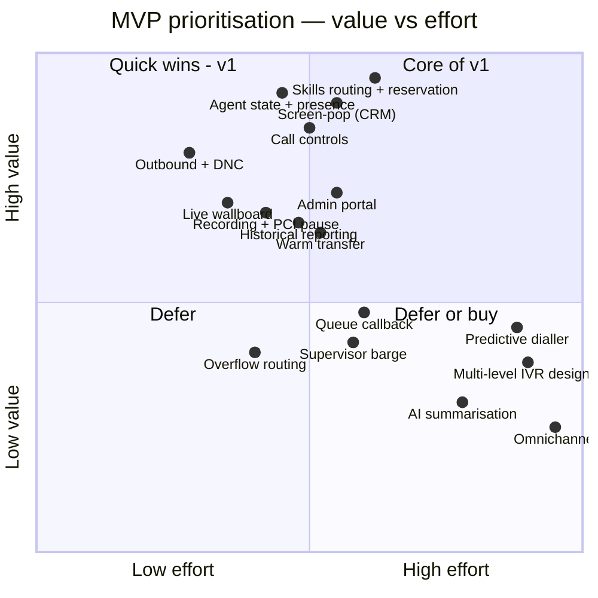

# 3. MVP Definition

> **Purpose:** decide what v1 is, what it is not, and be able to defend both.
>
> **My definition of the MVP here:** the smallest system that lets **one real team take
> real customer calls all day, safely and measurably**, and that we would be willing to
> leave running if the project were paused the day after pilot. Not a demo. Not a
> feature-complete replacement of the incumbent.

---

## 3.1 The MVP thesis

> **"One team, both directions, fully instrumented."**

We pick a single real team (~10–15 agents, one or two queues), move their inbound and
outbound calls onto our platform, and prove five things end-to-end:

1. A customer calls a real number and reaches the right available agent, fast (NFR-P1).
2. The agent sees who is calling before they say hello (NFR-P2).
3. The agent can control the call — hold, transfer, hang up, wrap up.
4. An agent can call a customer out, with DNC protection.
5. Everything that happened is recorded, reportable and reconcilable against the old tool.

If we cannot do those five things reliably for 15 agents, scaling to 500 is meaningless. If
we can, everything else on the roadmap is additive — it does not change the architecture.

### Why not smaller?

A common instinct is to ship "inbound only" first. I am rejecting that, deliberately:

- Outbound shares ~85% of the machinery already built for inbound — the same agent state
  machine, the same call lifecycle, the same CRM write-back, the same reporting pipeline.
  The genuinely new work is the dial API call, E.164 normalisation and the DNC gate: roughly
  **one week**.
- A pilot team that still needs the old tool for outbound has to run two softphones. That
  guarantees a bad pilot, bad feedback and a failed adoption story.

Shipping half a phone is not an MVP; it is a support burden.

### Why not bigger?

Every feature cut below shares one property: **adding it later costs roughly what it costs
now, and none of them change the architecture.** That is my test for deferral. Anything that
would force a redesign later is in v1 even if it is not visible to users — see §3.5.

---

## 3.2 In scope for v1

### Epic 1 — Foundations & telephony spine

| Item | Detail |
| --- | --- |
| Telephony provider integration | One CPaaS adapter behind `ITelephonyProvider` (FR-I, NFR-M1) |
| **Simulated provider adapter** | A second implementation for local dev, automated tests and load tests. Proves the port is real and lets the whole team work without carrier minutes (NFR-M5) |
| Browser softphone | WebRTC via the provider's JS SDK; device selection, mic permission handling, honest connection indicator (NFR-U4) |
| Webhook ingest | Signature-verified, replay-protected, idempotent (NFR-SEC10) |
| Call lifecycle & event stream | Immutable ordered events per call — the backbone of reporting and all future AI (FR-I1) |

### Epic 2 — Identity, agents & admin

| Item | Detail |
| --- | --- |
| OIDC SSO + roles | Agent, Supervisor, Ops-Admin, System-Admin (FR-A1, FR-A2) |
| Agent & skill management | Profiles, skills with proficiency, teams (FR-A3) |
| **Admin portal** | Queues, skills, routing rules, business hours, holidays, wrap-up codes — all editable without deployment (FR-A4) |
| Config audit trail | Who changed what, before → after (FR-A5) |

> **Why the admin portal is in v1 and not deferred:** without it, every routing tweak is a
> code change and a release. That does not merely inconvenience Ops — it makes the pilot
> unresponsive to feedback at exactly the moment we need to iterate fastest, and it trains
> the organisation to treat engineering as a ticket queue. This is the cut I would argue
> hardest to keep.

### Epic 3 — Agent state & presence

| Item | Detail |
| --- | --- |
| Server-authoritative state machine | FR-B1 — all transitions validated server-side |
| Not-Ready reason codes | FR-B2 |
| Heartbeat & zombie detection | FR-B4 — **non-negotiable**; an agent whose laptop slept while "Available" will silently swallow calls from the queue |
| Single-session enforcement | FR-B5 |
| Real-time push | SignalR to desktop and wallboard (NFR-P3) |

### Epic 4 — Inbound

| Item | Detail |
| --- | --- |
| DID → entry point → queue | FR-C1 |
| Minimal IVR | Greeting, single-level menu, business hours, holidays, closed message (FR-C2) |
| Queue with announcements | Position tracking, comfort messages, hold music (FR-C3) |
| Skills-based routing + priority | FR-C4, FR-C5 |
| **Reservation protocol** | Exactly-one-agent offers with timeout (FR-C6) — the correctness heart of the system |
| RNA handling | Re-queue + auto Not-Ready (FR-C7) |
| Abandon tracking | Including short-abandon exclusion (FR-C8) |

### Epic 5 — Outbound

| Item | Detail |
| --- | --- |
| Click-to-call + dial pad | FR-D1, FR-D2 |
| E.164 normalisation | FR-D2 |
| Caller-ID selection | FR-D3 |
| **DNC / suppression gate** | FR-D4 — a hard block in the call path, with audit |
| Shared state & disposition | FR-D5, FR-D6 |

### Epic 6 — In-call controls

Answer · hang up · mute · hold/retrieve · blind transfer · warm transfer · DTMF send
(FR-E1 – FR-E4).

> **Warm transfer stays in v1** even though it is the most complex control. It is the single
> most-used escalation path on a real floor, and a pilot without it generates "I had to ask
> the customer to call back" feedback that will sink adoption.

### Epic 7 — CRM integration

| Item | Detail |
| --- | --- |
| ANI reverse lookup + screen-pop | FR-F1, < 2 s |
| Unknown & ambiguous number handling | FR-F2, FR-F4 |
| Activity write-back | FR-F3 |
| **Resilience** | Circuit breaker, timeout with safe default, retry queue with dead-letter (FR-F5). The CRM is not allowed to take the phones down |

### Epic 8 — Recording & compliance

| Item | Detail |
| --- | --- |
| Policy-driven recording | Per queue (FR-G1) |
| Recording announcement | FR-G2 |
| **Manual PCI pause/resume** | FR-G3 |
| Encrypted storage + retention | FR-G4 |
| Role-restricted, audited playback | FR-G5 |

### Epic 9 — Supervisor & reporting

| Item | Detail |
| --- | --- |
| Live wallboard | Queues, agents, SL, longest wait (FR-H1) |
| Force state change / logout | FR-H2 |
| Historical reports + CDR search + CSV | FR-H3 |
| **Agreed KPI definitions** | FR-H4 — documented and signed off *before* build, not after (R-13) |

### Epic 10 — Run & observe

Health checks · structured logs correlated by `CallId` · metrics · distributed tracing ·
dashboards · alerting on SLOs · **degraded-mode fallback treatment** (FR-I2, FR-I3) ·
runbook · load test against the simulated provider.

---

## 3.3 Explicitly cut from v1 — and why

Each cut states **what we lose**, **why it is acceptable now**, and **what it costs to add
later**. A cut you cannot cost is not a decision, it is a hope.

| Cut feature | What we lose | Why acceptable for v1 | Cost to add later |
| --- | --- | --- | --- |
| **Predictive / progressive dialler** (FR-D8) | Outbound agent productivity | Carries the heaviest regulatory load in the whole domain (abandon-rate caps, AMD accuracy, calling-window rules). Needs its own compliance workstream. Manual + preview dialling covers the pilot team's real workflow | 6–8 weeks + legal review. Isolated component that consumes the same call API — no architectural impact |
| **Multi-level IVR + visual flow designer** (FR-C11) | Self-service deflection, complex menus | A flow designer is effectively a product in itself (versioning, testing, publishing, rollback of flows). Single-level covers the pilot's real menu | 8–12 weeks. Designed as a separate service that compiles to a flow definition the gateway interprets — no impact on routing |
| **Supervisor listen / whisper / barge** (FR-E6) | Live coaching, new-hire support | Recording playback + live wallboard covers most coaching needs for a small pilot team. Needs extra carrier capability and cost | 2–3 weeks; provider-supported feature behind the existing adapter |
| **Queue callback** (FR-C10) | Abandon reduction at peak | Genuinely valuable, but needs a scheduler, a retry policy and careful agent-state interaction. Not needed to prove the core | 3–4 weeks; consumes the existing outbound API |
| **Overflow & time-based re-routing** (FR-C9) | Automatic peak handling | Supervisors can move agents between queues manually at pilot scale | 1–2 weeks; an additional policy in the existing routing engine |
| **Conference / 3-way** (FR-E5) | Some escalation flows | Warm transfer covers the majority case | 1–2 weeks |
| **Scheduled reports & BI connector** (FR-H5, FR-H6) | Automated distribution | CSV export + read replica access unblocks analysts | 1–2 weeks each |
| **Quality management / scorecards** (FR-H7) | Formal QA programme | Different user group (QA team), different release cadence. Recordings + metadata are already available to them | Separate module, 6+ weeks, consumes existing recordings and events |
| **Automatic PCI pause via CRM context** (FR-G7) | Reliance on agent discipline | Manual pause + training is the standard interim control and is auditable | 2 weeks once CRM screen context events exist |
| **Omnichannel** (chat/email/SMS) | Unified agent experience | Out of programme scope entirely. The domain model is channel-agnostic so this is additive, not a rewrite | New channel adapters + universal queue tuning; the routing engine already works on `Interaction` |
| **AI features** (summaries, transcription, routing) | The stated "eventually" | Zero business value until the platform is trustworthy. Building AI on an unproven call pipeline means debugging two unknowns at once. All the *hooks* are in v1 ([doc 6](06-ai-readiness.md)) | Additive services subscribing to the existing event stream — by design, no core changes |
| **Multi-tenancy** (FR-I5) | Serving other business units | One business unit today (Q39). `TenantId` present in the schema from day one | Real work in auth/config isolation, but **no schema migration** — which is the expensive part |
| **Mobile agent app** | Remote flexibility | Browser softphone works on a laptop anywhere | Separate product decision |
| **Historical data migration** (Q17) | Continuity of old reports | Archive the incumbent's export; run both systems in parallel during transition | Would be a project of its own, with KPI-definition mismatch pain. I would push back on this permanently |

---

## 3.4 Prioritisation method

I scored each candidate on **Value × Risk-reduction ÷ Effort**, then applied two hard
overrides. The overrides matter more than the score.

**Override 1 — Compliance is not negotiable by score.** DNC checking, recording consent and
PCI pause are in v1 regardless of effort. A compliance breach is not a bug we fix next
sprint; it is a legal event. These items score poorly on "user value" and are still
mandatory.

**Override 2 — Architectural-fork items are in v1 even when invisible.** See §3.5.

---

## 3.5 The invisible v1 items I refuse to cut

These deliver no visible user feature. Every one of them is far more expensive to retrofit
than to build now. This is where an architect earns their keep.

| Item | Why it cannot wait |
| --- | --- |
| **`ITelephonyProvider` port + a second (simulated) implementation** | An abstraction with one implementation is a guess. A second implementation is proof. It also unblocks local dev, CI and load testing without carrier cost, and it is our only real defence against re-creating the vendor lock-in we are trying to escape (R-10) |
| **Event-sourced interaction stream** | Reporting, audit, dispute resolution and every future AI feature read from it. Bolting an event stream onto a CRUD system afterwards means rebuilding all of them. This is the single highest-leverage decision in the design |
| **`TenantId` on every core entity** | Costs nothing now; a schema migration across a live call-record table later |
| **`Interaction` abstraction rather than `Call`** | Costs nothing now; enables omnichannel without a domain rewrite (Q38) |
| **Correlation ID + structured logging from day one** | "Why did call X not reach an agent?" is the most common production question in this domain. Without correlated events it is unanswerable, and support becomes archaeology |
| **Idempotency on every webhook and command** | Carriers retry. Networks duplicate. Non-idempotent handlers cause double-billing, double-routing and double-logging — bugs that surface only in production, under load |
| **Server-authoritative agent state** | If the client can assert its own state, a stale browser tab can claim to be Available and quietly black-hole calls. Fixing this later means rewriting the desktop's whole interaction model |
| **Reservation tokens validated server-side** | The difference between "we route calls" and "we route each call to exactly one agent." Retrofitting this is a rewrite of the routing core |
| **Degraded-mode fallback treatment** | Requires carrier-side configuration decided at integration time. Deciding it after an outage is too late |

---

## 3.6 Indicative plan

**[ASSUMPTION — Q3:** a team of 5: 2 backend, 1 frontend, 1 full-stack, 1 QA-automation,
with a part-time architect/BA and an Ops SME available. Adjust proportionally.**]**

| Phase | Weeks | Outcome | Exit criteria |
| --- | --- | --- | --- |
| **0 — Discovery & de-risk** | 1–2 | TCO model; CRM spike; CPaaS spike; number porting kicked off; KPI definitions signed | Go/no-go decision made and recorded (R-01). Porting order placed (R-02) |
| **1 — Spine** | 3–5 | Telephony gateway + both adapters; call lifecycle; event stream; auth; skeleton desktop | A simulated call traverses the whole system and appears in the event log |
| **2 — Route & talk** | 6–9 | Agent state machine; routing engine; reservation protocol; call controls; real inbound call to a real agent | **First real customer-style call handled end-to-end.** Internal dogfood begins |
| **3 — Context & compliance** | 10–12 | Screen-pop; CRM write-back; outbound + DNC; recording + PCI pause; dispositions | Two-way calling with full CRM context; compliance sign-off obtained |
| **4 — See & control** | 13–15 | Wallboard; historical reports; admin portal; supervisor controls | Ops can configure a new queue unaided, and reconcile a day's numbers |
| **5 — Harden** | 16–18 | Load test to 2× target; chaos testing (kill routing node mid-call); security review/pen-test; runbook; DR drill | NFR targets met under load; failover verified; pen-test findings closed |
| **6 — Pilot** | 19–22 | One team live; **parallel run** with the incumbent; daily reconciliation | 2 consecutive weeks meeting SLA with no P1 incidents; reporting reconciles within agreed tolerance |
| **7 — Roll out** | 23+ | Team-by-team migration | Incumbent decommissioned only after the last team has been stable for 30 days |

**~5 months to pilot, ~6 to first team fully live.** The riskiest dependency is not in this
table — it is number porting (R-02), which is why Phase 0 starts it.

### What I would cut if the date were fixed and immovable

In this order, and I would say so in writing:

1. Admin portal → seed configuration via versioned migration scripts (costs Ops agility;
   saves ~2 weeks). *Reluctantly.*
2. Historical reporting UI → raw CDR export + read replica for analysts (saves ~2 weeks).
3. Warm transfer → blind transfer only (saves ~1 week; **will generate agent complaints**).
4. Recording playback UI → recordings still captured and stored, accessed via signed links
   (saves ~1 week).

I would **not** cut: DNC, recording consent, PCI pause, reservation correctness, heartbeat/
zombie detection, the event stream, or the second provider adapter. Cutting any of those
buys days and costs the programme.

---

## 3.7 MVP success criteria

The pilot is a success only if **all** of these hold for two consecutive weeks:

| # | Criterion | Measure |
| --- | --- | --- |
| 1 | Calls reach agents fast | p95 offer latency < 1 s (NFR-P1) |
| 2 | Agents get context | Screen-pop on ≥ 95% of calls from known numbers, p95 < 2 s |
| 3 | Nothing is lost | Zero calls dropped by platform fault; 100% of calls produce a complete CDR |
| 4 | Numbers are trusted | Reported SL/AHT/abandon reconcile with the incumbent within ±2% during parallel run (R-13) |
| 5 | Agents prefer it | Pilot agent survey ≥ 4/5 on "would you go back?" — the honest adoption signal |
| 6 | Ops are self-sufficient | Ops create and modify a queue with no engineering involvement |
| 7 | It stays up | ≥ 99.9% availability in business hours; zero P1s in week 2 |
| 8 | We can run it | Every alert has a runbook entry; on-call resolved incidents without escalating to the build team |
| 9 | Compliance signed off | Security review and pen-test findings closed; Legal approved recording and consent behaviour |

**Kill/pause criteria** (agreed up front, so the decision is not emotional): if after the
pilot p95 offer latency exceeds 2 s, or platform-caused call loss exceeds 0.1%, or agent
preference is below 3/5, we stop the rollout and fix before migrating another team.

---

**Previous:** [← Stakeholder Questions](02-stakeholder-questions.md) ·
**Next:** [System Design →](04-system-design.md)
