# 4. System Design

> **Scope:** components and their responsibilities, how they communicate, the data model,
> the critical flows, and the failure behaviour of each.
>
> **Guiding principle:** the phones must keep working when anything else is broken. Every
> design decision below is downstream of that sentence.

---

## 4.1 Architecture at a glance

### Context (C4 level 1)

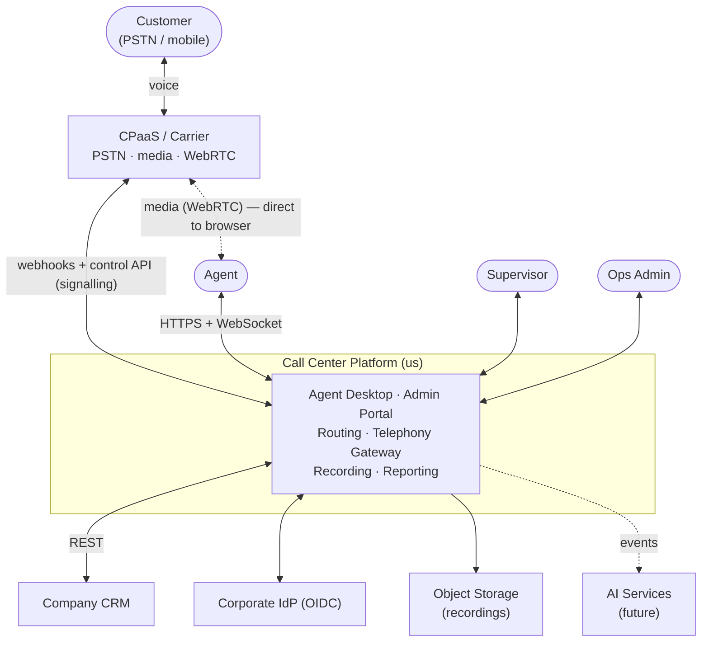

### Containers (C4 level 2)

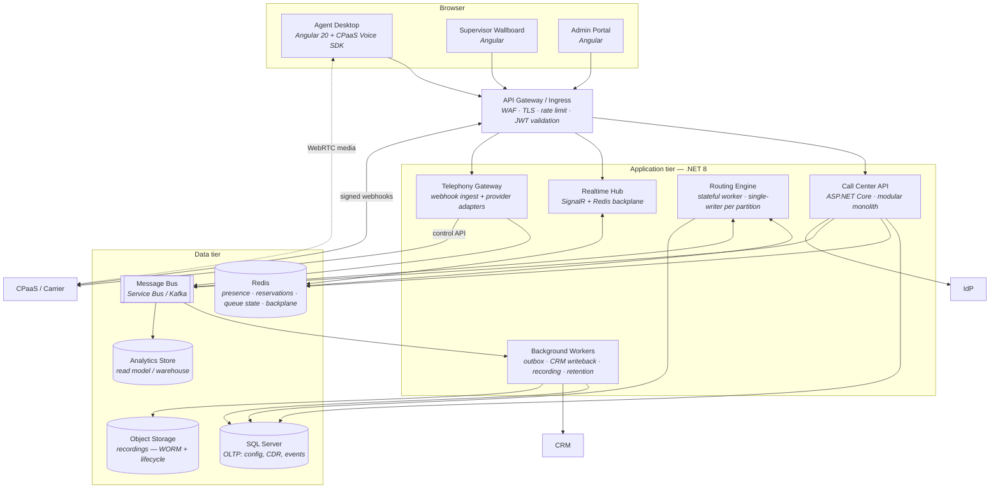

---

## 4.2 Technology choices and why

| Layer | Choice | Rationale | Alternative considered |
| --- | --- | --- | --- |
| Backend | **.NET 8 (LTS)** | Stated preference and genuinely well-suited: excellent async I/O for a signalling-heavy workload, first-class SignalR for push, strong typing for a domain with many state machines, mature observability. LTS matters for a system with a 5+ year life | Node.js (weaker for CPU-bound routing and long-lived typed domains); Go (fine, but the team's stated stack is .NET and telephony SDKs are well-supported on both) |
| Architecture style | **Modular monolith → selective extraction** | At 50 agents, microservices buy distributed-systems problems and pay for them with latency and operational cost. Modules with enforced boundaries give the same design discipline. §5.4 defines *when* each module gets extracted, and the Routing Engine is extracted from day one because it is stateful | Microservices from day one — rejected: premature for the volume, and it multiplies the failure modes on a system where the failure mode is "the phones stop" |
| Frontend | **Angular 20 (LTS)** | Stated preference, and genuinely the right fit for an agent desktop: a call is a continuous stream of unprompted events, which is exactly what RxJS models well, while signals cover component state. The opinionated structure suits a long-lived internal app with rotating maintainers, and an LTS line matters for the same reason .NET 8 does | React (equally viable; no reason to override the stated preference) |
| Realtime | **SignalR (WebSocket) + Redis backplane** | Push, not polling (NFR-P5). Automatic transport fallback, built-in reconnection with state reconciliation, native .NET integration | Raw WebSockets (rebuilding reconnection/backplane); SSE (unidirectional); polling (rejected at 500 clients) |
| OLTP database | **SQL Server 2022+** | Deeply relational config and call data; **table partitioning** on the time-series tables so retention is a metadata operation rather than a mass DELETE; native JSON storage for provider payloads and event bodies; **Always On availability groups** for the HA target in NFR-A1; TDE and Always Encrypted for the compliance requirements in §1.6; and first-class EF Core support on the .NET stack the team already runs | PostgreSQL (equally capable — the deciding factor is existing licensing and operational familiarity, and both favour SQL Server here); a document database (rejected: this data is deeply relational and every report is SQL-shaped) |
| Cache / ephemeral state | **Redis** | Sub-millisecond presence and reservation state; atomic Lua scripts give the compare-and-set semantics the reservation protocol needs; also the SignalR backplane. **Never the system of record** | In-memory only (loses state on restart); DB-only (too slow and too much write pressure for presence) |
| Messaging | **Azure Service Bus (or Kafka at scale)** | Decouples the call path from slow consumers (CRM write-back, reporting, recording). Guarantees the hot path is never blocked by a downstream system | In-process only — rejected: it makes the CRM's availability the phones' availability |
| Recording storage | **Object storage (S3/Blob)** with lifecycle tiering, SSE-KMS, object-lock | Cheap, durable, tiered, immutable. Recordings never touch the app servers' disks | Database BLOBs (rejected — kills the DB) |
| Analytics | **Read model in SQL Server for v1 → warehouse (Azure Synapse / Fabric) later** | Do not buy a warehouse for 3,000 calls/day. Do design the event stream so one can be added without changing producers | Reporting off the OLTP primary — rejected: analyst queries must never compete with the call path |
| Telephony | **CPaaS behind `ITelephonyProvider`** | §1.1 and R-10. Two adapters in v1 (one real, one simulated) | Self-hosted FreeSWITCH/Asterisk + SBC — a valid future state, gated on the economics in §5.7 |

---

## 4.3 Components and responsibilities

### 4.3.1 Telephony Gateway

**Owns:** everything provider-specific. It is the only code in the system that knows a
vendor's name.

| Responsibility | Notes |
| --- | --- |
| Receive and verify webhooks | HMAC signature check, timestamp window, replay cache (NFR-SEC10) |
| Translate vendor payloads → canonical domain events | `CallInitiated`, `CallAnswered`, `DtmfReceived`, `CallEnded`, `RecordingAvailable`… |
| Translate domain commands → vendor control API | `Dial`, `Answer`, `Hold`, `Transfer`, `StartRecording`, `PauseRecording`, `Hangup` |
| Serve call-control instruction documents | The vendor's flow control (TwiML/NCCO-equivalent) for IVR and queue treatment |
| Issue softphone capability tokens | Short-lived, scoped to one agent identity |
| Idempotency | Deduplicate by `(provider, providerCallId, eventType, sequence)` — carriers retry, and duplicate handling causes double-routing |

```csharp
// The port. Nothing above this line in the stack knows which vendor we use.
public interface ITelephonyProvider
{
    string Name { get; }

    Task<CallHandle>   PlaceCallAsync(PlaceCallRequest r, CancellationToken ct);
    Task               AnswerAsync(CallHandle call, CancellationToken ct);
    Task               HangupAsync(CallHandle call, HangupReason reason, CancellationToken ct);
    Task               HoldAsync(CallHandle call, bool hold, CancellationToken ct);
    Task<TransferResult> TransferAsync(CallHandle call, TransferTarget target,
                                       TransferMode mode, CancellationToken ct);
    Task               SendDtmfAsync(CallHandle call, string digits, CancellationToken ct);
    Task               SetRecordingAsync(CallHandle call, RecordingCommand cmd, CancellationToken ct);
    Task<AgentToken>   IssueAgentTokenAsync(AgentId agent, TimeSpan ttl, CancellationToken ct);

    // Inbound direction: vendor payload -> canonical events (0..n)
    bool TryParseWebhook(HttpRequestSignature sig, ReadOnlySpan<byte> body,
                         out IReadOnlyList<TelephonyEvent> events);
}
```

**Implementations in v1:** `TwilioTelephonyProvider` (or equivalent) and
`SimulatedTelephonyProvider`. The simulated one is not a stub — it models ring time, answer
probability, RNA, caller abandon and hangup, so routing logic can be tested deterministically
and load-tested for free. It is v1 work, not part of the prototype.

**Failure behaviour:** if the provider's API is unreachable, commands are retried with
jittered backoff for a bounded window, then the call is marked `Failed` with a specific
reason and the agent is released. We never leave an agent stuck in `Reserved` because a
vendor API timed out.

---

### 4.3.2 Routing Engine — the heart

**Owns:** queue state, agent eligibility, the matching decision, and the reservation
lifecycle. This is the only genuinely stateful component and the only one whose correctness
directly determines whether the business works.

**Concurrency model.** The engine runs as a set of workers, each owning a set of **queue
partitions** (consistent hash on `QueueId`). Within a partition, matching is **single-writer**
— one goroutine-equivalent loop, no cross-thread races on the same queue. Partition ownership
is leased from Redis with a TTL and heartbeat (lease-based leader election). If a worker
dies, its lease expires (≈ 5 s) and another worker takes over the partition by rebuilding
state from Redis + the event log.

> **Why this and not "just put it in the database with a transaction":** the matching loop
> runs on every arrival, every state change and every timer tick — that is thousands of
> evaluations per minute at 500 agents. Doing it under row locks in SQL Server would make the
> DB the bottleneck and the latency unpredictable. Single-writer-per-partition gives us
> correctness *without* contention, and scales horizontally by adding partitions (§5.3).

**The matching cycle** — triggered by: call enqueued · agent becomes Available · reservation
timeout · queue timer tick.

```
for each partition owned by this worker:
  candidateCalls  = queue.PeekOrdered(by: priority DESC, enqueuedAt ASC)
  for each call in candidateCalls:
      eligible = agents.Where(a => a.State == Available
                               && a.Skills ⊇ call.RequiredSkills
                               && a.Queues.Contains(call.QueueId)
                               && !call.PreviouslyOfferedTo(a.Id))   // no RNA loop
      if eligible is empty: continue           // leave in queue, try next call
      chosen = selectionPolicy.Select(eligible, call)
      if TryReserve(chosen, call) :            // atomic CAS in Redis
           emit CallOffered(call, chosen)
           schedule ReservationTimeout(call, chosen, t = queue.RingTimeout)
           break                                // one offer per agent per cycle
```

**Selection policies** (strategy pattern, configurable per queue — Q19):

| Policy | Rule | When to use |
| --- | --- | --- |
| `LongestIdle` *(default)* | Agent `Available` for the longest | Fairest distribution; standard contact-centre default |
| `HighestProficiency` | Best skill score, longest-idle as tiebreak | Complex/technical queues |
| `LeastCallsToday` | Load-levelling across a shift | Fairness across part-time shifts |
| `PreferredAgent` | Last agent who handled this customer, falling back to the default after a timeout | Relationship-based service (FR-C12, phase 2) |

**Reservation protocol** — the correctness core (FR-C6). A reservation is an atomic
compare-and-set on the agent's state plus a signed token:

```
RESERVE  = Lua script, atomic in Redis:
             if agentState[a] == "Available":
                 agentState[a] = "Reserved"
                 reservation[a] = { callId, token, expiresAt }
                 return OK
             else return CONFLICT
```

The agent's browser receives `CallOffered { callId, reservationToken, expiresAt }`. When the
agent clicks Answer, the API validates `reservationToken` **server-side** against Redis
before issuing any telephony command (NFR-SEC3). Therefore:

- Two agents can never be offered the same call (the CAS makes reservation exclusive).
- An agent cannot answer a call they were not offered (token validation).
- A stale/duplicate answer after timeout is rejected with `409 Conflict` and a clear UI
  message, rather than silently double-connecting.

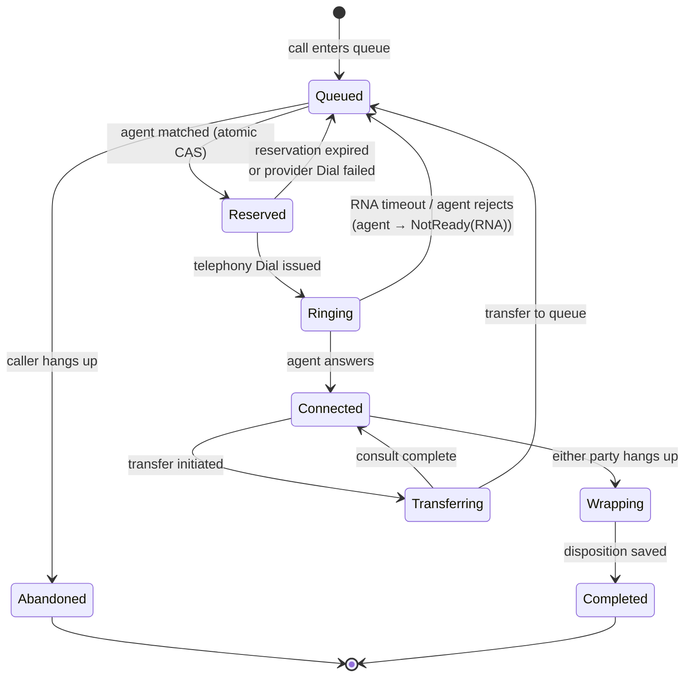

**Failure behaviour:** the engine holds working state in Redis, not in process memory, and
every decision is journalled as an event. A worker crash costs ≤ 5 s of routing latency on
its partitions. Calls already connected are entirely unaffected — media is carrier-side and
connected calls do not depend on the engine (NFR-A5).

---

### 4.3.3 Agent State & Presence

**Owns:** the server-authoritative agent state machine (FR-B1) and liveness.

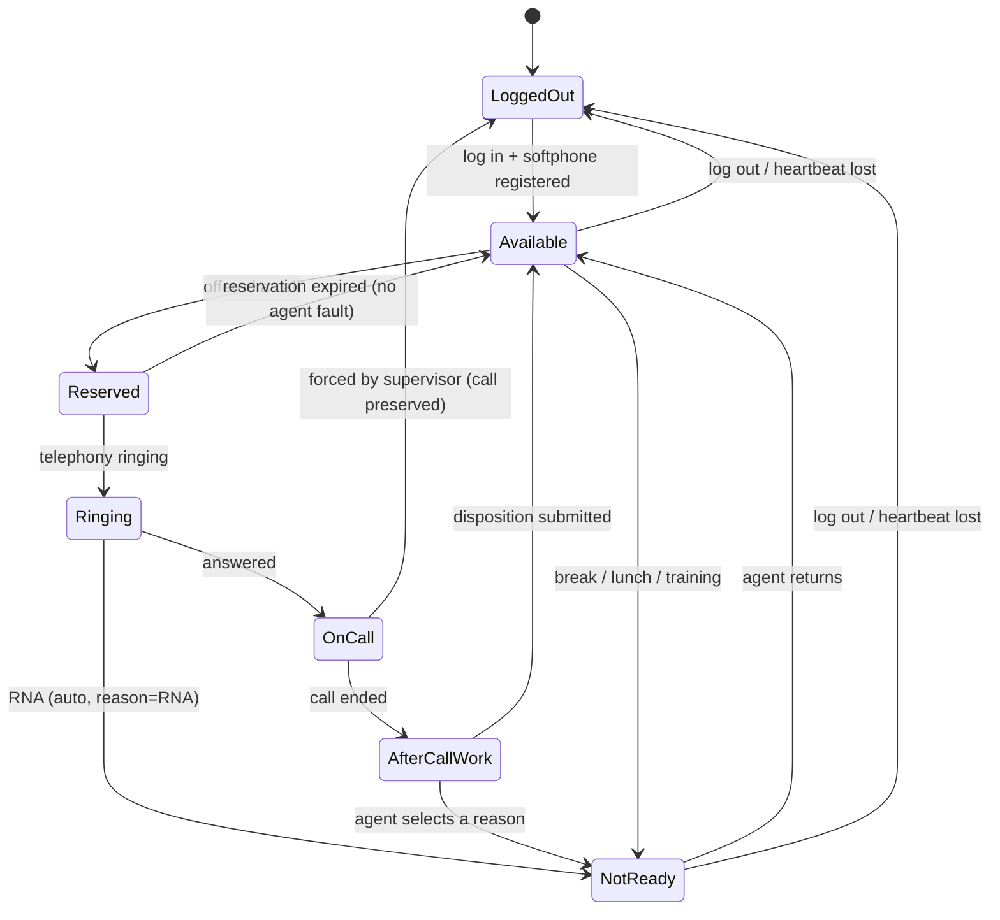

Rules that matter:

- **Every transition is validated server-side.** The client requests; the server decides.
  A client that believes it is `Available` while the server says `NotReady` will be corrected
  on the next heartbeat.
- **Heartbeat every 10 s** over the existing SignalR connection. Two missed heartbeats →
  `ConnectionSuspect` (stop offering calls, keep the session); six missed → auto-logout with
  an event. This closes the "zombie available agent" hole (FR-B4), which in my experience is
  the number-one cause of "the queue is backing up and nobody knows why."
- **Reconnection reconciles, not resets.** On reconnect the client sends its last known
  state and call context; the server replies with the authoritative snapshot. An agent who
  refreshes the browser mid-call gets their call back, not a blank screen.
- **Single session per agent** (FR-B5): a second login publishes `SessionEvicted` to the
  first.

---

### 4.3.4 Realtime Hub

SignalR hubs with a Redis backplane so any application instance can push to any connected
client (essential once we are behind a load balancer).

| Group | Members | Messages |
| --- | --- | --- |
| `agent:{agentId}` | One agent's session | `CallOffered`, `CallConnected`, `CallEnded`, `StateChanged`, `SessionEvicted`, `ScreenPop` |
| `queue:{queueId}` | Supervisors watching that queue | `QueueStats` (throttled, 1 Hz) |
| `team:{teamId}` | Supervisors of that team | `AgentStateChanged` |
| `tenant:{tenantId}` | Admins | `ConfigChanged`, `SystemAlert` |

**Throughput discipline:** wallboard statistics are **aggregated and throttled server-side to
1 Hz per queue**, not forwarded per event. At 500 agents the naive design (push every state
change to every supervisor) is ~50 messages/second × 50 supervisors — self-inflicted load
for data no human can read. This is a deliberate design constraint, not an optimisation.

---

### 4.3.5 CRM Integration (Anti-Corruption Layer)

**Owns:** everything the CRM's data model would otherwise leak into ours.

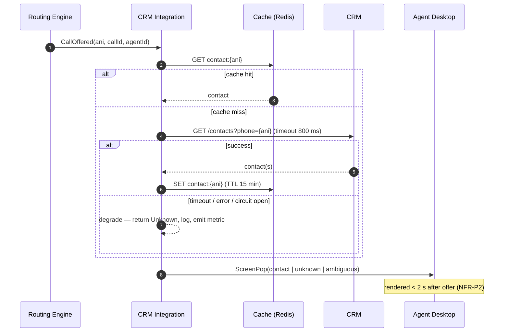

Non-negotiable rules:

1. **Hard timeout (800 ms) on the lookup.** The call is offered to the agent regardless;
   the screen-pop catches up or degrades. Ringing must never wait on the CRM.
2. **Circuit breaker.** After N consecutive failures the breaker opens and we stop calling
   the CRM entirely for a cool-down period, serving "unknown" instantly rather than adding
   latency to every call.
3. **Write-back is asynchronous, durable and idempotent.** Published to the bus and processed
   by a worker with exponential backoff and a dead-letter queue. A CRM outage delays activity
   records; it never blocks a call, and it never loses one.
4. **Idempotency key = `CallId`.** The CRM must not receive duplicate activities when we
   retry.

---

### 4.3.6 Recording & Media Lifecycle

| Stage | Behaviour |
| --- | --- |
| Start | Provider records per queue policy (FR-G1); announcement played if required (FR-G2) |
| Pause | Agent presses Pause before card capture; a `RecordingPaused` event is journalled with timestamps so we can *prove* the gap to an auditor (FR-G3) |
| Ingest | On `RecordingAvailable`, a worker fetches the media, writes it to our object storage with SSE-KMS, verifies the checksum, then instructs the provider to delete its copy — **we own the data** (G2) |
| Access | Never served directly. Short-lived signed URLs, issued only after a role check, with every issuance written to the audit log (FR-G5) |
| Retention | Lifecycle rules: hot 30 days → cool 12 months → archive to the legal retention limit → delete. Legal hold overrides deletion (FR-G4) |
| Erasure | A `SubjectErasureRequested` event fans out to recordings, transcripts and the analytics store, producing a signed deletion certificate (FR-G6, phase 2) |

---

### 4.3.7 Reporting & Analytics

Strictly **CQRS**: the call path writes events; the reporting path reads projections. They
never share a query.

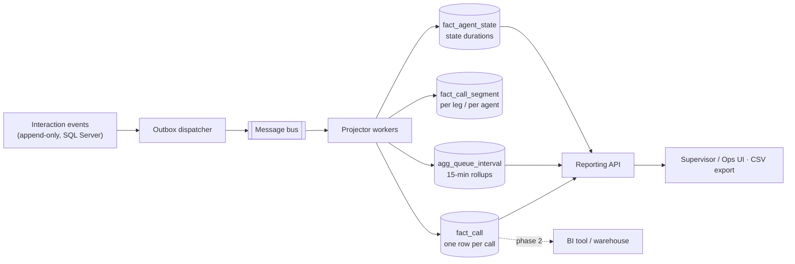

Live wallboard numbers come from **Redis counters** (sub-second, approximate, cheap).
Historical numbers come from **projections** (exact, interval-aligned). Documenting that both
exist — and that they may differ by seconds during an interval — prevents the classic
"the wallboard says 47 and the report says 46" trust incident (R-13).

---

## 4.4 Critical flow 1 — inbound call, end to end

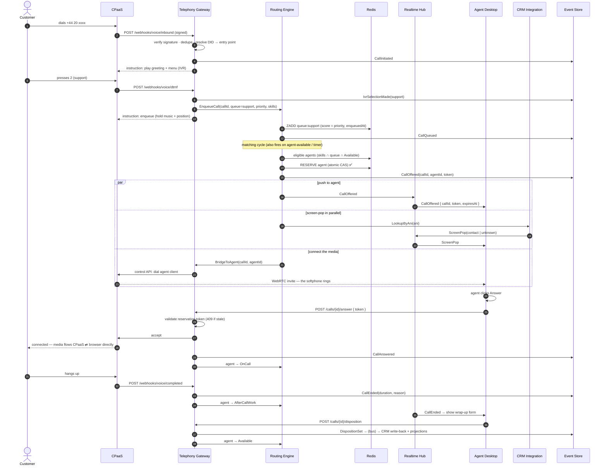

**Latency budget for NFR-P1 (arrival → agent's phone rings, p95 < 1 s):**

| Step | Budget |
| --- | --- |
| Webhook receipt + signature verify + DID resolve | 50 ms |
| Enqueue + matching cycle | 100 ms |
| Reservation CAS (Redis) | 5 ms |
| Telephony bridge command → provider | 250 ms |
| Provider rings the browser client | 300 ms |
| SignalR push to desktop (parallel) | 50 ms |
| **Total** | **~755 ms** — ~250 ms of headroom |

The CRM lookup is deliberately **outside** this budget: it runs in parallel and has its own
2 s target (NFR-P2). This is why screen-pop cannot delay ringing.

---

## 4.5 Critical flow 2 — outbound with DNC gate

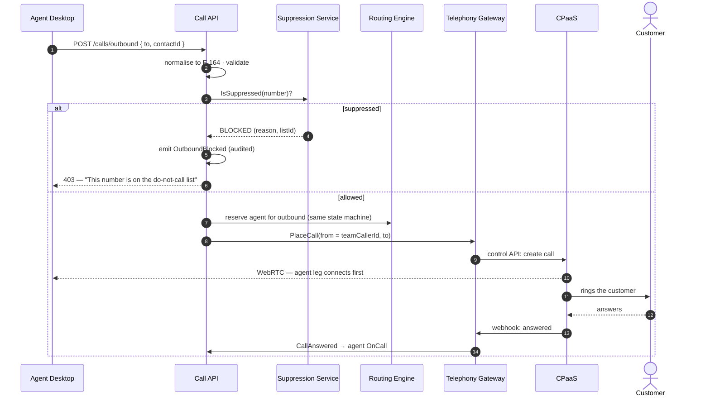

The DNC check is a **synchronous gate in the call path**, not an after-the-fact report.
If the suppression service is unavailable, we **fail closed** — the call is blocked. A
blocked legitimate call is an inconvenience; a call to a suppressed number is a regulatory
breach (R-07).

---

## 4.6 Critical flow 3 — warm transfer

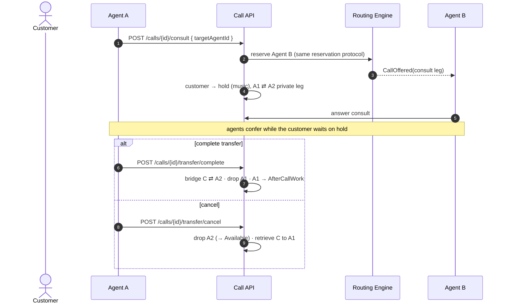

Two design points worth stating: the consult leg uses the **same reservation protocol**, so
Agent B cannot simultaneously receive a queue call (no special-case race), and the call keeps
**one `CallId` across all legs** so reporting can show the whole customer journey rather than
three disconnected records.

---

## 4.7 Data model

### 4.7.1 Core schema

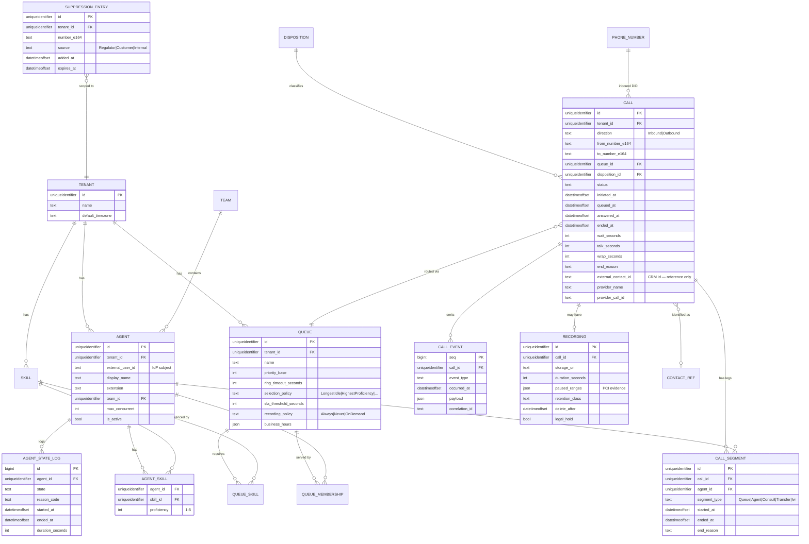

### 4.7.2 Design decisions in the data model

| Decision | Reason |
| --- | --- |
| **`CALL_EVENT` is append-only and is the system of record** | Everything else (CDR fields, projections, reports) is derived. Any call is fully reconstructible for a support question or an audit (NFR-M4). This is also the AI substrate ([doc 6](06-ai-readiness.md)) |
| **`CALL` carries denormalised durations** | Reports must not aggregate raw events at query time. Computed once on completion, then read cheaply. Derived values remain re-computable from events if a bug is found |
| **No customer PII stored, only `external_contact_id`** | The CRM remains the master of customer data. We store a reference plus the phone number we were given. This dramatically shrinks our GDPR surface and avoids two sources of truth |
| **`tenant_id` on every table from day one** | §1.8. Free now, a migration nightmare later |
| **`CALL_EVENT` and `CALL` partitioned monthly by time** | Call data is time-series shaped. A monthly partition function keeps indexes small and query plans stable, and turns retention into a `SWITCH OUT` of one partition — a metadata operation — rather than a mass `DELETE` that would bloat the transaction log |
| **Segments separate from calls** | A call may involve several agents (transfer, consult). Per-agent reporting needs per-leg granularity; per-customer reporting needs the whole journey. One `CallId`, many segments |
| **`paused_ranges` on the recording** | PCI evidence. We must be able to prove the recording was paused during card capture, not merely claim it |
| **Queue/agent runtime state is in Redis, not SQL Server** | Presence changes many times per minute per agent. Writing that to the OLTP primary would create pointless write pressure. SQL Server holds the *journal* (`AGENT_STATE_LOG`), Redis holds the *current value* |

### 4.7.3 Where each kind of state lives

| State | Store | Durability | Why |
| --- | --- | --- | --- |
| Configuration (queues, skills, agents, hours) | SQL Server | Durable, audited | Low write rate, high read rate, cached in-process with change notification |
| Call journal / events | SQL Server (partitioned monthly) | Durable, append-only | System of record |
| Live agent presence | Redis | Ephemeral, rebuildable | Sub-ms reads; rebuildable from sessions + journal |
| Queue membership & order | Redis sorted sets | Ephemeral, rebuildable from events | Ordered, atomic, fast |
| Reservations | Redis with TTL | Ephemeral by design | Must expire automatically; a lost reservation must never strand an agent |
| Wallboard counters | Redis | Approximate | Speed over precision; exact numbers come from projections |
| Recordings | Object storage | Durable, immutable, tiered | Large binaries, long retention |
| Projections / reports | SQL Server read model → warehouse later | Rebuildable from events | CQRS; never queried on the call path |

---

## 4.8 Inter-service communication

| Path | Mechanism | Why |
| --- | --- | --- |
| Browser → backend (commands) | REST/HTTPS + JWT | Simple, cacheable, debuggable, works with standard tooling |
| Backend → browser (events) | SignalR WebSocket | Push with < 2 s staleness; polling 500 clients is not an option |
| Carrier → backend | Signed webhooks (HTTPS) | Provider-dictated; verified and idempotent at our edge |
| Backend → carrier | REST control API | Provider-dictated; wrapped by the port |
| Gateway → Routing Engine | In-process (v1) → gRPC on extraction | Lowest latency on the hot path; the interface is defined so extraction is mechanical |
| Anything → slow consumers (CRM, reporting, recording, AI) | **Asynchronous message bus** | The call path must never block on a system we do not control |
| Database writes → bus | **Transactional outbox** | An event and its state change commit atomically. Without this we get lost or phantom events — and in this domain that means a call that "never happened" in reporting |

### Synchronous vs asynchronous — the rule I apply

> **Synchronous** only when the caller cannot proceed without the answer *and* the latency is
> inside the call path's budget: reservation CAS, telephony control commands, DNC check.
>
> **Asynchronous** for everything else: CRM write-back, recording ingest, projections, audit
> fan-out, AI. If it can be a message, it should be a message — because every synchronous
> dependency is a new way for the phones to stop.

---

## 4.9 Security architecture

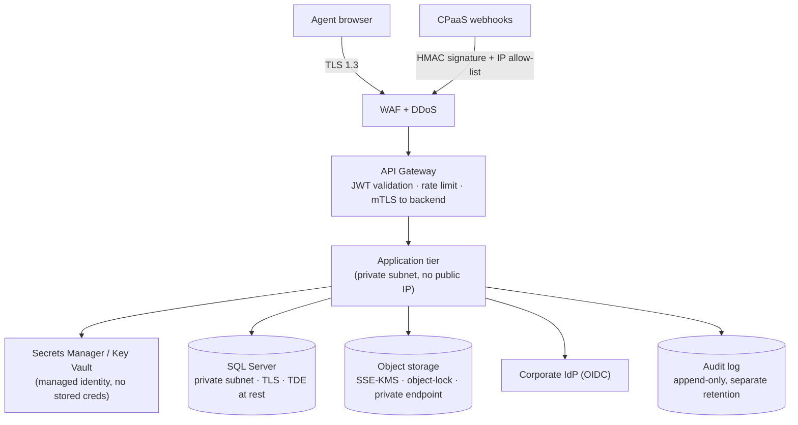

| Control | Implementation |
| --- | --- |
| Authentication | OIDC authorisation-code + PKCE; access tokens ~15 min; refresh rotation; MFA enforced for Supervisor/Admin (NFR-SEC2) |
| Authorisation | Role + resource-scoped policies evaluated server-side. Supervisors scoped to their teams. **Call actions additionally require a valid reservation token** (NFR-SEC3) |
| Webhook trust | HMAC signature, timestamp window, replay cache, provider IP allow-list |
| Transport | TLS 1.2+ externally, mTLS between tiers, DTLS-SRTP for media |
| Data at rest | SQL Server **Transparent Data Encryption**, with **Always Encrypted** on the PII columns so they stay encrypted even from a database administrator; recordings SSE-KMS with customer-managed keys |
| Secrets | Managed identity → vault. No secrets in images, env files or config repos |
| Audit | Append-only log for config change, recording access, barge, export, forced logout, DNC override. Separate retention, separate access control |
| Toll fraud | Per-agent daily spend cap, destination allow-list, anomaly detection on premium-rate prefixes, automatic suspension + alert (NFR-SEC8) |
| Tenant isolation | `tenant_id` filter enforced in a global EF Core query filter, not left to individual queries |
| PCI | Pause/resume with journalled ranges; DTMF payloads never written to logs or events; payment segments flagged |

---

## 4.10 Failure modes and designed responses

The table I would actually put on the wall. Each row is a scenario we have designed for and
can test.

| Failure | Blast radius | Designed response |
| --- | --- | --- |
| **CPaaS outage** | Total — no calls | Carrier-level failover route (phase 2, adapter boundary in v1); status page + agent banner; queued calls given fallback treatment. Honestly: this is our largest residual dependency, and the reason the port matters |
| **Routing Engine worker dies** | Its partitions stop matching for ~5 s | Lease expires → another worker adopts the partition → state rebuilt from Redis. **Connected calls unaffected** (NFR-A5) |
| **Redis unavailable** | Presence & queue state lost | Redis in HA (primary + replica, automatic failover). On total loss: reject new enqueues into fallback treatment, rebuild presence from agent re-registration. Connected calls unaffected |
| **SQL Server primary fails** | Writes fail; no new journal entries | **Always On availability group** fails over automatically (~30–60 s) and EF Core retries the transient error. Events buffer in the bus and are replayed. The call path degrades but does not stop — the gateway still routes from cached config |
| **CRM down or slow** | No screen-pop, delayed write-back | Circuit breaker + cached lookups + durable retry queue. **Calls continue** (FR-F5) |
| **Message bus down** | Reporting and write-backs delayed | Outbox retains events in SQL Server and drains on recovery. Nothing is lost; things are late |
| **Agent loses network** | That agent only | Heartbeat detects within ~20 s → agent removed from routing → active call continues via carrier (media is not ours) → reconciliation on reconnect |
| **Agent's browser crashes mid-call** | That call | Media continues (carrier-side); on reconnect the desktop reconciles and reattaches to the active call |
| **Reservation "leaked"** (agent never responds and the timeout push is missed) | One agent idle | Redis TTL expires the reservation regardless of any process; a sweeper reconciles orphaned reservations every 5 s |
| **Duplicate webhook from the carrier** | Potential double-routing | Idempotency key `(provider, providerCallId, eventType, sequence)`; duplicates are acknowledged and dropped |
| **Deployment breaks routing** | Total | Canary by agent cohort, automated smoke call, instant rollback (§7.5) |
| **Traffic spike (5× expected)** | Long waits | Autoscale stateless tiers; queue depth alerts; overflow rules (phase 2); carrier concurrency cap protects us from a runaway bill |

---

## 4.11 Module boundaries in the codebase

The modular monolith is only real if the boundaries are enforced by the build, not by good
intentions:

```
CallCenter.sln
├── src/
│   ├── CallCenter.Domain/              # entities, value objects, state machines, events
│   │                                   # ZERO external dependencies — pure, fully unit-tested
│   ├── CallCenter.Application/         # use cases, ports (interfaces), policies
│   │   ├── Routing/                    # matching, selection policies, reservations
│   │   ├── Agents/                     # state machine, presence
│   │   ├── Calls/                      # lifecycle, controls, dispositions
│   │   ├── Crm/                        # ACL contracts
│   │   └── Reporting/                  # projections
│   ├── CallCenter.Infrastructure/      # EF Core, Redis, bus, object storage
│   ├── CallCenter.Telephony/           # ITelephonyProvider + adapters
│   │   ├── Simulated/                  # deterministic dev/test/load provider
│   │   └── Twilio/                     # real provider adapter
│   ├── CallCenter.Api/                 # REST controllers, SignalR hubs, auth, composition root
│   └── CallCenter.Workers/             # outbox dispatcher, projectors, CRM writeback, retention
└── tests/
    ├── CallCenter.Domain.Tests/        # state machine invariants
    ├── CallCenter.Routing.Tests/       # matching, fairness, reservation races
    └── CallCenter.Integration.Tests/   # full flows against the simulated provider
```

Enforced by architecture tests in CI (NetArchTest): `Domain` may not reference
`Infrastructure`; `Application` may not reference `Telephony` adapters, only the port; no
module may reference another module's internals. When a module is later extracted into its
own service (§5.4), the boundary already exists — extraction becomes a deployment change,
not a rewrite.

---

## 4.12 API surface (representative)

| Method | Route | Purpose |
| --- | --- | --- |
| `POST` | `/api/v1/agents/me/session` | Log in, register softphone, get capability token |
| `PUT` | `/api/v1/agents/me/state` | Request a state change (server validates) |
| `POST` | `/api/v1/agents/me/heartbeat` | Liveness (usually over SignalR) |
| `POST` | `/api/v1/calls/{id}/answer` | Accept an offered call — **requires reservation token** |
| `POST` | `/api/v1/calls/{id}/reject` | Decline → RNA path |
| `POST` | `/api/v1/calls/{id}/hold` · `/mute` · `/dtmf` | In-call controls |
| `POST` | `/api/v1/calls/{id}/consult` · `/transfer/complete` · `/transfer/cancel` | Warm transfer |
| `POST` | `/api/v1/calls/{id}/transfer` | Blind transfer |
| `POST` | `/api/v1/calls/{id}/recording` | Pause / resume (PCI) |
| `POST` | `/api/v1/calls/{id}/disposition` | Wrap-up, exits ACW |
| `POST` | `/api/v1/calls/outbound` | Click-to-call (DNC-gated) |
| `GET` | `/api/v1/queues/{id}/stats` | Point-in-time queue stats (live view uses SignalR) |
| `GET` | `/api/v1/reports/cdr` | CDR search + CSV export |
| `POST` | `/api/v1/admin/queues` … | Configuration (Ops-Admin only) |
| `POST` | `/api/v1/telephony/webhooks/{provider}` | Carrier callbacks (signature-verified) |
| `GET` | `/health/live` · `/health/ready` | Probes |

**Conventions:** versioned path; `Idempotency-Key` honoured on all POSTs that cause telephony
side-effects; RFC 7807 problem details for errors; `409 Conflict` with a machine-readable
reason for stale reservation attempts; every response carries a correlation ID.

**Implementation note — controllers, not minimal APIs.** The HTTP layer is built as ASP.NET
Core MVC controllers. This is a maintainability decision rather than a stylistic one, and it
matters most for the two things that are easy to get wrong here:

- **Authorisation is declarative and applies to a whole controller.** `[Authorize]` on the
  agent surface and `[Authorize(Roles = "Supervisor")]` on the reporting surface mean a new
  endpoint added to an existing controller inherits its protection. **Forgetting an attribute
  fails closed; forgetting to call an authorisation helper fails open** — and over a five-year
  life with a rotating team, that asymmetry is the whole argument.
- **Request validation happens at the edge.** `[ApiController]` plus annotated request DTOs
  reject a malformed command before any routing or telephony code runs, and return consistent
  problem details without each handler re-checking its own inputs.

Controllers also give us filters for cross-cutting concerns (correlation IDs, audit, rate
limiting), XML-doc-driven OpenAPI, and a natural grouping that matches the module boundaries
in §4.11. The prototype is built this way.

---

**Previous:** [← MVP Definition](03-mvp-definition.md) ·
**Next:** [Scalability Plan →](05-scalability-plan.md)
