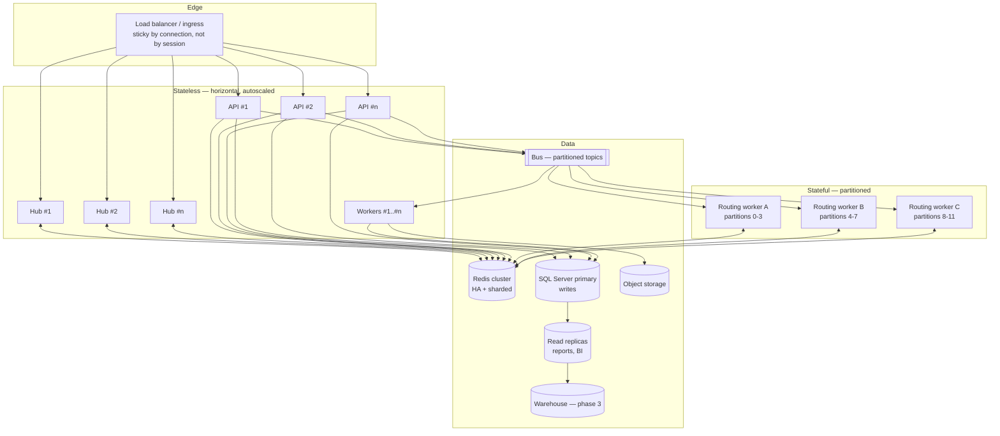

# 5. Scalability Plan — 50 → 500+ Agents

> **The claim I am making:** the 50-agent system and the 500-agent system are the *same
> architecture* with different instance counts, two components extracted, and one storage
> tier added. No rewrite. This document is the evidence for that claim, plus the honest list
> of what does break.

---

## 5.1 What 10× actually means here

Scaling "agents" is a proxy. These are the dimensions that really grow, and they do **not**
grow at the same rate — which is the whole point.

| Dimension | 50 agents | 500 agents | Growth | Hardest part |
| --- | --- | --- | --- | --- |
| Concurrent agents | 50 | 500 | 10× | Persistent WebSocket connections |
| Concurrent calls | ~45 | ~450 | 10× | Carrier channels (cost, not compute) |
| Calls / busy hour | ~800 | ~8,000 | 10× | Webhook ingest rate |
| **Routing decisions / sec** | ~3 | ~**80** | **~27×** | ⚠️ Superlinear — see §5.2 |
| Presence updates / sec | ~5 | ~50 | 10× | Redis writes, fan-out |
| Wallboard fan-out msgs / sec | ~250 | ~**25,000** | **100×** | ⚠️ Superlinear — see §5.2 |
| Events / day | ~240k | ~2.4M | 10× | Write throughput, partition management |
| Recording storage / month | ~35 GB | ~420 GB | 10× | Cost and lifecycle, not performance |
| Reporting query volume | Low | Moderate | ~10× | Contention with the call path |

**The two superlinear items are the real scaling story.** Everything else is capacity
planning; those two are design problems, and both are solved in the v1 design rather than
discovered at 300 agents.

---

## 5.2 The two superlinear problems

### Problem 1 — routing decisions grow with agents × queue depth

A naive matching loop re-evaluates *every waiting call* against *every available agent* on
*every trigger*. Triggers scale with agents, and the work per trigger scales with agents ×
calls. That is **O(A × C)** per trigger and **O(A² × C)** per second. At 50 agents nobody
notices. At 500 it is roughly 27× the work, and it arrives as growing offer latency —
exactly the symptom that erodes trust in NFR-P1.

**Design response, present from v1:**

| Technique | Effect |
| --- | --- |
| **Queue partitioning with single-writer per partition** | The matching set is one queue, not the whole centre. Work per decision stays bounded by *that queue's* size regardless of total scale |
| **Skill-indexed agent sets in Redis** | Eligible agents are a set intersection (`SINTER` over skill sets ∩ available set), not a linear scan with predicate evaluation |
| **Event-driven, not polling** | The cycle runs on arrival / availability / timeout — not on a 100 ms tick across all queues |
| **Incremental "dirty queue" evaluation** | Only queues affected by the triggering event are re-evaluated |
| **Bounded work per cycle** | Each cycle offers at most one call per newly available agent; it does not attempt to drain the queue in one pass |

Result: routing cost per decision is roughly **O(log Q + S)** where Q is that queue's depth
and S is the skill-set intersection size — effectively flat as the centre grows, because
growth adds *partitions*, not *depth*.

### Problem 2 — wallboard fan-out grows with agents × supervisors

Naively: every agent state change (≈ 50/s at 500 agents) pushed to every supervisor
(≈ 50) = **2,500 messages/second**, carrying data that changes faster than a human can read.
Add per-queue stats and it is worse.

**Design response, present from v1:**

| Technique | Effect |
| --- | --- |
| **Server-side aggregation to 1 Hz per queue** | Fan-out becomes `queues × supervisors-watching`, not `events × supervisors` |
| **Push deltas, not snapshots** | Only changed counters go on the wire |
| **Subscription scoping** | A supervisor subscribes to their teams/queues, not to everything |
| **Redis counters as the source for live views** | The wallboard never queries SQL Server — it reads pre-aggregated counters |

Result: ~50–100 messages/second at 500 agents instead of 25,000. **This is a design
constraint, not a later optimisation**, because retrofitting it means changing the client
contract after supervisors have built habits around it.

---

## 5.3 Scaling each tier

| Tier | Scaling model | 50 agents | 500 agents | Limit / next step |
| --- | --- | --- | --- | --- |
| **API (stateless)** | Horizontal, CPU + RPS triggers | 2 × 2 vCPU | 6 × 4 vCPU | Effectively unbounded; DB connections are the real constraint → PgBouncer |
| **Realtime Hub** | Horizontal + Redis backplane | co-located with API | 4 dedicated instances | ~5,000 concurrent WS per instance comfortably; we need 550. Separated from the API at ~200 agents so a hub restart does not cycle every API request |
| **Routing Engine** | Partitioned, lease-based ownership | 2 instances (1 active + standby) | 4–6 instances, 32 partitions | Partition count set to 32 from day one — **rebalancing is cheap, re-partitioning a live system is not** |
| **Workers** | Horizontal per queue depth | 2 | 6–10 | Competing consumers; scale per topic independently (CRM write-back scales separately from projections) |
| **Redis** | HA pair → cluster | 1 primary + 1 replica | 3 shards × 2 | Presence/queue keys are hash-tagged by tenant+queue so a shard split does not break atomicity of the reservation script |
| **SQL Server** | Vertical + readable secondaries + partitioning | 1 primary + 1 secondary | 1 large primary + 3 readable secondaries | Write ceiling ≈ 5k events/s — we need ~30/s at 500 agents. **Not the bottleneck** |
| **Message bus** | Partitioned topics | Basic tier | Standard, partitioned by `CallId` | Partition key = `CallId` preserves per-call ordering while scaling out |
| **Object storage** | Managed | — | — | Not a scaling concern; a cost concern (§5.6) |

### Connection management detail

Sticky routing is at the **connection** level (a WebSocket naturally stays on one hub
instance), never at the **session** level. Any API instance can serve any request, and any
hub instance can push to any agent via the backplane. This matters because a hub instance
restart during a deploy must not log agents out — it must trigger a client reconnect that
reconciles state (§4.3.3). We test this explicitly: rolling-restart the hub tier while
50 simulated agents are on calls, and assert zero call loss and zero state divergence.

---

## 5.4 Extraction path: when a module becomes a service

The modular monolith is a starting point, not a destination. Extraction is triggered by
**evidence**, not by fashion. Each trigger below is a metric we alert on.

| Module | Extract when | Why that trigger | Effort |
| --- | --- | --- | --- |
| **Routing Engine** | **Day one** | It is stateful and has a different scaling and failure profile from request/response code. It must be deployable and restartable independently of the API | Already separate |
| **Realtime Hub** | > ~200 concurrent agents, or hub CPU > 50% | WebSocket memory/CPU profile differs from request handling; hub restarts must not cycle the API tier | ~1 week |
| **Reporting / Projections** | Report queries measurably affect call-path latency, or query p95 > 5 s | Analytical and transactional workloads compete for the same resources | ~2 weeks |
| **Telephony Gateway** | Second provider goes live, or webhook ingest > 500 rps | Needs its own scaling and its own public ingress security posture | ~2 weeks |
| **CRM Integration** | CRM rate limits require centralised throttling, or a second CRM appears | Centralising the token bucket across instances | ~1 week |
| **Recording pipeline** | Media ingest saturates worker I/O | Bandwidth-bound work should not share nodes with latency-sensitive work | ~1 week |
| **Admin / Config** | Never, realistically | Low traffic, high coupling to the domain. Extracting it would be cargo-cult | — |

> **The principle:** extract for an *operational* reason — independent scaling, independent
> deployment, isolation of a failure domain, or a different security posture. Never extract
> to have more services. Each extraction adds a network hop to a system with a 1-second
> latency budget, and every hop must earn its place.

---

## 5.5 Growth milestones and what happens at each

| Milestone | Trigger | Actions | Lead time needed |
| --- | --- | --- | --- |
| **M1 — 50 agents** | Pilot live | Baseline config; establish SLO dashboards and alerting | — |
| **M2 — 100 agents** | 2× pilot | Separate the Hub tier; add a read replica; PgBouncer; move reporting queries off the primary | 2 weeks |
| **M3 — 200 agents** | Multiple teams | Routing partitions 8 → 16; Redis → HA cluster; extract Reporting; **re-run the load test at 2× current** | 4 weeks |
| **M4 — 350 agents** | Sustained growth | Extract Telephony Gateway; partition bus topics; introduce the analytics warehouse; recording storage lifecycle review | 6 weeks |
| **M5 — 500+ agents** | Target scale | Routing partitions → 32; multi-AZ active/active; carrier failover live; consider a second region | 8 weeks |
| **M6 — beyond / multi-region** | New geography or DR mandate | Regional deployments with data residency per region; global routing at the carrier layer | 3 months |

**The operating rule:** we re-run the full load test (against the simulated provider, so it
costs nothing) at **every milestone plus 100%**. We must always have measured headroom for
double the current load, because hiring in a contact centre happens faster than
re-architecture.

---

## 5.6 Cost at scale — the part that usually gets forgotten

Scalability is not only "does it work" — it is "can we afford it." Indicative monthly
figures **[ASSUMPTION — needs Q5/Q6]**, to show shape rather than precision:

| Component | 50 agents | 500 agents | Scaling shape |
| --- | --- | --- | --- |
| Carrier minutes | ~$2,000 | ~$20,000 | **Linear — dominant.** Volume-tier negotiation is the biggest single lever |
| Compute (app + workers) | ~$600 | ~$3,500 | Sub-linear (better bin-packing at scale) |
| SQL Server (HA + secondaries) | ~$700 | ~$3,200 | Step-function at each tier upgrade. Licensing is per core, so scaling up costs more than it does on an open-source engine — worth modelling explicitly (R-01) |
| Redis | ~$150 | ~$900 | Step-function |
| Recording storage (cumulative, 7-yr retention) | ~$50 | ~$3,000+ | **Compounding — grows even if call volume is flat** |
| Bus + observability | ~$200 | ~$1,200 | Linear-ish |
| **Total infra** | **~$3,400** | **~$30,600** | **~9× for 10× agents** |
| **Per agent per month** | **~$68** | **~$61** | Mild economy of scale |

Two honest observations:

1. **Carrier minutes dominate at scale, not our infrastructure.** Optimising our code to save
   $200/month while ignoring a 10% minute-rate negotiation worth $2,000/month is misplaced
   effort. At 500 agents, procurement is a bigger performance lever than engineering.
2. **Recording storage compounds.** At 7-year retention the archive keeps growing even at
   flat call volume. Tiering (hot → cool → archive) and an enforced retention policy are
   cost controls, not just compliance controls. This is the line item most likely to surprise
   Finance in year 3.

---

## 5.7 When to reconsider self-hosted media

The CPaaS decision (§1.1) is deliberately revisitable. The economics cross over at a
predictable point:

| Factor | CPaaS | Self-hosted (FreeSWITCH/Kamailio + SBC + carrier SIP) |
| --- | --- | --- |
| Per-minute cost | High | ~60–80% lower at volume |
| Fixed cost | ~Zero | Significant: SBCs, media servers, 24×7 telecom expertise |
| Time to value | Weeks | Many months |
| Operational risk | Vendor's problem | **Ours, at 3 a.m.** |
| Feature velocity | Vendor's roadmap | Ours |

**My recommendation:** revisit when **all three** are true — (a) sustained volume above
~2 million minutes/month, (b) a permanent telecom-competent operations team exists, and
(c) the CPaaS bill exceeds the fully-loaded cost of running our own media by a clear margin
(I would want ≥ 40%, not 10%, to justify the risk transfer).

Because everything sits behind `ITelephonyProvider`, this becomes a new adapter plus a
carrier project — **not a platform rewrite**. That option value is precisely what the port
was bought for, and it is why I insisted on two adapters in v1 (§3.5).

---

## 5.8 Capacity testing strategy

We cannot load-test by placing 500 real calls — it would cost thousands and annoy a carrier.
The **simulated provider** (§4.3.1, and built in the prototype) is what makes capacity
testing routine rather than heroic.

| Test | What it proves | Cadence |
| --- | --- | --- |
| **Soak** — 500 simulated agents, 8 h at target rate | No memory leaks, no connection drift, stable latency over a shift | Before each milestone |
| **Spike** — 10× arrival burst for 60 s | Queue behaviour and autoscaling under a campaign or an outage-driven surge | Before each milestone |
| **Chaos: kill a routing worker mid-cycle** | Partition re-lease < 5 s; no lost, stranded or double-offered calls | Every release |
| **Chaos: Redis failover** | Reservations behave correctly; presence rebuilds | Monthly |
| **Chaos: CRM 100% failure** | Calls continue; screen-pop degrades; write-backs drain on recovery | Every release |
| **Rolling deploy under load** | Zero call loss, agents stay logged in (NFR-A5) | Every release |
| **Fairness test** | Longest-idle distribution is statistically even across 500 agents; no agent starvation | Before each milestone |

The fairness test deserves a note: routing bugs that quietly favour some agents are invisible
in aggregate metrics and extremely visible to the floor. Agents notice within a day, and it
becomes a morale and payroll-fairness issue. We assert on the *distribution*, not just the
average.

---

## 5.9 What genuinely does not scale, and the honest answer

An architecture document that claims everything scales is not credible. These are the
real ceilings:

| Limit | Ceiling | Honest answer |
| --- | --- | --- |
| **Single-writer per queue partition** | One very hot queue (thousands waiting) is bound to a single writer | Acceptable: a queue that deep is a staffing emergency, not a throughput problem. If ever needed, shard the queue by sub-skill. I would not build that speculatively |
| **SQL Server single primary for writes** | ~5k events/s | We need ~30/s at 500 agents — 150× headroom. Beyond that: partition by tenant or move the event stream to a log store. Not a year-3 problem |
| **CPaaS concurrency and rate limits** | Vendor-imposed | Negotiated in the contract; monitored with alerts at 70% of the cap. **The most likely real ceiling we will hit** |
| **SignalR connections per instance** | ~5k practical | We need ~550 total. Add instances; the backplane already handles it |
| **Single-region deployment** | Regional outage = full outage | Accepted for v1 with carrier-level fallback. Multi-region is M6 and is a data-residency decision as much as a technical one |
| **Human limits** | A wallboard with 500 agents on it is unreadable | Solved by UX (team scoping, exception-based alerting), not by engineering. Worth saying out loud, because "show me everything" is a common supervisor request that does not survive 10× |

---

## 5.10 Summary — what changes between 50 and 500

```mermaid
flowchart LR
    subgraph N50["50 agents"]
        direction TB
        A["2 × API+Hub"]
        B["2 × Routing (8 partitions)"]
        C["SQL Server primary + secondary"]
        D["Redis HA pair"]
        E["Reports on replica"]
    end
    subgraph N500["500 agents"]
        direction TB
        F["6 × API · 4 × Hub (separated)"]
        G["6 × Routing (32 partitions)"]
        H["SQL Server primary + 3 secondaries<br/>+ warehouse"]
        I["Redis cluster, 3 shards"]
        J["Extracted Reporting + Gateway"]
    end
    N50 -->|"same code · same contracts<br/>configuration, instance counts,<br/>and two extractions"| N500
```

**The headline:** going from 50 to 500 agents requires **more instances, more partitions, one
extra storage tier, and two module extractions whose boundaries already exist**. It does not
require changing the domain model, the call flow, the client contract, or the routing
algorithm. That is the definition of an architecture that scales — and the work that makes it
true was done in v1 (§3.5), not deferred.

---

**Previous:** [← System Design](04-system-design.md) ·
**Next:** [AI-Readiness Notes →](06-ai-readiness.md)
