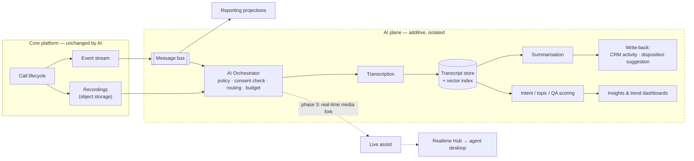
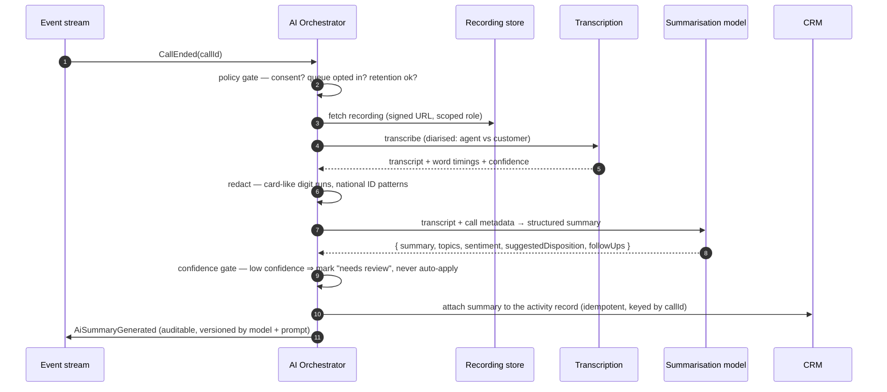

# 6. AI-Readiness Notes

> **Scope:** how the architecture leaves room for AI, and what we must decide **now** so that
> we are not blocked later. **No AI is implemented in this programme.**
>
> **The thesis:** AI readiness is not an AI feature. It is three properties of the platform —
> a **structured event stream**, **accessible media**, and a **clean extension seam**. If
> those exist, every AI feature on the roadmap becomes an additive service. If they do not,
> every AI feature becomes a platform change.

---

## 6.1 The one decision that cannot be deferred

Most AI features can be added later at their natural cost. **One cannot**, and it is a
telephony decision, not an AI decision:

> **Does our chosen CPaaS support real-time media streaming (a live audio fork of the call)
> to a websocket endpoint we control?**

| If we only get recordings | If we also get a real-time media stream |
| --- | --- |
| Post-call summaries ✅ | Post-call summaries ✅ |
| Post-call QA / scoring ✅ | Live agent assist (next-best-action) ✅ |
| Searchable transcripts ✅ | Live supervisor alerting (escalation detection) ✅ |
| Trend and intent analytics ✅ | Real-time sentiment ✅ |
| Voice bot / self-service ❌ | Voice bot / self-service ✅ |
| Live agent assist ❌ | Automatic PCI pause by detected intent ✅ |

Changing provider *after* go-live means re-doing the integration, re-testing every call flow,
and re-porting numbers — a multi-month project. **Therefore: "supports media streaming" is a
mandatory selection criterion for the CPaaS in v1, even though we will not use it in v1.**
It costs us nothing to require it and protects the entire second half of the roadmap.

This is the AI-readiness item I would escalate if it were being dropped for procurement
convenience. Everything else in this document can genuinely wait. (Stakeholder question Q36
asks which AI outcome the business wants first, precisely because a "voice bot" answer makes
this constraint urgent rather than prudent.)

---

## 6.2 The three readiness properties, and where they already exist in the design

### Property 1 — a structured, complete event stream

Every interaction already emits an ordered, immutable event sequence (FR-I1, §4.7). This is
the single most valuable AI asset we will build, and we are building it **for reporting**,
which means it pays for itself before any AI exists.

```jsonc
// Shape of what an AI pipeline consumes. Nothing here is AI-specific —
// it is the same stream that drives reporting and audit.
{
  "callId": "0f2a…",          "tenantId": "…",
  "direction": "Inbound",     "queue": "support-tier1",
  "startedAt": "2026-09-16T09:14:02Z", "endedAt": "2026-09-16T09:19:48Z",
  "participants": [ { "role": "Agent", "agentId": "…", "skills": ["billing","en"] } ],
  "ivrPath": ["main-menu", "billing"],
  "events": [
    { "seq": 1,  "type": "CallInitiated",   "at": "…", "payload": { "ani": "+44…" } },
    { "seq": 7,  "type": "CallQueued",      "at": "…", "payload": { "priority": 5 } },
    { "seq": 12, "type": "CallOffered",     "at": "…", "payload": { "agentId": "…" } },
    { "seq": 14, "type": "CallAnswered",    "at": "…" },
    { "seq": 22, "type": "HoldStarted",     "at": "…" },
    { "seq": 31, "type": "TransferCompleted","at": "…", "payload": { "toAgentId": "…" } },
    { "seq": 40, "type": "CallEnded",       "at": "…", "payload": { "reason": "CallerHangup" } },
    { "seq": 41, "type": "DispositionSet",  "at": "…", "payload": { "code": "billing-query-resolved" } }
  ],
  "recording": { "uri": "s3://…", "durationSeconds": 346, "pausedRanges": [[120,148]] },
  "externalContactId": "crm:0031x…"
}
```

**Why this matters more than it looks.** Transcription gives an AI *what was said*. This
stream gives it *what happened* — that the customer waited 4 minutes, was transferred twice,
and the agent put them on hold during the billing discussion. Models reason far better about
a call when they have both. Teams that add AI later usually discover their call metadata is
scattered across logs and cannot be reconstructed; ours is a first-class, queryable artifact
from day one because reporting demanded it.

### Property 2 — accessible, governed media

Recordings live in **our** object storage with known URIs, checksums, retention classes and
`pausedRanges` (§4.3.6). An AI pipeline needs no new storage design, no new access path, and
no new permission model — it needs a read role and a signed URL.

Crucially, the PCI `pausedRanges` are already journalled. A transcription pipeline therefore
inherits the compliance boundary automatically: **the audio we never recorded is the audio
that can never be transcribed.**

### Property 3 — a clean extension seam

AI services attach as **event-stream subscribers**. They do not sit in the call path, they
do not share a database with the call path, and they cannot make the phones stop.



Note what the dashed boundary means operationally: **if the entire AI plane is deleted, the
contact centre works exactly as before.** That is the property I want, and it is why AI is
not in the MVP.

---

## 6.3 Roadmap: three phases, in increasing order of risk

| Phase | Capability | Data needed | Latency | Why this order |
| --- | --- | --- | --- | --- |
| **AI-1** | Post-call transcription + summary, suggested disposition | Recording + event stream | Minutes (batch) | Lowest risk: offline, reviewable, no customer exposure, immediate ACW saving. If it is wrong, an agent corrects it |
| **AI-2** | Automated QA scoring, topic/intent trends, searchable transcripts | AI-1 outputs | Hours (batch) | Pure analytics on data we already produced. Expands QA coverage from ~2% of calls (human sampling) to 100% |
| **AI-3** | Real-time assist, live sentiment/escalation alerts, intent-based routing, voice self-service | **Live media stream** | < 500 ms | Highest value, highest risk. Requires §6.1, and requires AI-1/AI-2 to have built organisational trust first |

**Why strictly this order.** AI-1 has a human in the loop, a natural correction path, and a
measurable business metric (ACW seconds saved). AI-3 speaks to customers or interrupts agents
mid-call — there is no undo. Shipping AI-3 first, before anyone trusts the transcripts, is
how AI programmes get cancelled.

### AI-1 in a little more detail, because it is the one we will actually build first



Design points that matter later:

- **The orchestrator owns policy, not the model.** Consent, redaction, budget caps and
  confidence gating live in our code. Swapping models must never change compliance behaviour.
- **Every AI output is stamped with `modelId` + `promptVersion` + `generatedAt`.** When
  someone asks in 18 months "why did it say that?", we must be able to answer. This also
  makes A/B evaluation possible.
- **AI output is a *suggestion*, never an authority.** A suggested disposition is pre-filled
  and editable; the agent's submission is what counts. Reporting must be able to distinguish
  human-entered from AI-suggested values — otherwise the first AI regression silently
  corrupts a year of business metrics.
- **Structured output, not prose.** We request a schema-constrained response
  (`summary`, `topics[]`, `sentiment`, `suggestedDisposition`, `followUps[]`) so downstream
  systems parse rather than scrape.

---

## 6.4 What we build into v1 to make this possible (cost: near zero)

These are in the v1 backlog and none of them is an AI feature:

| v1 item | AI purpose it serves |
| --- | --- |
| Event stream is complete, ordered and replayable | Training/eval corpora; retroactive analysis over historical calls |
| Recording metadata includes `pausedRanges`, codec, sample rate, channel layout | STT needs stereo/diarised audio; a mono mixdown materially hurts diarisation accuracy. **Requesting dual-channel recording from the provider is a v1 configuration decision** |
| `AiProcessingConsent` flag on queue + contact | The consent gate must exist before there is anything to gate |
| Recording retention classes | An AI pipeline must not resurrect audio past its retention date |
| Stable `CallId` correlation across all legs and systems | Joining transcript ↔ CDR ↔ CRM activity without fuzzy matching |
| Disposition taxonomy defined and versioned | The label set for classification; without it, "suggest a disposition" has no target space |
| Outbox + bus already in place | AI services subscribe with no producer changes |
| `external_contact_id` only (no PII copies) | Keeps our AI data surface minimal by construction |

Total additional v1 effort: **roughly two days**, mostly configuration and one flag. That is
the entire cost of AI readiness. Retrofitting the same properties after go-live would be
weeks, plus a data backfill that is simply impossible for calls already recorded in mono.

---

## 6.5 Model and vendor strategy

I would **not** pick a model now — capability and price move faster than our build schedule,
and the decision is reversible if we design for it. What I would fix now is the *seam*:

```csharp
// The AI plane gets the same treatment as telephony: a port, not a dependency.
public interface ITranscriptionProvider
{
    Task<Transcript> TranscribeAsync(RecordingRef recording, TranscriptionOptions o, CancellationToken ct);
}

public interface ICallAnalysisProvider
{
    Task<CallAnalysis> AnalyseAsync(Transcript t, CallContext ctx, CancellationToken ct);
}
```

**Selection criteria, in priority order:**

1. **Data-processing terms** — no training on our data; a signed DPA; deletion guarantees.
   *This is a veto criterion, and it is Legal's call, not engineering's (Q37).*
2. **Region / residency** — inference must run in an approved region (NFR-SEC7).
3. **Quality on our audio** — accented, noisy, domain-specific speech. Evaluate on *our*
   recordings, never on vendor benchmarks.
4. **Structured-output support** — schema-constrained responses, so we parse instead of
   scrape.
5. **Cost at our volume** — see below.
6. **Latency** — irrelevant for AI-1/AI-2 (batch), decisive for AI-3.

### Indicative cost, so the business can plan

A worked example for **AI-1 at 500 agents** (~6,000 calls/day, ~5 min average). Transcription
is priced per audio-minute and varies widely by vendor; the summarisation step is the part I
can size precisely. A 5-minute diarised transcript plus call metadata is roughly **1,500
input tokens**, producing a **~400-token** structured summary.

Deliberately quoted by **capability tier rather than by product name** — vendors and prices
move faster than this programme will, and naming one here would date the document and imply a
procurement decision we have not made. Rates below are representative of published list
pricing at the time of writing; substitute real quotes during selection.

| Tier | Input $/1M tokens | Output $/1M tokens | Cost / 1,000 calls | Cost / month (180k calls) |
| --- | --- | --- | --- | --- |
| Small / fast | ~$1 | ~$5 | ~$3.50 | ~$630 |
| Mid-tier | ~$2–3 | ~$10–15 | ~$7 | ~$1,260 |
| Frontier | ~$5 | ~$25 | ~$17.50 | ~$3,150 |

Two levers cut that materially, and both suit this workload exactly:

- **Batch processing** — post-call summarisation is not latency-sensitive, and every major
  provider offers an asynchronous batch mode at roughly **half of list price**. That alone
  halves the figures above.
- **Prompt caching** — the instructions, disposition taxonomy and output schema are identical
  on every call; only the transcript varies. Most providers bill a cached prefix at a large
  discount, so structure the request with the stable part first and the transcript last.

**My recommendation:** evaluate the mid-tier model first on a sample of real calls, and only
move up a tier if measured quality on *our* audio justifies it. Start with a proper eval set
(100–200 human-labelled calls) before choosing — vendor benchmarks will not tell us how a
model handles our accents, our product names, or a customer talking over an agent. The
transcription step, not the summarisation step, is where quality is usually won or lost.

For a **real-time** feature (AI-3) the economics are completely different — cost is per
streamed audio-minute for the whole call, not per summary — which is another reason to prove
value in batch first.

---

## 6.6 Governance and the things that go wrong

I have seen more AI contact-centre projects fail on governance than on model quality.
These controls are designed in from the start:

| Concern | Control |
| --- | --- |
| **Consent** | AI processing is gated per queue and per contact. If a customer did not consent to recording, there is no recording, therefore no transcript. The gate is enforced in the orchestrator, not in a prompt |
| **PII leakage** | Redaction runs **between** transcription and analysis: card-like digit runs, national ID patterns, and (where required) names. Redaction is a pipeline stage we own |
| **Right to erasure** | `SubjectErasureRequested` already fans out to recordings — it extends to transcripts, embeddings and vector indexes. Vector indexes are the part teams forget; ours is in scope from the design (FR-G6) |
| **Hallucinated summaries in the CRM** | Summaries are stored in a clearly AI-labelled field, versioned by model, and never overwrite agent-entered notes. Low-confidence outputs are flagged "needs review", not auto-applied |
| **Silent quality drift** | A standing eval set of human-labelled calls, re-run on every model or prompt change. Without this, a model update degrades output and nobody notices for a quarter |
| **Bias in automated QA scoring** | Scores are **advisory input to a human reviewer**, never an automated performance action against an agent. This is an HR and ethics line, and I would put it in writing before AI-2 ships |
| **Cost runaway** | Per-day token budget and per-call cost ceiling in the orchestrator, with alerting. An AI pipeline that retries on failure can produce a surprising bill |
| **Over-trust** | AI-suggested values are visually distinct in the UI, and reporting separates AI-suggested from human-confirmed values so we can measure acceptance rate rather than assume it |

### The metric I would insist on before scaling any AI feature

> **Acceptance rate**: the percentage of AI suggestions an agent accepts unedited.

If agents accept 85% of suggested dispositions, the feature is working. If they accept 30%,
we have built a productivity *tax*, not a productivity tool — and we should find that out on
one pilot team, not across 500 agents. This metric is measurable precisely because the event
stream records both the suggestion and the final human value.

---

## 6.7 Summary

| Question | Answer |
| --- | --- |
| Is AI built in this programme? | **No.** Explicitly out of scope (§1.10) |
| What does v1 do for AI? | Complete event stream · owned, well-described recordings · consent flag · dual-channel audio · stable correlation IDs · bus for subscribers · versioned disposition taxonomy |
| What does that cost in v1? | ~2 days, mostly configuration |
| What is the one thing we must not get wrong now? | **Choose a CPaaS that supports real-time media streaming** (§6.1) |
| What does adding AI later require of the core platform? | **Nothing.** AI services subscribe to events and read recordings. Deleting the AI plane leaves the contact centre fully functional |
| What is the first AI feature? | Post-call transcription + summary + suggested disposition, in batch, measured by ACW seconds saved and suggestion acceptance rate |

---

**Previous:** [← Scalability Plan](05-scalability-plan.md) ·
**Next:** [Deployment Strategy →](07-deployment-strategy.md)
