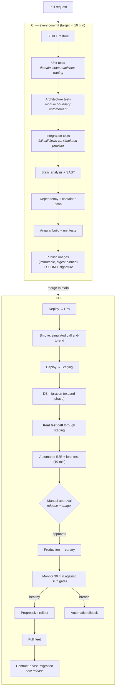
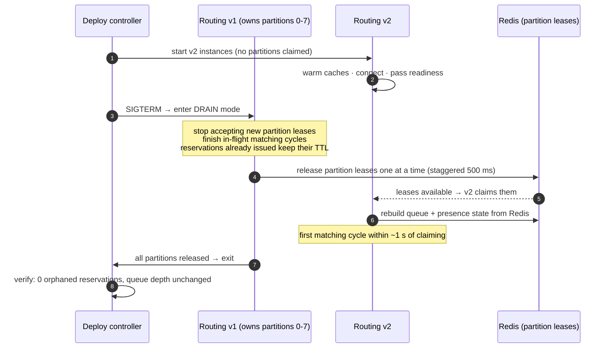
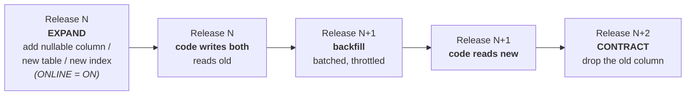
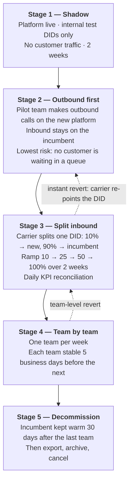

# 7. Deployment Strategy

> **The constraint that makes this different from a normal web app:** at any moment,
> hundreds of people are mid-conversation with customers. There is no "retry the request."
> A deployment that drops a call drops a customer.
>
> **Corollary:** the interesting part of this document is not the pipeline. It is
> **drain, canary, rollback, and the fact that half our production configuration lives at a
> carrier we do not control.**

---

## 7.1 Environments

| Environment | Purpose | Telephony | Data | Who deploys | Refresh |
| --- | --- | --- | --- | --- | --- |
| **Local** | Development | **Simulated provider** | Docker Compose: SQL Server, Redis, seeded config | Developer | On demand |
| **CI (ephemeral)** | Automated tests per PR | Simulated provider | Fresh containers per run, destroyed after | Pipeline | Per commit |
| **Dev (shared)** | Integration, feature demos | Provider **sandbox** + 2 test DIDs | Synthetic data | Auto on merge to `main` | Nightly reset |
| **Staging** | Production rehearsal | Provider **production** account, dedicated test DIDs | Anonymised production-shaped data, production-sized | Auto after dev gate | Weekly refresh |
| **Production** | Live | Provider production, real DIDs | Live | Manual approval | — |
| **DR** | Recovery target | Pre-registered failover route | Continuous replication | Automated drill quarterly | — |

**Staging must be a real rehearsal, not a smaller copy.** It runs the same topology
(partitioned routing, Redis HA, ≥ 2 instances per tier) and real telephony. The most common
cause of a production-only failure in this domain is a difference in telephony
configuration — provider webhook URLs, recording settings, codec negotiation — none of which
a simulated provider will ever catch. **Every release places a real test call in staging
before it is allowed near production.**

**The simulated provider is the reason this is affordable.** Without it, every CI run would
cost carrier minutes and every developer would need a phone number. With it, a full inbound
routing regression suite runs in seconds, for free, deterministically — including scenarios
that are almost impossible to reproduce with real calls (caller abandons at exactly the
moment of reservation, agent RNA under load, provider webhook arriving twice).

---

## 7.2 Pipeline

**Principles**

- **One artifact, promoted, never rebuilt.** The image tested in staging is byte-identical
  to the one in production; only configuration differs. Images are digest-pinned, signed, and
  accompanied by an SBOM.
- **Configuration is versioned separately** from code and applied declaratively, so a config
  change can roll back without a code deploy (and vice versa).
- **Trunk-based with short-lived branches.** Long-lived branches in a system with a shared
  event schema produce painful merge conflicts in exactly the files where a mistake is
  expensive.
- **Feature flags for anything user-visible**, so deploy ≠ release. A risky routing change
  ships dark and is enabled for one team first.

---

## 7.3 Deploying each tier — they are not the same

This is the heart of the strategy. A single "rolling update" policy across all tiers would be
wrong for three of the five.

| Tier | Strategy | Why |
| --- | --- | --- |
| **API (stateless)** | Rolling, surge +1, readiness-gated | No session affinity; standard and safe |
| **Realtime Hub** | Rolling, **slow** (1 pod at a time, 60 s soak) | Every restart forces reconnects. Reconnection is designed to reconcile (§4.3.3), but reconnecting 500 clients at once is a thundering herd — clients use jittered backoff, and we cycle slowly |
| **Routing Engine** | **Drain → handover → replace** (see below) | Stateful. Partition ownership must transfer deliberately, not be dropped |
| **Workers** | Rolling; graceful stop after in-flight message completes | Idempotent consumers; at-least-once delivery makes this safe |
| **Angular frontend** | Atomic swap behind CDN, versioned assets, **client update prompt** | An agent mid-call must not be force-refreshed. New version banner: "Update available — will apply after your next call" |

### The Routing Engine deployment dance

What makes this safe:

- **Connected calls are never affected.** Media is carrier-side; a connected call does not
  depend on the routing engine at all (NFR-A5). This is the single biggest benefit of the
  §1.1 build-vs-buy decision, and it is why deployments here are far less frightening than
  they would be with self-hosted media.
- **Reservations survive**, because they live in Redis with a TTL, not in process memory.
  A reservation issued by v1 is validated by v2 without either instance knowing.
- **Staggered lease release** avoids a mass re-claim spike.
- **Queue order is preserved**, because the queue is a Redis sorted set, not in-process state.

The post-deploy verification is explicit and automated: zero orphaned reservations, queue
depth unchanged across the transition, and no agent left in `Reserved` without a matching
call. If any assertion fails, the deploy halts and rolls back.

---

## 7.4 Database migrations — expand/contract, always

A voice platform cannot take a maintenance window for a schema change, and during a canary,
**two code versions run against one database**. Therefore every migration is
backwards-compatible by construction:

Hard rules, enforced by a CI migration linter:

| Rule | Reason |
| --- | --- |
| Never rename or drop a column in the same release that stops using it | The canary's old pods still read it |
| Never add a `NOT NULL` column without a default | Blocks writes on a large table |
| All index creation uses `WITH (ONLINE = ON)` | A plain `CREATE INDEX` takes a schema-modification lock on `CallEvents` — on a table that size, that is an outage |
| Backfills are batched, throttled and resumable | A single `UPDATE` over a partitioned call table will lock the call path |
| Every migration has a tested `down` path, or is proven forward-only-safe | Rollback must not be the first time we consider it |
| Migrations run as a separate pipeline step, not on app start-up | Ten pods racing to migrate is a classic self-inflicted outage |

**Event schema versioning** follows the same discipline: events are additive only. A consumer
must tolerate unknown fields, and no consumer may depend on field removal. The event stream
is replayed for projections and (later) AI — breaking its schema breaks history, not just the
next release.

---

## 7.5 Canary and progressive rollout

Percentage-based traffic splitting is the wrong model here: an agent is a *session*, not a
request. We canary by **agent cohort**.

| Stage | Population | Duration | Gate |
| --- | --- | --- | --- |
| **0 — Internal** | Engineering test agents + automated smoke call | 10 min | Smoke call completes end-to-end |
| **1 — Canary** | 1 team (~10 agents), chosen with the Ops lead | 30 min | All SLO gates green |
| **2 — Expand** | 25% of agents | 2 h | All SLO gates green |
| **3 — Majority** | 75% | 2 h | All SLO gates green |
| **4 — Full** | 100% | — | Watch for one full business day |

### Automated rollback gates

Evaluated continuously during canary; **any breach triggers an automatic rollback** — no
human deliberation, because the cost of a false rollback is minutes and the cost of a slow
rollback is customer calls.

| Signal | Threshold |
| --- | --- |
| Call setup failure rate | > 0.5% (baseline ≈ 0.05%) |
| p95 offer latency (NFR-P1) | > 1.5 s for 5 consecutive minutes |
| Agent WebSocket disconnect rate | > 3× baseline |
| Unhandled exception rate | > 2× baseline |
| Orphaned reservations | > 0 |
| Abandon rate on canary queues | > 1.5× the non-canary control group |
| Webhook processing errors | > 0.1% |

The abandon-rate comparison against a **control group** is the one that catches subtle harm.
A change that degrades routing fairness or adds 400 ms of offer latency will not throw
exceptions — it will show up as more customers hanging up, and only a side-by-side comparison
makes that visible within an hour rather than a week.

### The smoke call

Every deployment to every environment ends with an automated end-to-end call:

1. Place a real call from a test number to a test DID.
2. Assert: IVR answers → call enqueues → test agent is offered → auto-answer → audio
   verified (a DTMF tone is sent and detected on the far end) → hang up.
3. Assert: CDR written, event stream complete, recording present, CRM activity created.

This takes ~40 seconds and costs a few cents. It has caught, in my experience, the class of
failure that no unit test ever catches: a provider webhook URL left pointing at the previous
environment.

---

## 7.6 Rollback

| Scenario | Action | Target time |
| --- | --- | --- |
| Bad code, no schema change | Re-point to the previous image digest; cohorts revert in reverse order | **< 3 min** |
| Bad code, expand-phase schema change | Roll back code only; the schema is backwards-compatible by design | < 5 min |
| Bad configuration (queue/routing rule) | Revert the config version — no deployment needed | < 1 min |
| Bad feature flag | Kill the flag | **< 10 s** |
| Bad carrier configuration | Revert the carrier config from version control (§7.7) | < 5 min |
| Data corruption | Restore from PITR to a parallel instance, reconcile, then cut over | < 60 min (RTO) |

**Rollback drills happen monthly in staging**, under simulated load, and are timed. An
untested rollback is a hope, not a control — and the moment you need it is the moment you
find out. We also practise the awkward one: rolling back *during* a canary, with two versions
live and calls in flight.

---

## 7.7 The part everyone forgets: carrier configuration

Roughly half of what makes production work is **not in our cluster**: DID routing, webhook
URLs, recording settings, codec preferences, concurrency caps, failover routes, caller-ID
verification. Treating that as click-ops is how a Friday afternoon becomes an incident.

| Practice | Detail |
| --- | --- |
| **Carrier config as code** | Provider resources defined in Terraform (or the provider's API via a versioned script), reviewed in PRs, applied by the pipeline |
| **Environment isolation** | Separate sub-accounts per environment. It must be *impossible* for staging to answer a production call |
| **Webhook URL indirection** | Carriers point at a stable gateway hostname, never at an environment-specific URL. Swapping the target is a routing change on our side, not a carrier change |
| **Drift detection** | A nightly job diffs live carrier configuration against the committed definition and alerts on any manual change |
| **Number inventory in source control** | Which DID maps to which entry point, with an owner. This document is also the cutover plan |

---

## 7.8 Cutover from the incumbent

The riskiest day of the programme. The strategy is to make it **boring, gradual and
reversible** (Q34).

**Why outbound first (Stage 2).** An outbound call that fails is an agent pressing redial. An
inbound call that fails is a customer in a queue hearing silence. Starting with the direction
where failure is recoverable buys us a week of real-world learning at almost no customer risk
— and it is exactly why outbound is in the MVP (§3.1).

**The revert path is always one carrier change.** At every stage, "point the DID back at the
incumbent" is a single configuration change with a < 5 minute effect. That is what makes this
plan safe enough to run during business hours. We rehearse the revert in staging before
Stage 3, so nobody is executing it for the first time under pressure.

**Parallel run and reconciliation.** During Stage 3 both platforms report on the same DID.
Daily, we reconcile call counts, SL, AHT and abandon rate between the two. Discrepancies are
investigated *before* ramping. This is the antidote to R-13 — the trust problem — and it
cannot be done after the incumbent is switched off, which is why the window is protected in
the plan rather than treated as contingency.

---

## 7.9 Backup & disaster recovery

| Asset | Method | RPO | RTO | Retention | Verified by |
| --- | --- | --- | --- | --- | --- |
| **SQL Server (calls, config, events)** | Full nightly + differential, with **transaction log backups every minute** for point-in-time restore; cross-region copy | **1 min** | 30 min | 35 days PITR, 12 months monthly fulls | **Weekly automated restore drill** into a scratch instance with a row-count + checksum assertion |
| **Recordings (object storage)** | Versioning + object-lock (WORM) + cross-region replication | ~15 min | Immediate (replica is readable) | Per retention class (§4.3.6) | Monthly sample restore + playback check |
| **Redis** | Not backed up — **by design** | n/a | Rebuilt in < 60 s | — | Chaos test: flush Redis, verify presence rebuilds from agent re-registration |
| **Platform configuration** | Git (IaC + app config + carrier config) | 0 | Minutes | Full history | Quarterly rebuild-from-scratch drill |
| **Secrets** | Managed vault with soft-delete + purge protection | 0 | Minutes | Versioned | Quarterly restore drill |
| **Audit log** | Append-only, separate store, WORM | 1 min | 1 h | ≥ 2 years | Quarterly integrity verification |

> **Redis is deliberately not backed up.** It holds only derived, rebuildable state. Backing
> it up would create a tempting path to restoring *stale* presence data, which is worse than
> having none — a restored "Available" agent who went home an hour ago silently swallows
> calls. Rebuild-from-truth is the correct recovery.

### DR scenarios

| Scenario | Response | Target |
| --- | --- | --- |
| Single instance/pod fails | Orchestrator replaces it; no human involvement | Seconds |
| Availability zone fails | Multi-AZ; traffic shifts automatically | < 2 min, no call loss |
| SQL Server primary fails | Always On availability group failover; events buffer in the bus and replay | 30–60 s |
| Redis primary fails | HA failover; reservations may be lost for one cycle and are re-offered | < 30 s |
| **Region fails** | Promote DR region; re-point carrier webhooks (pre-registered failover route); DNS cutover | **RTO 15 min, RPO 1 min** |
| **CPaaS outage** | Secondary carrier route for critical DIDs (phase 2); agent banner; queued calls get fallback treatment | Partial service |
| Ransomware / destructive action | Object-lock prevents recording tampering; PITR restores the database; IaC rebuilds the platform | < 4 h |

**The quarterly DR drill is a real failover, not a tabletop.** We fail over to the DR region,
place real test calls, and measure. A DR plan that has never been executed is documentation,
not a capability — and the item that always breaks on the first real drill is carrier webhook
re-pointing, which is precisely why it is rehearsed.

---

## 7.10 Release cadence and operational rules

| Aspect | Policy |
| --- | --- |
| **Cadence** | Weekly scheduled release; hotfixes any time via the same pipeline (never a manual path — an unrehearsed process under pressure is how outages compound) |
| **Window** | Outside peak hours. **Not** because we cannot deploy safely during peak, but because if something subtle goes wrong, fewer customers are affected while we detect it (Q33) |
| **Freeze periods** | Peak business days (known seasonal spikes), and the 48 h around each cutover stage |
| **Approval** | Automated gates decide; a human release manager confirms. Any change to routing, telephony or compliance behaviour also needs the Ops lead's sign-off |
| **On-call** | The deploying team is on call for 24 h after their release — the strongest incentive for careful change |
| **Post-deploy** | 30-minute active watch on the release dashboard; automated summary posted to the ops channel |
| **Definition of Done** | Feature-flagged · migration is expand-safe · runbook entry written · dashboard panel + alert added · rollback tested in staging |

### Observability that must exist before the first production deploy

| Layer | What we watch |
| --- | --- |
| **Business SLOs** | Offer latency, answer rate, abandon rate, service level, agents-available vs calls-waiting |
| **Application** | Error rates, queue depths, reservation success/timeout ratio, webhook lag, outbox backlog |
| **Infrastructure** | CPU/memory, connection counts, Redis latency, DB replication lag |
| **External** | CPaaS API latency and error rate, CRM latency and circuit-breaker state |
| **Traces** | Every call traced end-to-end by `CallId` across gateway → routing → hub → CRM |

Alerting is on **symptoms, not causes**: "calls are waiting while agents are available" is an
alert; "CPU is 70%" is a dashboard. The first tells us customers are affected; the second
tells us nothing actionable on its own. Every alert has a runbook link, and an alert without
one is treated as a bug in the alert.

---

## 7.11 Summary

| Question | Answer |
| --- | --- |
| How does code reach production? | One immutable artifact, promoted dev → staging → canary → fleet, gated by automated SLO checks and one human approval |
| How do we deploy without dropping calls? | Media is carrier-side, so connected calls are unaffected. Routing drains and hands over partitions; hubs cycle slowly; the frontend never force-refreshes an agent mid-call |
| How do we roll back? | Image digest revert in < 3 min; feature flag in < 10 s; config revert in < 1 min; carrier revert in < 5 min. Drilled monthly |
| How do we know it worked? | An automated real test call, plus continuous SLO gates with a canary-vs-control abandon-rate comparison |
| How do we not lose data? | PITR with a 1-minute RPO, weekly *verified* restores, WORM recordings with cross-region replication |
| How do we survive losing a region? | Quarterly-rehearsed failover with pre-registered carrier routes; RTO 15 min |
| What is the riskiest moment, and how is it handled? | Cutover. Handled by going outbound-first, splitting inbound traffic gradually at the carrier, reconciling KPIs daily, and keeping a one-change revert path at every stage |

---

**Previous:** [← AI-Readiness Notes](06-ai-readiness.md) ·
**Back to:** [Index](README.md)
