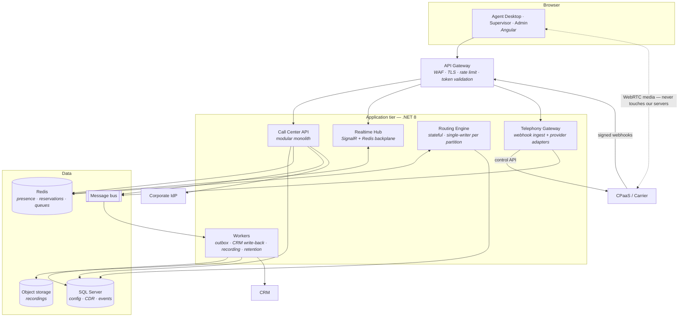
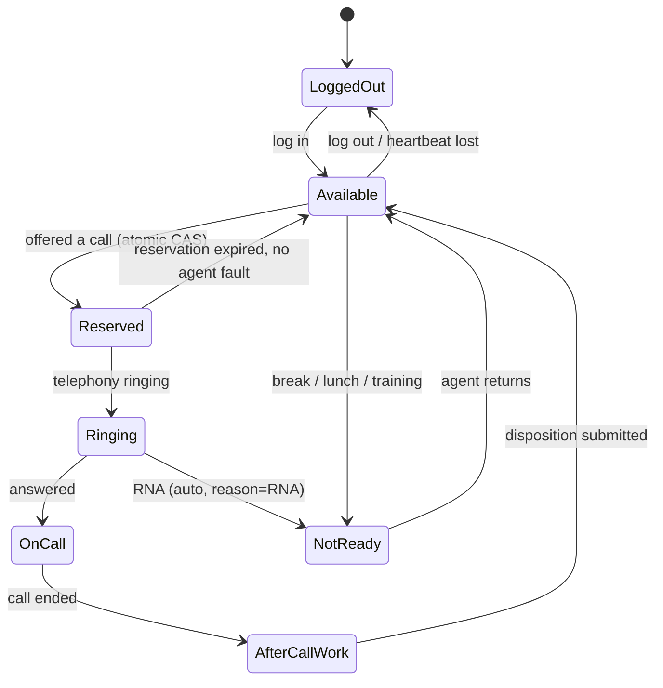
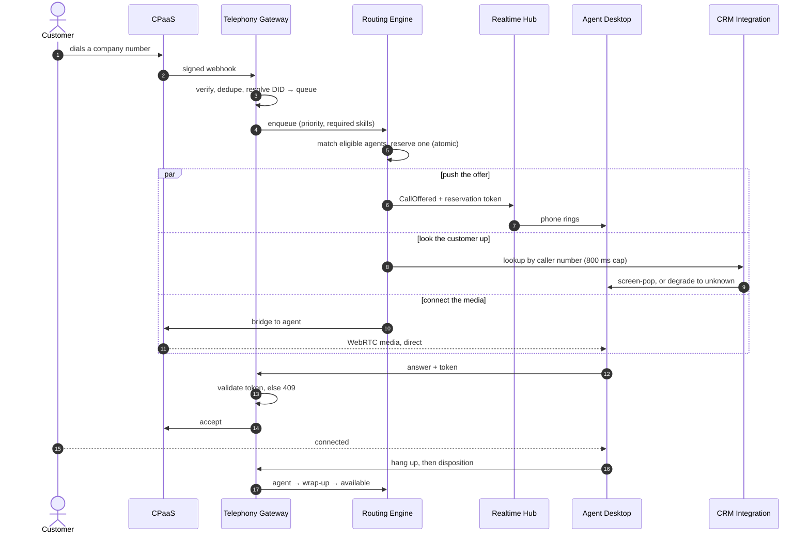
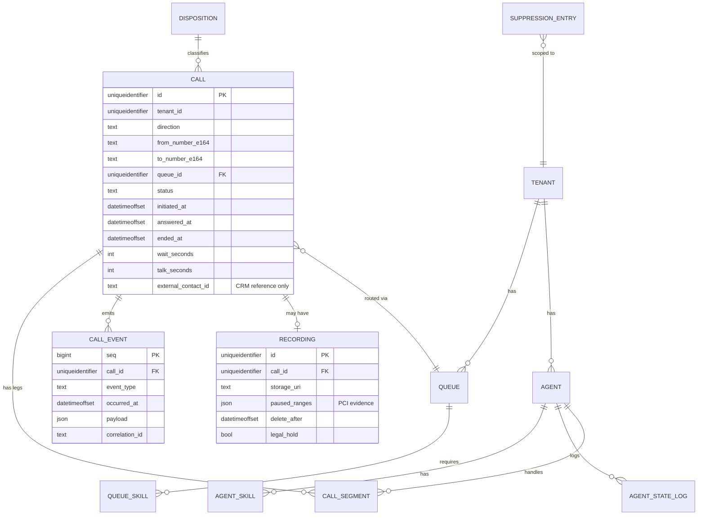
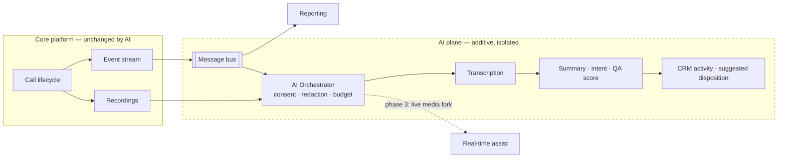
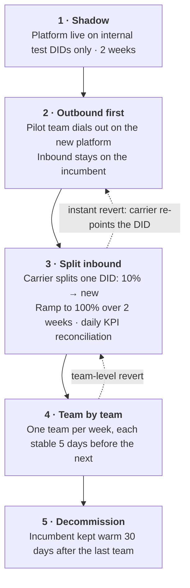

> **Brief:** replace a third-party call center tool with our own inbound + outbound platform.
> CRM-integrated. 50 agents today, 500+ later. AI-ready eventually. .NET Core + Angular.
>
> **This document** covers requirements, the questions I would ask, MVP scope, architecture,
> scalability, AI-readiness and delivery. Items marked **[A]** are assumptions I made to keep
> moving; each maps to a question in §2. Fuller working notes and a running .NET prototype
> accompany this document.

---

## 1. Requirement analysis

### 1.1 What we are actually building

We are building a **contact routing and agent-productivity system** — not a telephony system.
That distinction drives almost everything else.

| We build | We buy / rent |
| --- | --- |
| Routing engine: queues, skills, priorities, reservations | Carrier interconnect, SIP trunks, PSTN termination |
| Agent state machine and presence | Media path, codecs, echo cancellation, WebRTC gateway |
| Agent desktop, supervisor tooling, reporting | Number provisioning, porting, emergency-services routing |
| CRM integration, screen-pop, dispositions | Media capture for recording |
| Recording lifecycle, retention, redaction policy | Speech-to-text engine (future) |

**Why.** Carrier-grade media handling is a multi-year problem with a regulatory surface
(emergency calling, lawful intercept, number portability) that has nothing to do with our
business. "Build our own platform" means *we own the logic and the data*. It does not mean we
terminate SIP on our own metal in year one. §5.4 states exactly when that calculus changes.

The consequence that matters: **signalling flows through us, media does not.** That is why 500
agents is a capacity-planning exercise rather than a re-architecture, and why a backend
deployment cannot drop a live call.

### 1.2 Business goals

| Goal | Success measure |
| --- | --- |
| Eliminate third-party licence cost | Cost per agent per month ≤ 60% of current tool by end of year 1 |
| Own the customer-interaction data | 100% of call events and recordings in our own store, queryable within 5 min |
| Remove CRM ↔ phone friction | Screen-pop on ≥ 95% of identified inbound calls in < 2 s; after-call work down 20% |
| Scale 50 → 500+ without re-platforming | 10× headroom with no component rewrite (§5) |
| Be AI-**ready**, not AI-first | Every call emits a structured event stream an AI pipeline can consume with zero core changes |
| Real service-level visibility | Live wallboard < 2 s stale; standard KPIs available historically |

> **Caution.** Replacing a per-seat licence with a per-minute carrier bill, cloud infrastructure
> and 2–3 engineers of permanent ownership is **not automatically cheaper**. If the real driver
> is control and data ownership rather than cost, the MVP scope changes. See Q1.

### 1.3 Stakeholders

**Agents** need a phone that never drops and one screen. **Supervisors** need live queue and
agent state, and the ability to intervene. **Ops** need to change routing without a deployment.
**Compliance** needs recording consent, PCI and an audit trail. **Finance** owns the carrier
contract and cares about per-minute cost and toll fraud. **Engineering** needs a scope that does
not grow an IVR designer in week 9.

### 1.4 Functional requirements

Grouped; **M** = MVP, **2** = phase 2, **3** = later.

| Area | Requirements | Pri |
| --- | --- | --- |
| **Identity & config** | SSO (OIDC) **[A]**; roles Agent/Supervisor/Ops-Admin/Admin enforced server-side; agent profiles with skills + proficiency; **Ops can edit queues, skills, routing rules, hours and wrap-up codes without a deployment**; full config audit trail | M |
| **Agent state** | Server-authoritative state machine; Not-Ready reason codes; state visible to supervisors < 2 s; **heartbeat with zombie detection**; one session per agent | M |
| **Inbound** | DID → entry point → queue; minimal IVR (greeting, single menu, business hours, holidays); queue with position and announcements; **skills-based routing**; priority queues; **reservation protocol — one agent, one offer, with timeout**; ring-no-answer re-queue; abandon tracking. *Later: overflow, queue callback, last-agent routing (2); multi-level IVR designer (3)* | M |
| **Outbound** | Click-to-call and dial pad; E.164 normalisation; caller ID per team; **do-not-call gate before every attempt**; same agent state as inbound; disposition capture. *Later: preview dialler (2); predictive dialler (3)* | M |
| **Call control** | Answer, hang up, mute, hold; blind transfer; warm (consult) transfer; DTMF send. *Later: conference, supervisor listen / whisper / barge (2)* | M |
| **CRM** | Reverse lookup by caller number → screen-pop < 2 s; unknown-number and ambiguous-match handling; activity write-back on completion; **CRM downtime must not stop calls**. *Later: CRM-driven routing attributes (2)* | M |
| **Recording & compliance** | Policy-driven recording per queue; recording announcement; **manual pause/resume for card capture (PCI)**; encrypted storage with retention; role-restricted, audited playback. *Later: right-to-erasure across recordings and transcripts (2)* | M |
| **Supervisor & reporting** | Live wallboard (waiting, longest wait, service level, agent states); force state change / logout; interval reports, CDR search, CSV export; **agreed written KPI definitions**. *Later: scheduled reports, BI connector, quality scorecards (2–3)* | M |
| **Platform** | Immutable ordered event stream per interaction; health, structured logs correlated by `CallId`, metrics, tracing; **degraded mode — routing down means fallback treatment, never silence** | M |

### 1.5 Non-functional requirements

These are what constrain the architecture. "Fast" and "scalable" are not requirements; numbers are.

| | Target | Why this number |
| --- | --- | --- |
| Call arrival → agent's phone rings | p95 < 1 s, p99 < 2 s | Past ~2 s the caller hears dead air |
| Screen-pop rendered | p95 < 2 s | Must beat the agent saying "hello" |
| State change → supervisor view | p95 < 2 s | Floor management is useless when stale |
| Desktop actions (answer/hold/transfer) | p95 < 300 ms | Perceived as instant |
| Availability in business hours | 99.9% v1, 99.95% at 500 agents | — |
| RTO / RPO (call records) | 15 min / 1 min | A lost CDR is a lost compliance artifact |
| In-progress call survives a rolling deploy | Mandatory | Media is carrier-side; signalling reconciles on reconnect |
| Capacity **[A]** | 60 agents / 50 concurrent calls at v1; design headroom 750 / 600 | Derived from 500 agents × 6 calls/hr × 5 min AHT |

**Security.** TLS 1.2+ and SRTP everywhere; OIDC + MFA for supervisors and admins; authorisation
enforced at the API *and* in routing (an agent cannot answer a call they were not offered);
PII and recordings encrypted at rest; append-only audit log for config changes, recording access
and exports; PCI achieved by pause-recording plus never logging DTMF; signature-verified,
replay-protected carrier webhooks; per-agent spend caps and destination allow-lists against toll
fraud.

**Operability.** Telephony behind a port/adapter boundary; Ops-configurable behaviour without a
release; ≥ 70% unit coverage on routing and state machines; **every call reconstructible from its
event stream**; a one-command local environment with a simulated telephony provider.

### 1.6 Assumptions and risks

Assumptions **[A]**: CPaaS provides media and PSTN in v1 · agents use WebRTC-capable browsers on
reliable networks · one CRM with a documented REST API and indexed phone numbers · one country
and language · corporate IdP supports OIDC · our DIDs are portable (4–8 weeks) · outbound is
agent-initiated · incumbent history need not migrate.

Top risks, scored likelihood × impact:

| Risk | Score | Mitigation |
| --- | :-: | --- |
| **Number porting delays go-live** | 16 | Start porting discovery in week 1, in parallel. Pilot on new numbers with carrier forwarding so software is never blocked by telecom paperwork |
| **Agent network quality causes poor audio** — and we get blamed | 16 | Pre-deployment network assessment; per-call WebRTC telemetry (MOS, jitter, loss) so we can prove where the fault lies; mandated headsets |
| **Build-vs-buy economics turn negative** | 15 | 3-year TCO model in week 1 against real volumes, with agreed kill-criteria, before production code |
| **A bad deploy stops calls routing** | 15 | Canary by agent cohort, automated smoke call, instant rollback, drain-before-deploy (§7.3) |
| **Compliance breach** — a call to a suppressed number, or a card number in a recording | 15 | Both are hard gates in the call path, not reports: DNC blocks before dialling, PCI pause is journalled. Predictive dialling excluded from MVP |
| **Scope creep** (IVR designer, WFM, omnichannel) | 15 | Signed MVP scope with an explicit out-of-scope list |
| **CRM integration harder than advertised** | 12 | Spike the API in week 1; anti-corruption layer with cache so CRM latency never blocks a call |
| **Reporting disagrees with the old tool** | 12 | Agree KPI formulas in writing up front; parallel-run and reconcile before decommissioning |

### 1.7 Out of scope

Omnichannel (chat/email/SMS) · workforce management · quality scorecards · our own SIP/media
stack · predictive dialling · CRM modification · **AI feature implementation** · mobile app ·
multi-tenancy as a product (schema readiness only) · replacing the corporate phone system.

---

## 2. The questions I would ask

Each states what changes depending on the answer. A question whose answer changes nothing is not
worth a stakeholder's time.

| # | Question | What changes |
| --- | --- | --- |
| **Q1** | Is the driver **cost**, **control/data ownership**, or **specific missing features**? What are we paying today? | Cost → thin layer over CPaaS. Control → own the data model even at higher cost. Features → name the three and check they cannot be bought. It may show we should not build this at all |
| **Q2** | Do we have existing carrier relationships or SIP trunks? Is self-hosting media in or out? | **The architectural fork.** CPaaS → 4–6 months to pilot. Self-hosted SBC → 12+ months and specialist hires |
| **Q3** | Real call volumes: per day, busy-hour peak, average handle time, inbound:outbound ratio? | Every capacity and cost number is currently invented. Peak-to-average drives autoscaling more than totals do |
| **Q4** | Which CRM, which version? Can I have sandbox credentials this week? | Salesforce, Dynamics and a homegrown app are three different projects — 4–8 weeks of estimate variance |
| **Q5** | Can the CRM be searched by phone number in < 300 ms? Is the field indexed and normalised? What are the rate limits? | If not, a 2-second screen-pop needs a locally synced number → contact read-model. That is 3–4 weeks of extra work |
| **Q6** | Which jurisdictions do we call? What is the law on recording consent in each? | Determines whether announcements are mandatory and whether recording can be default-on |
| **Q7** | Do agents take **card payments** by phone? | Decides whether PCI-DSS is in scope, which affects recording, logging and audit |
| **Q8** | Which DIDs are in use, who owns them, and can they be ported? | Usually the critical path to go-live, and entirely outside engineering's control |
| **Q9** | Where do agents sit, and on what network? Is a browser softphone acceptable, or are desk phones mandated? | Hardphone support is a different and much harder integration |
| **Q10** | How are calls routed **today**? Can I see the incumbent's configuration, and who owns changing it? | It is the de-facto spec, written by the people who live with it. It also tells us whether Ops can self-serve, or engineering becomes a permanent ticket queue |
| **Q11** | When several agents are eligible, who gets the call — longest idle, highest skill, fewest calls today? And what happens on ring-no-answer? | Business policy disguised as an algorithm. Getting it wrong is visibly unfair, and a weak RNA rule lets one distracted agent silently degrade a queue |
| **Q12** | What is the Service Level target, and precisely how is it calculated? | Reporting mismatches destroy trust faster than bugs. "80/20" means different things in different tools |
| **Q13** | How do we cut over — big bang, by team, or by queue? Is a parallel run acceptable? | A big-bang voice cutover is the most dangerous thing we could do here |
| **Q14** | For AI, what is the *first* business outcome — shorter wrap-up, quality coverage, deflection, or better routing? | Decides whether we need **real-time media streaming**, which constrains the carrier we choose now (§6.1) |

**If I could ask only three:** Q2 (the architectural fork), Q4+Q5 (the largest estimate variance
and the headline UX promise), Q3 (everything is sized on invented numbers until then).

---

## 3. MVP definition

> **Thesis: one team, both directions, fully instrumented.** One real team (~10–15 agents, one or
> two queues) moves their inbound *and* outbound calls onto our platform, and we prove five
> things: a customer reaches the right available agent fast; the agent sees who is calling before
> saying hello; the agent can control the call; an agent can call out with DNC protection; and
> everything that happened is recorded, reportable and reconcilable against the old tool.

**Why not inbound-only.** Outbound shares ~85% of the machinery — same state machine, same
lifecycle, same write-back, same reporting. The genuinely new work is the dial call, E.164
normalisation and the DNC gate: about a week. A pilot team that still needs the old tool for
outbound runs two softphones, which guarantees bad feedback and a failed adoption story.

### 3.1 In and out

**In v1:** telephony integration with **two** provider adapters (one real, one simulated) ·
browser softphone · SSO and roles · **admin portal** · agent state machine with heartbeat ·
minimal IVR · skills routing with priority and the reservation protocol · RNA handling · abandon
tracking · click-to-call with the DNC gate · answer/hold/blind and warm transfer/DTMF ·
screen-pop with write-back and graceful degradation · recording with PCI pause · live wallboard ·
historical reports and CDR export · health, logs, metrics, tracing, runbook, load test.

**Cut, with the cost of adding it later:**

| Cut | Why acceptable now | Cost later |
| --- | --- | --- |
| Predictive dialler | Heaviest regulatory load in the domain; needs its own compliance workstream | 6–8 weeks + legal review; consumes the same call API |
| Multi-level IVR designer | A flow designer is a product in itself (versioning, testing, publishing) | 8–12 weeks; separate service, no routing impact |
| Supervisor listen / whisper / barge | Recordings plus the wallboard cover coaching at pilot scale | 2–3 weeks behind the existing adapter |
| Queue callback | Valuable, but needs a scheduler and careful state interaction | 3–4 weeks on the existing outbound API |
| Overflow / time-based re-routing | Supervisors can move agents manually at pilot scale | 1–2 weeks; another policy in the routing engine |
| Quality scorecards | Different user group, different cadence | Separate module consuming existing recordings |
| **AI features** | Zero value until the platform is trustworthy. Building AI on an unproven pipeline means debugging two unknowns at once | Additive services on the existing event stream — by design, no core changes |
| Omnichannel, WFM, multi-tenancy, mobile | Out of programme scope | Model is already channel-agnostic; `TenantId` already present |

### 3.2 The invisible v1 items I will not cut

These ship no visible feature and are far more expensive to retrofit. This is where a 50-agent
system either does or does not become a 500-agent system.

- **The telephony port with a second implementation.** An abstraction with one implementation is
  a guess. The second one is proof — and it makes CI, local development and load testing free.
- **The event-sourced interaction stream.** Reporting, audit, dispute resolution and every future
  AI feature read from it. Bolting it on later means rebuilding all of them.
- **Server-authoritative agent state and server-validated reservation tokens.** The difference
  between "we route calls" and "we route each call to exactly one agent".
- **Idempotency on every webhook and command.** Carriers retry. Non-idempotent handlers cause
  double-routing and double-counting — bugs that only appear in production, under load.
- **`TenantId` on every table, and `Interaction` rather than `Call`.** Free now; a migration
  across a live call table later.
- **Correlation IDs and structured logging.** "Why did call X not reach an agent?" is the most
  common production question in this domain, and it is unanswerable without them.

### 3.3 Plan and success criteria

**[A]** a team of five. Phase 0 discovery and de-risk (wk 1–2) → spine (3–5) → route and talk
(6–9) → context and compliance (10–12) → see and control (13–15) → harden (16–18) → **pilot with
parallel run** (19–22) → team-by-team rollout (23+). **~5 months to pilot.** The riskiest
dependency is not on that list: number porting, which is why Phase 0 starts it.

The pilot succeeds only if, for two consecutive weeks: p95 offer latency < 1 s · screen-pop on
≥ 95% of known numbers · zero platform-caused call loss and 100% complete CDRs · reported
SL/AHT/abandon reconcile with the incumbent within ±2% · pilot agents score ≥ 4/5 on "would you
go back?" · Ops create a queue unaided · ≥ 99.9% availability · security review closed.

**Kill criteria, agreed up front:** if p95 offer latency exceeds 2 s, platform-caused call loss
exceeds 0.1%, or agent preference is below 3/5, we stop the rollout and fix before migrating
another team.

---

## 4. System design

### 4.1 Architecture

**Choices and why.** **.NET 8 (LTS)** — excellent async I/O for a signalling-heavy workload,
first-class SignalR, strong typing for a domain full of state machines. **Angular (LTS)** — a
call is a continuous stream of unprompted events, which RxJS models well, and the opinionated
structure suits a long-lived internal app with rotating maintainers. **Modular monolith with
selective extraction** — at 50 agents, microservices buy distributed-systems problems and pay
for them in latency; §5.3 defines when each module gets extracted, and the routing engine is
extracted from day one because it is stateful. **SQL Server** for OLTP and **Redis** for
presence, queue order and reservations — never the system of record. **Message bus** so the call
path is never blocked by a downstream system we do not control.

### 4.2 Components

| Component | Owns | Failure behaviour |
| --- | --- | --- |
| **Telephony Gateway** | Everything provider-specific. Verifies webhooks, translates vendor payloads into canonical events, translates commands into vendor API calls, deduplicates retries | Provider errors retried with jittered backoff for a bounded window, then the call fails cleanly and **the agent is released** — never stranded in Reserved |
| **Routing Engine** | Queue state, eligibility, matching, reservation lifecycle. Partitions leased from Redis with single-writer semantics per partition | Worker death costs ≤ 5 s of routing latency on its partitions; another worker adopts them. **Connected calls are entirely unaffected** |
| **Agent State & Presence** | Server-authoritative state machine, heartbeat, single-session enforcement | Heartbeat loss removes the agent from routing within ~20 s |
| **Realtime Hub** | Push to desktops and wallboards; supervisor stats aggregated to 1 Hz per queue | Reconnect reconciles against the server rather than resetting the client |
| **CRM Integration (ACL)** | Lookup with hard timeout, circuit breaker, read-through cache, durable idempotent write-back | Degrades to "unknown"; **calls continue** |
| **Recording lifecycle** | Policy, PCI pause with journalled ranges, ingest to our storage, signed-URL access, retention and legal hold | Ingest retries; recordings are never served directly |
| **Reporting** | CQRS projections from the event stream | Analyst queries never touch the call path |

### 4.3 The reservation protocol — the correctness core

The engine offers a call to exactly one agent at a time. Reservation is an **atomic
compare-and-set** on the agent's state (a Lua script in Redis) plus a signed token with a TTL.
The agent's Answer request must present that token, and the server validates it before issuing
any telephony command. Therefore:

- two agents can never be offered the same call;
- an agent cannot answer a call they were not offered;
- a reservation **always** resolves — answered, rejected, or expired by TTL — so a missed push or
  a vendor timeout can never strand an agent.

Ring-no-answer re-queues the caller **with a priority boost** (it was not their fault) and puts
the agent Not-Ready with reason `RNA`, so the next call does not hit the same unattended desk.

### 4.4 Inbound call, end to end

**Latency budget for the 1-second target:** webhook verify and DID resolve 50 ms · enqueue and
match 100 ms · reservation CAS 5 ms · bridge command 250 ms · provider rings the browser 300 ms
· realtime push 50 ms ≈ **755 ms**, with ~250 ms of headroom. The CRM lookup is deliberately
**outside** this budget — it runs in parallel with its own 2-second target. That is the single
most important detail on the diagram: **ringing never waits on the CRM.**

### 4.5 Data model

Decisions worth defending:

- **`CALL_EVENT` is append-only and is the system of record.** Everything else is derived, so any
  call is fully reconstructible for a support question or an audit — and it is the substrate every
  future AI feature reads.
- **Durations are denormalised onto `CALL` on completion**, so reports never aggregate raw events
  at query time, while staying re-computable if a bug is found.
- **No customer PII, only `external_contact_id`.** The CRM stays the master of customer data.
  This shrinks our GDPR surface and avoids two sources of truth.
- **`CALL` and `CALL_EVENT` partitioned monthly.** Retention becomes a partition `SWITCH OUT` instead
  of a mass `DELETE`, and query plans stay stable as volume grows.
- **Runtime presence lives in Redis, not SQL Server.** Presence changes many times per minute per
  agent; writing that to the OLTP primary is pointless pressure on the database the call path
  depends on. SQL Server holds the *journal*, Redis the *current value*.

### 4.6 Communication and failure

**Synchronous** only when the caller cannot proceed without the answer *and* the latency fits the
call path: reservation CAS, telephony commands, the DNC check. **Asynchronous** for everything
else — CRM write-back, reporting projections, recording ingest, audit fan-out, AI. Database
writes publish through a **transactional outbox** so a state change and its event commit
atomically; without that we get lost or phantom events, which in this domain means a call that
never happened in reporting.

| Failure | Designed response |
| --- | --- |
| CPaaS outage | Carrier-level failover route (phase 2, adapter boundary in v1); agent banner; queued calls get fallback treatment. Honestly our largest residual dependency |
| Routing worker dies | Lease expires → another worker adopts the partition → state rebuilt. Connected calls unaffected |
| Redis unavailable | HA failover; on total loss new enqueues get fallback treatment and presence rebuilds from re-registration |
| SQL Server primary fails | Always On availability group failover; events buffer in the bus and replay. The call path degrades but does not stop |
| CRM down or slow | Circuit breaker, cached lookups, durable retry queue. **Calls continue** |
| Agent loses network | Detected in ~20 s, removed from routing; the active call continues via the carrier; reconnect reconciles |
| Duplicate carrier webhook | Idempotency key `(provider, providerCallId, eventType, sequence)` |
| Bad deployment | Canary by cohort, automated smoke call, instant rollback (§7) |

---

## 5. Scalability — 50 to 500 agents

### 5.1 What actually grows

Scaling "agents" is a proxy. Most dimensions grow 10×; **two grow superlinearly**, and those are
the design problems.

| Dimension | 50 | 500 | Growth |
| --- | --- | --- | --- |
| Concurrent agents, calls, events | 50 / 45 / 240k per day | 500 / 450 / 2.4M per day | 10× |
| **Routing decisions per second** | ~3 | ~80 | **~27×** |
| **Wallboard fan-out messages/sec** | ~250 | ~25,000 | **100×** |

**Problem 1 — routing cost.** A naive matcher re-evaluates every waiting call against every
available agent on every trigger: O(A × C) per trigger, and triggers scale with agents. Solved by
**partitioning queues with a single writer each** (the matching set is one queue, not the centre),
**skill-indexed agent sets** in Redis (a set intersection, not a linear scan), event-driven rather
than polled evaluation, and bounded work per cycle. Cost per decision stays effectively flat
because growth adds *partitions*, not *depth*.

**Problem 2 — wallboard fan-out.** Naively, every state change pushed to every supervisor is
~2,500 messages/second at 500 agents, carrying data no human can read. Solved by **server-side
aggregation to 1 Hz per queue**, delta pushes, subscription scoping, and reading live figures from
Redis counters rather than the database. Result: ~50–100 messages/second instead of 25,000.

Both are in the v1 design, because retrofitting the second one means changing the client contract
after supervisors have built habits around it.

### 5.2 Scaling each tier

| Tier | Model | 50 agents | 500 agents |
| --- | --- | --- | --- |
| API | Horizontal, stateless | 2 × 2 vCPU | 6 × 4 vCPU |
| Realtime Hub | Horizontal + Redis backplane | co-located | 4 dedicated instances |
| Routing Engine | Partitioned, lease-based ownership | 2 instances, 8 partitions | 4–6 instances, 32 partitions |
| Workers | Competing consumers per topic | 2 | 6–10 |
| Redis | HA pair → cluster | 1 + 1 replica | 3 shards × 2 |
| SQL Server | Vertical + readable secondaries + partitioning | primary + secondary | primary + 3 secondaries |

**Partition count is set to 32 from day one** — rebalancing is cheap, re-partitioning a live
system is not.

### 5.3 When a module becomes a service

Extraction is triggered by evidence, not fashion: the **Routing Engine on day one** (stateful,
different failure profile); the **Realtime Hub** above ~200 agents (so a hub restart does not
cycle the API tier); **Reporting** when analyst queries measurably affect call-path latency; the
**Telephony Gateway** when a second provider goes live. Each extraction adds a network hop to a
system with a one-second budget, so each must earn it.

### 5.4 Cost, and when to reconsider self-hosted media

Indicative monthly infrastructure: **~$3.4k at 50 agents, ~$30.6k at 500** — about 9× for 10×
agents. Two honest observations: **carrier minutes dominate at scale, not our infrastructure**
(at 500 agents, procurement is a bigger performance lever than engineering), and **recording
storage compounds** — at 7-year retention the archive grows even at flat call volume, which is
the line item most likely to surprise Finance in year 3.

Revisit self-hosted media only when **all three** hold: sustained volume above ~2M minutes/month,
a permanent telecom-competent operations team exists, and the CPaaS bill exceeds the fully-loaded
cost of running our own by a clear margin — I would want ≥ 40%, not 10%, to justify the risk
transfer. Because everything sits behind the telephony port, that becomes a new adapter plus a
carrier project, **not a platform rewrite**. That option value is exactly what the port was
bought for.

### 5.5 What genuinely does not scale

An architecture document that claims everything scales is not credible. One very hot queue is
bound to a single writer — acceptable, because a queue that deep is a staffing emergency, not a
throughput problem. **CPaaS concurrency and rate limits are the most likely real ceiling**, so we
negotiate them in the contract and alert at 70%. A single-region deployment means a regional
outage is a full outage; that is accepted for v1 with carrier-level fallback. And a wallboard
with 500 agents on it is unreadable — solved by UX and exception-based alerting, not engineering.

---

## 6. AI-readiness

**No AI is built in this programme.** AI readiness is not an AI feature; it is three properties
of the platform. If they exist, every AI feature is additive. If they do not, every AI feature is
a platform change.

### 6.1 The one decision that cannot be deferred

> **Does our chosen CPaaS support real-time media streaming — a live audio fork to an endpoint we
> control?**

Recordings alone give us post-call summaries, QA scoring and searchable transcripts. A real-time
stream additionally enables live agent assist, escalation alerting, and voice self-service.
Changing provider after go-live means re-doing the integration, re-testing every flow and
re-porting numbers. **So "supports media streaming" is a mandatory selection criterion in v1,
even though we will not use it in v1.** It costs nothing to require and protects the entire
second half of the roadmap. This is the item I would escalate if it were dropped for procurement
convenience.

### 6.2 The three properties, and where they already exist

**A structured event stream.** Every interaction already emits ordered, immutable events. This is
the most valuable AI asset we will build, and we are building it *for reporting* — so it pays for
itself before any AI exists. Transcription tells a model *what was said*; this stream tells it
*what happened* — that the customer waited four minutes, was transferred twice, and was put on
hold during the billing discussion. Teams who add AI later usually find their call metadata
scattered across logs and unreconstructable.

**Accessible, governed media.** Recordings live in our own storage with known URIs, retention
classes and journalled PCI `paused_ranges`. A transcription pipeline inherits the compliance
boundary automatically: **the audio we never recorded can never be transcribed.**

**A clean extension seam.** AI services attach as event-stream subscribers. They are not in the
call path and cannot make the phones stop.

**Delete the entire AI plane and the contact centre works exactly as before.** That is the
property I want, and it is why AI is not in the MVP.

### 6.3 Roadmap and governance

**AI-1** post-call transcription, summary and suggested disposition (batch, minutes) → **AI-2**
automated QA scoring and topic trends (batch, hours) → **AI-3** real-time assist and intent-based
routing (< 500 ms, needs §6.1). Strictly that order: AI-1 has a human in the loop and a
measurable metric (ACW seconds saved); AI-3 speaks to customers or interrupts agents mid-call,
where there is no undo. Shipping AI-3 first, before anyone trusts the transcripts, is how AI
programmes get cancelled.

What v1 does for AI costs **about two days**: dual-channel recording configured (a mono mixdown
materially hurts diarisation, and cannot be fixed retroactively), an `AiProcessingConsent` flag,
retention classes, stable `CallId` correlation, and a versioned disposition taxonomy — the label
set a classifier needs a target space for.

Governance designed in from the start: consent gating in the orchestrator rather than in a prompt
· redaction between transcription and analysis · erasure extending to transcripts **and vector
indexes** (the part teams forget) · AI output stored in a clearly labelled field, versioned by
model and prompt, never overwriting agent notes · low-confidence output flagged for review rather
than auto-applied · **automated QA scores as advisory input to a human reviewer, never an
automated action against an agent** — an HR and ethics line I would put in writing before AI-2
ships.

The metric I would insist on before scaling any AI feature: **acceptance rate** — the percentage
of AI suggestions an agent accepts unedited. At 85% the feature works; at 30% we have built a
productivity tax. We should find that out on one pilot team, not across 500 agents.

---

## 7. Delivery

### 7.1 Environments and pipeline

Local and CI run against the **simulated telephony provider** — that is what makes a full
routing regression suite run in seconds, for free, deterministically, including scenarios that
are almost impossible to reproduce with a real carrier (a caller abandoning at the exact moment
of reservation, RNA under load, a duplicated webhook). **Staging is a real rehearsal, not a
smaller copy**: same topology, real telephony, and every release places a real test call before
it goes near production. The most common production-only failure in this domain is a telephony
configuration difference that no simulator will ever catch.

One immutable artifact is promoted dev → staging → canary → fleet; only configuration differs.
Configuration is versioned separately from code so either can roll back without the other. CI
runs unit tests, **architecture tests that enforce module boundaries**, integration tests against
the simulator, SAST and dependency scanning.

### 7.2 Deploying each tier — they are not the same

A single rolling-update policy would be wrong for three of the five tiers. The API rolls normally.
The **Realtime Hub rolls slowly**, one instance at a time, because reconnecting 500 clients at
once is a thundering herd. The frontend swaps atomically but **never force-refreshes an agent
mid-call**. The **Routing Engine drains**: new instances start and warm, the old ones stop
accepting partition leases, finish in-flight matching cycles and release leases one at a time;
the new instances claim them and rebuild state. Reservations survive because they live in Redis
with a TTL, not in process memory — a reservation issued by the old version is validated by the
new one without either knowing. Post-deploy assertions are explicit and automated: zero orphaned
reservations, queue depth unchanged, no agent left Reserved without a call.

**Connected calls are never affected, because media is carrier-side.** That is the single biggest
operational dividend of the §1.1 decision.

**Migrations are expand/contract, always**, because during a canary two code versions share one
database: add nullable → write both → backfill in throttled batches → read new → drop old, a
release later. Index creation always uses `WITH (ONLINE = ON)`; a plain `CREATE INDEX` on the event table
is an outage. Event schemas are additive-only — the stream is replayed for projections and later
for AI, so breaking it breaks history.

### 7.3 Canary, rollback and cutover

We canary by **agent cohort**, not by traffic percentage, because an agent is a session rather
than a request: internal test agents → one team → 25% → 75% → 100%. Any breach of the automated
gates rolls back without human deliberation — call-setup failure rate, p95 offer latency, agent
disconnect rate, orphaned reservations, and **abandon rate compared against a non-canary control
group**. That last one catches the subtle harm: a change that adds 400 ms of offer latency throws
no exceptions, it just makes more customers hang up.

Rollback targets: feature flag < 10 s · configuration < 1 min · image digest < 3 min · carrier
configuration < 5 min. **Drilled monthly in staging under load**, including the awkward case of
rolling back mid-canary with two versions live. An untested rollback is a hope.

Roughly half of what makes production work is **not in our cluster** — DID routing, webhook URLs,
recording settings, concurrency caps. That is Terraform-managed, reviewed in PRs, with nightly
drift detection against the committed definition, and separate sub-accounts per environment so it
is *impossible* for staging to answer a production call.

**Outbound goes first** because a failed outbound call is an agent pressing redial, whereas a
failed inbound call is a customer hearing silence. That buys a week of real-world learning at
almost no customer risk — and is exactly why outbound is in the MVP. At every stage the revert is
**one carrier change** with a sub-five-minute effect, rehearsed before it is needed. During the
split, both platforms report on the same DID and we reconcile daily; discrepancies are
investigated before ramping. That is the antidote to the reporting-trust risk, and it cannot be
done after the incumbent is switched off.

### 7.4 Backups, DR and operations

| Asset | Method | RPO / RTO | Verified by |
| --- | --- | --- | --- |
| SQL Server | Full + differential backups, transaction log backups every minute for point-in-time restore, cross-region copy | 1 min / 30 min | **Weekly automated restore drill** with checksum assertions |
| Recordings | Versioning + object-lock (WORM) + cross-region replication | ~15 min / immediate | Monthly sample restore and playback |
| Redis | **Not backed up, by design** | — / < 60 s | Chaos test: flush and verify presence rebuilds |
| Configuration & secrets | Git (IaC, app and carrier config) + vault with soft-delete | 0 / minutes | Quarterly rebuild-from-scratch drill |
| Audit log | Append-only, separate store, WORM | 1 min / 1 h | Quarterly integrity verification |

Redis is deliberately not backed up: it holds only derived, rebuildable state, and restoring
*stale* presence is worse than having none — a restored "Available" agent who went home an hour
ago silently swallows calls.

Region failure is a 15-minute RTO: promote the DR region, re-point carrier webhooks to a
pre-registered failover route, cut DNS. **The quarterly DR drill is a real failover with real
test calls**, because the item that always breaks on the first real drill is carrier webhook
re-pointing.

Alerting is on **symptoms, not causes**: "calls are waiting while agents are available" is an
alert; "CPU is 70%" is a dashboard. Every alert has a runbook link, and an alert without one is
treated as a bug in the alert. The deploying team is on call for 24 hours after their release —
the strongest incentive for careful change.

---

## 8. Prototype

A small working .NET 8 + Angular slice accompanies this document, scoped to a few hours and to one
loop: inbound call arrives, the platform selects an agent and offers the call, the agent desktop
updates itself over SignalR, the agent answers, hangs up, dispositions, and returns to the pool —
with a supervisor console watching the same state live. Queueing, longest-waiting-first ordering,
decline-and-requeue, and abandonment are all real; state lives in SQL Server behind EF Core.

Three properties are load-bearing and visible in the code: **agent state is server-authoritative**,
the client may only request a transition; the server publishes a **complete snapshot** after every
change, so no client-side reducer can drift out of step; and routing runs after every mutation
**inside a single lock**, so one call can never be offered twice.

It is laid out as four projects — domain, application, infrastructure, API — with the dependencies
pointing inwards, and is verified by thirty-five tests that run in about a second: the state
machine and call timings against the domain alone, routing over an in-memory database, the
controllers and error-mapping filter against a stand-in service, and four dependency-rule tests
that fail the build if a layer ever reaches outwards.

The telephony port and its second adapter, CRM degradation, skills-based selection, RNA priority
boost, recording and PCI pause, the DNC gate, the interaction event stream and multi-instance
routing are **all absent by design**, each mapped in the prototype's README to the section here
that answers it. Scoping the demonstration is the same exercise as scoping the MVP.

---

## 9. What I would do before writing production code

1. **Week 0** — build the 3-year TCO model against real volumes and take a recorded go/no-go
   decision, with kill-criteria agreed.
2. **Week 1** — two spikes in parallel: can the CRM be reverse-looked-up by phone in under
   300 ms and accept activity write-backs; and can a real call reach a browser softphone inside
   the one-second budget.
3. **Week 1** — start number porting discovery. It is the real critical path, and it is outside
   engineering's control.
4. **Week 2** — agree KPI definitions with Ops in writing, and get Legal's position on recording
   consent and emergency calling.

Everything else in this document is reversible. Those four are not.
