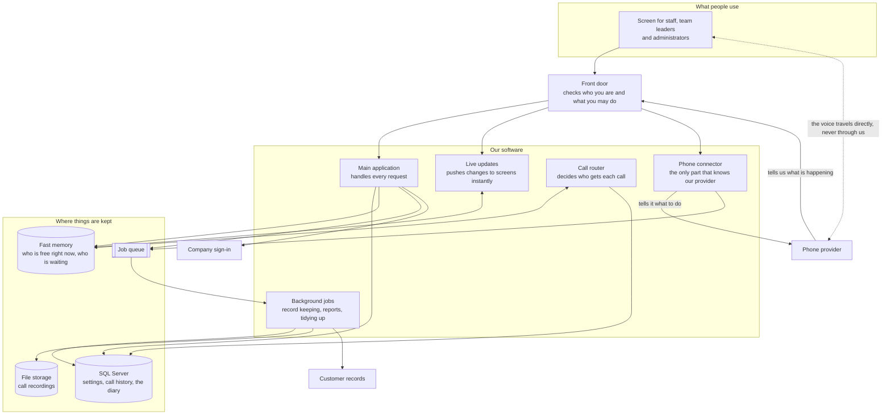
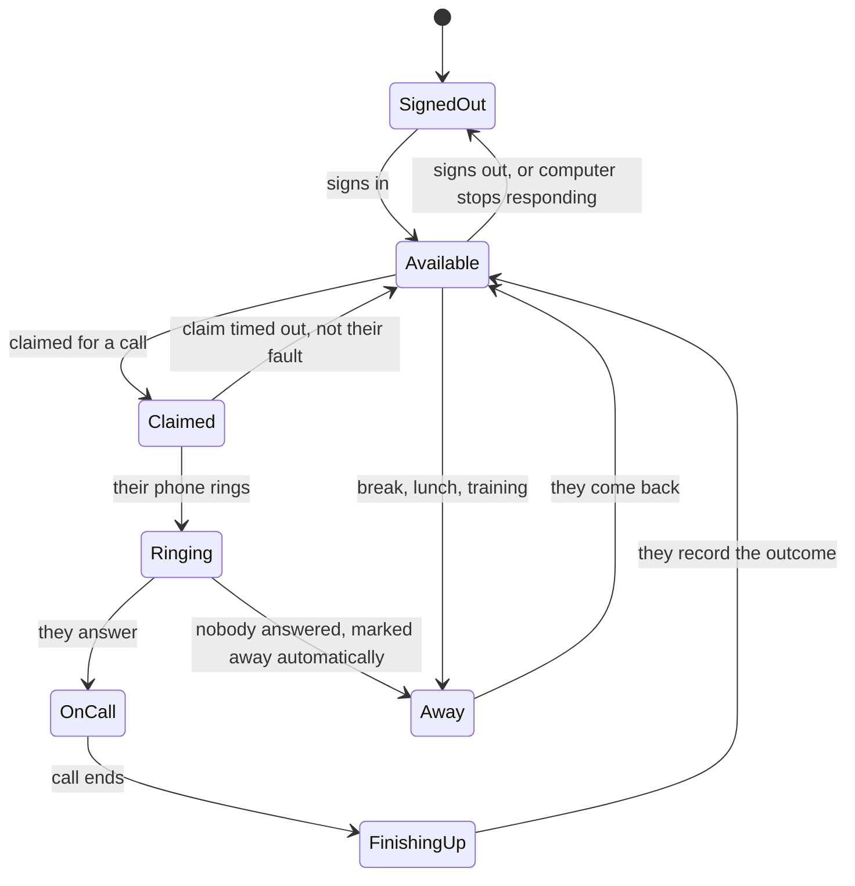
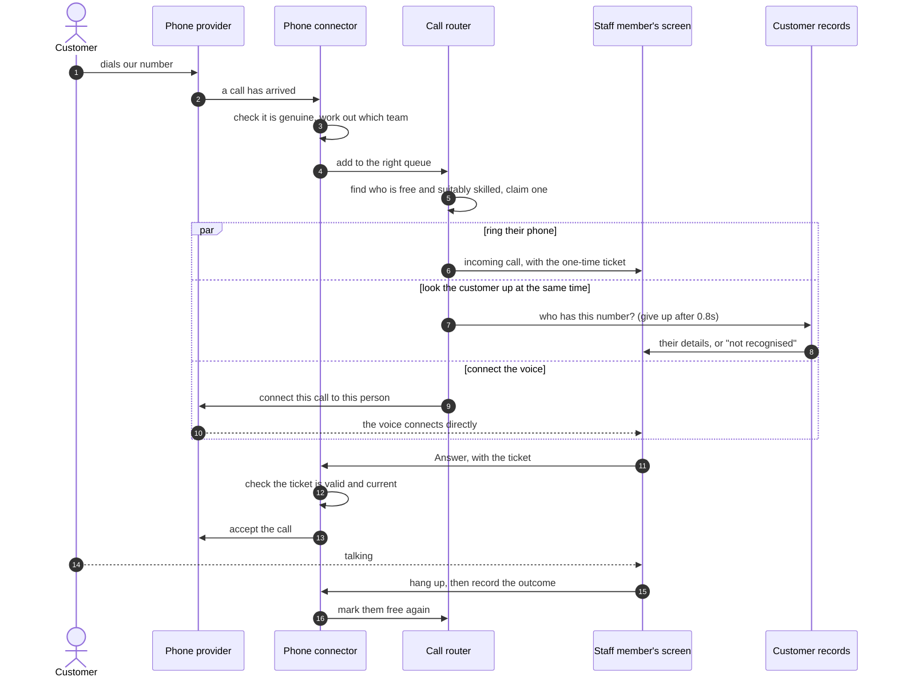
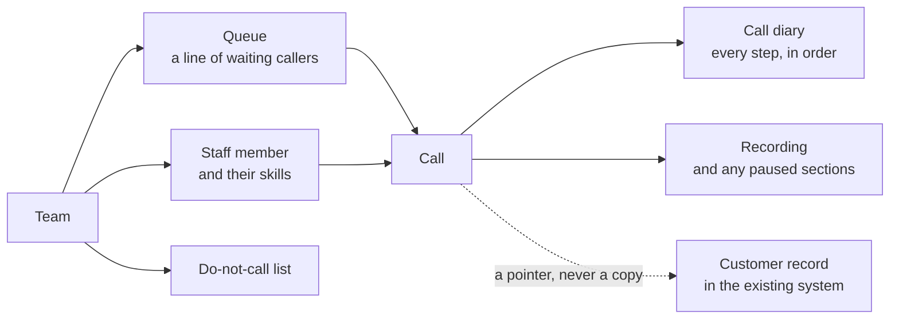
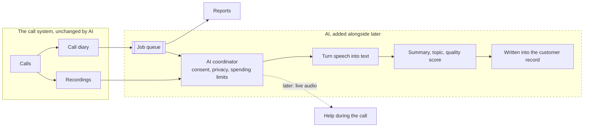
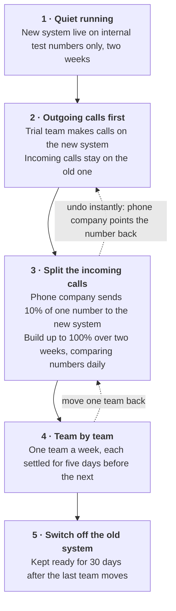

> **The ask:** stop paying for someone else's call centre software and build our own. Our staff
> should be able to take calls from customers and make calls to them, see who is calling before
> they answer, and have everything recorded properly. It needs to work for 50 staff now and 500
> later, and leave room for AI later on.
>
> **This document** explains what I would build, what I would build first, what I still need to
> ask you, and how we would put it live without disrupting customers. It is written to be readable
> without a technical background. Where a technical word is genuinely useful, I explain it the
> first time I use it, and there is a short glossary at the end.
>
> Anything marked **[assumption]** is something I decided so I could keep making progress. Each
> one is a question in section 2, and each one is easy to change now and expensive to change later.

---

## 1. What we are building

### 1.1 The most important decision

There are two very different things we could mean by "build our own call centre".

One is building the **telephone network part** — the equipment and software that actually carries
someone's voice across the country. The other is building the **thinking part** — deciding which
of our staff should get each call, showing them who is calling, keeping records, and reporting on
how we are doing.

**I recommend we build the thinking part and rent the telephone part.**

| We build | We rent from a phone provider |
| --- | --- |
| Deciding who gets each call, and in what order | Carrying the actual voice |
| Tracking who is available, busy, or on a break | Phone numbers and the connection to the phone network |
| The screen our staff use to handle calls | The technology that lets a call reach a web browser |
| Linking calls to our customer records | Legal duties like emergency-call handling |
| Recording calls, storing them, deleting them on time | Capturing the audio of a call |

**Why.** Carrying voice reliably is a specialist business with heavy legal duties — emergency
calls, lawful interception, moving phone numbers between providers. It would take years, needs
people we do not have, and none of it would make us better at serving customers. Renting it is
normal practice and it is what the companies selling call centre software mostly do themselves.

"Build our own" should mean **we own the decisions and we own the data**. It does not have to mean
we own the cables. Section 5.4 sets out exactly when it would become worth revisiting that.

There is a very practical payoff. Because the voice travels between the phone provider and our
staff member's computer — and not through our own systems — **a customer's call cannot be cut off
by our software being updated or restarted.** That one fact makes almost everything else in this
document safer and cheaper.

### 1.2 What success looks like

| Goal | How we would measure it |
| --- | --- |
| Spend less than we do today | Cost per staff member per month down to 60% of the current tool within a year |
| Own our own customer-call data | Every call and recording stored in our systems and searchable within five minutes |
| Stop staff retyping things | The customer's record appears on screen for 95% of recognised calls, in under two seconds; time spent finishing off after a call down by a fifth |
| Grow to 500 staff without rebuilding | The same system handles ten times the load by adding capacity, not by being redesigned |
| Be ready for AI without building it yet | Every call produces a tidy record an AI tool could later read, with no changes needed to the core system |
| Let managers see what is happening | A live screen no more than two seconds out of date, plus the standard reports |

> **An honest warning.** Swapping a monthly licence fee for a per-minute phone bill, cloud running
> costs and two or three permanent engineers is **not automatically cheaper**. If the real reason
> for doing this is control and ownership rather than saving money, that is a perfectly good
> reason — but it changes what we should build first. This is question 1 in section 2.

### 1.3 Who this has to work for

**Staff on the phones** need a phone that never drops, and everything on one screen. **Team
leaders** need to see who is waiting and who is free, and be able to step in. **Operations
managers** need to change how calls are shared out without waiting for engineers. **Legal and
compliance** need call recording consent, card-payment safety, and a record of who listened to
what. **Finance** owns the phone bill and worries about surprise costs. **The engineering team**
needs a scope that does not quietly double in size.

### 1.4 What the system has to do

**Must have for the first version:**

| Area | What it does |
| --- | --- |
| **Signing in** | Staff sign in with their normal company account **[assumption]**. Four kinds of user: staff member, team leader, operations admin, system admin. What each is allowed to do is enforced by the system, not just hidden on screen |
| **Availability** | Staff mark themselves available, or unavailable with a reason (break, lunch, training). The system, not the staff member's computer, is the authority on this. If someone's computer goes to sleep or loses its connection, the system notices and stops sending them calls |
| **Incoming calls** | Each phone number leads to the right team. A short recorded greeting and a simple menu ("press 1 for sales"). Callers wait in line and are told where they are. Calls go to someone with the right skills, most important calls first, **offered to one person at a time**. If nobody picks up, the caller keeps their place and the system stops sending calls to that desk |
| **Outgoing calls** | Staff can click a customer's number to call them, or type one. **Every number is checked against the do-not-call list before we dial** |
| **During a call** | Answer, hang up, mute, hold. Pass a call to a colleague, either straight away or after speaking to them first. Send keypad tones |
| **Customer records** | The caller's record appears on screen within two seconds. If we do not recognise the number, we offer to create a record. If the number matches more than one customer, we show the options rather than guessing. **If the customer record system is down, calls carry on as normal** |
| **Recording** | Calls recorded according to a policy we set per team, with a spoken notice where the law requires one. **Staff can pause the recording while taking card details.** Recordings are encrypted, deleted on schedule, and only the right people can listen — with a record of who did |
| **Reporting** | A live screen showing who is waiting, how long, and who is free. Standard reports, a searchable call history, and export to a spreadsheet. **The exact definition of each number agreed in writing before we build it** |
| **Keeping it running** | A complete, permanent diary of everything that happened on every call. Monitoring and alerts. If the part that shares out calls fails, callers hear a message — never silence |

**Deliberately later:** automatic dialling of long customer lists · a visual tool for building
complex phone menus · team leaders listening in or joining live calls · offering customers a
call-back instead of waiting · scheduled report emails · quality scoring · chat and email
alongside phone · AI features.

### 1.5 The numbers the design has to hit

"Fast" and "reliable" are not requirements. These are.

| | Target | Why this number |
| --- | --- | --- |
| Call arrives → staff member's phone rings | Under 1 second, almost always | Beyond about 2 seconds the caller hears silence and thinks the line is dead |
| Customer record appears on screen | Under 2 seconds | It has to beat the staff member saying "hello" |
| A change of availability shows on the manager's screen | Under 2 seconds | A screen showing old information is worse than no screen |
| Buttons on screen respond | Under a third of a second | Anything slower feels broken |
| System available during working hours | 99.9% — about 43 minutes of downtime a month | — |
| Time to recover from a serious failure | 15 minutes, losing at most 1 minute of call records | A missing call record is a missing legal record |
| Updating the software during the day | Must never drop a call in progress | Possible because the voice does not travel through our systems |
| Size **[assumption]** | 60 staff and 50 calls at once to begin with, designed to reach 750 and 600 | Worked out from 500 staff × 6 calls an hour × 5 minutes a call |

**Keeping things safe.** All connections encrypted. Company sign-in with a second factor for
managers and admins. The system checks permission on every request — **someone cannot answer a
call that was not offered to them**, even if they try. Customer details and recordings encrypted
where they are stored. A permanent, unchangeable log of who changed settings, who listened to
recordings and who exported data. Card details protected by pausing the recording and never
writing keypad presses into any log. Spending limits and blocked destinations so nobody can run
up a huge phone bill through a hacked account.

### 1.6 What I am assuming, and what could go wrong

**Assumptions:** we rent the phone network part rather than build it · staff use modern web
browsers on reliable internet · there is one customer record system with a documented way to
connect to it, and we can look customers up by phone number quickly · one country and one
language to start · staff sign in with existing company accounts · we can move our existing phone
numbers to a new provider, which takes four to eight weeks · staff dial out themselves rather than
a machine dialling for them · we do not need to move old call history into the new system.

**The risks I would watch, most serious first:**

| Risk | What we do about it |
| --- | --- |
| **Moving our phone numbers takes longer than expected and delays launch** | Start that paperwork in week one, alongside the building work. Run the trial on brand-new numbers so the software is never waiting on the phone company |
| **Poor internet at a staff member's desk makes calls sound bad — and the new system gets blamed** | Check the network before we start. Measure call quality automatically on every call so we can show where the problem actually is. Standardise on one headset |
| **It turns out cheaper to keep buying than to build** | Build a proper three-year cost comparison in week one, using real call volumes, and agree in advance what result would make us stop |
| **A software update stops calls reaching anyone** | Release to a few staff first, place an automatic test call, and be able to undo it in three minutes |
| **We break a rule** — we call someone on the do-not-call list, or record a customer's card number | Both are blocked automatically as part of making the call, not checked afterwards in a report |
| **The work quietly grows** — "and can it also do…" | An agreed, written list of what is in and what is out, and a proper process for changing it |
| **Connecting to the customer record system is harder than expected** | Try it in week one before committing. Build it so that system being slow or down never delays a call |
| **The new reports disagree with the old ones and nobody trusts them** | Agree exactly how every number is calculated before building. Run both systems side by side and compare daily before switching off the old one |

### 1.7 Not included

Chat, email and WhatsApp · staff scheduling software · call quality scoring · building our own
phone network · automatic bulk dialling · changing the customer record system · **actually
building AI features** · a mobile app · replacing the phone system for staff outside the call
centre.

---

## 2. What I need to ask you

I have made sensible assumptions so that work is not blocked. But these answers would change what
I build, and a few of them could change whether we should build it at all.

| # | The question | Why it matters |
| --- | --- | --- |
| **1** | Is the real reason **cost**, **control of our own data**, or **specific things the current tool cannot do**? And what are we paying now? | This changes everything. If it is cost, we build something thin and cheap. If it is control, we invest in owning the data properly. If it is three missing features, we should first check whether we can simply buy them |
| **2** | Do we already have a phone provider or phone equipment? Is building the phone network part definitely off the table? | **The biggest fork in the road.** Renting means about five months to a first trial. Building it ourselves means a year or more and hiring specialists |
| **3** | How many calls do we actually get — per day, at the busiest hour, how long does a typical call last, and how many calls do we make versus receive? | Every size and cost figure in this document is currently an educated guess |
| **4** | Which customer record system, and can I get access to a test copy this week? | This is the single biggest unknown in the timeline — it could swing the estimate by a month or two either way |
| **5** | Can that system find a customer by phone number in under a third of a second? | If not, the promise of "their details appear before you say hello" needs a few extra weeks of work to keep a fast local copy |
| **6** | Which countries do we call, and what does the law there say about recording calls? | Decides whether we must play a recorded notice, and whether recording can be on by default |
| **7** | Do staff take **card payments** over the phone? | If yes, a whole set of extra rules applies to recording, logging and who can see what |
| **8** | Which phone numbers do we use, who owns them, and can they be moved? | Usually the thing that decides the launch date — and it is outside our control |
| **9** | Where do staff sit, and on what internet connection? Is answering calls through a web browser acceptable, or do they need desk phones? | Desk phones are a different and considerably harder piece of work |
| **10** | How are calls shared out **today**? Can I see how the current tool is set up, and who is allowed to change it? | The current setup is the real specification, written by the people who live with it. It also tells me whether your operations team can make changes themselves, or whether every small change will have to queue behind engineers |
| **11** | When several people could take a call, who should get it — whoever has waited longest, the most skilled, or whoever has taken fewest calls today? And what should happen when nobody answers? | This is a fairness decision, not a technical one. Get it wrong and staff notice within a day |
| **12** | What is the service target, and exactly how is it calculated today? | Reports that disagree with the old system destroy trust faster than bugs do |
| **13** | How do we switch over — everyone at once, or team by team? Can we run both systems side by side for a while? | Switching everyone at once is the riskiest thing we could possibly do |
| **14** | For AI later, what would you most want first — less paperwork after calls, better quality checking, or customers helping themselves? | This decides something we must choose **now**: whether the phone provider we pick can send us live audio during a call. Changing provider later is a major project |

**If I could only ask three:** question 2 (it decides the whole shape), questions 4 and 5 (the
biggest unknown and the headline promise), and question 3 (everything is sized on guesswork until
then).

---

## 3. What the first version should include

> **The goal for version one: one real team, taking and making calls all day, with everything
> measured.** Pick one team of ten to fifteen people. Move all their calls onto the new system.
> Prove five things: customers reach the right person quickly; staff see who is calling before
> they answer; staff can control the call; staff can call customers with the do-not-call check
> working; and everything that happened is recorded and matches the old system's numbers.

**Why not start with incoming calls only?** Outgoing calls reuse about 85% of the same machinery.
The genuinely new part is roughly a week's work. And a trial team that still needs the old system
for outgoing calls has to keep two applications open all day — which guarantees bad feedback and
a failed trial.

### 3.1 What is in, and what waits

Everything in the "must have" table in section 1.4 is in version one. That includes two things
people often try to cut, which I would argue hard to keep:

- **A settings screen for the operations team.** Without it, every change to how calls are shared
  out is a software release. That does not just slow things down — it means the trial cannot
  respond to feedback at the very moment we most need it to.
- **Passing a call to a colleague after speaking to them first.** It is the most-used way of
  handling a call someone else should take. A trial without it produces "I had to ask the customer
  to call back", which sinks it.

**What waits, and what it costs to add later:**

| Waiting | Why that is safe | Cost to add later |
| --- | --- | --- |
| Automatic bulk dialling | Carries the heaviest legal rules in this whole area and needs its own compliance work | 6–8 weeks plus legal review. It plugs into what we have already built |
| Visual tool for building phone menus | That is a product in its own right. A simple menu covers the trial team | 8–12 weeks, separate from the call-sharing logic |
| Team leaders listening in on live calls | Recordings plus the live screen cover coaching at trial size | 2–3 weeks |
| Offering customers a call-back | Genuinely useful, but needs careful handling | 3–4 weeks |
| Quality scoring | Different users, different timetable. The recordings are already there | Separate piece of work |
| **AI features** | Worth nothing until the phone system itself is trusted. Building AI on top of something unproven means debugging two new things at once | Added alongside, reading the call records we already keep. **No changes to the core system** — that is the whole point of section 6 |

### 3.2 The unglamorous things I will not cut

These produce nothing a user can see. Every one of them is far cheaper to do now than to retrofit,
and together they are the difference between a system that grows to 500 staff and one that gets
rebuilt.

- **Being able to swap phone providers.** We write our software against a general description of
  "a phone provider", then plug a specific one in behind it. To prove that actually works, we
  build **two** — the real one, and a fake one for testing. The fake one also means our automatic
  tests cost nothing to run, instead of ringing real phones.
- **A permanent diary of every call.** Every report, every audit, every "what happened to Mrs
  Patel's call on Tuesday", and every future AI feature reads from it. Adding it afterwards means
  rebuilding all of those.
- **The system, not the staff member's computer, decides who is available.** Otherwise a laptop
  that went to sleep can keep claiming to be ready for calls, and those calls quietly vanish.
- **Assuming messages can arrive twice.** Phone providers re-send messages when they are not sure
  we got them. If we do not plan for that, calls get counted twice and staff get double credit —
  the kind of error nobody notices for three months.

### 3.3 Timetable and how we judge it

**[assumption]** a team of five. Two weeks of investigation and cost-checking → three weeks
building the foundations → four weeks until the first real call is answered → three weeks adding
customer records and compliance → three weeks of manager tools and reporting → three weeks of
hardening and testing → **a four-week trial running alongside the old system** → then team by
team. **About five months to the trial.**

The riskiest item is not on that list: moving the phone numbers. That is why it starts in week one.

**The trial has succeeded only if, for two weeks running:** calls reach staff in under a second ·
customer details appear for 95% of recognised callers · not one call is lost because of our
software · our reports match the old system's within 2% · trial staff rate it at least 4 out of 5
on "would you go back?" · the operations team sets up a new team without asking engineering · the
system is up 99.9% of the time.

**And agreed in advance — what would make us stop:** if calls take more than two seconds to reach
staff, or we lose more than one call in a thousand, or staff rate it below 3 out of 5, we stop
rolling out and fix it before another team moves.

---

## 4. How the system is put together

### 4.1 The overall shape

The dotted line is the important one. **The customer's voice goes straight between the phone
provider and the staff member's computer.** It never passes through our software. That is why we
can update our systems in the middle of the working day without cutting anyone off.

**A note on the technology choices.** We would use Microsoft's .NET for the server side, Angular
for the screens, and **Microsoft SQL Server** for the main database. .NET handles large numbers of
simultaneous conversations well and has strong built-in support for pushing live updates to
screens. Angular suits a screen that is constantly receiving new information, and its structured
style suits software that will be maintained for years by changing teams. All three have
long-term supported versions, which matters for something with a five-year life.

SQL Server earns its place beyond being the company standard: it stores each month of call
history separately, so deleting expired records is instant rather than a heavy overnight job; it
keeps a second copy that takes over automatically if the first fails; and it can encrypt customer
details so that even a database administrator cannot read them — exactly what section 1.5 asks
for. Its licence is priced per processor, so growing the database is a budget line worth
modelling early rather than discovering later.

We would start as **one well-organised application rather than many small ones** — splitting up
too early buys problems without buying benefits at 50 staff. The exception is the call router,
separated from day one because it is the one part that remembers things moment to moment and needs
to be restarted and scaled on its own. Section 5.3 says when each other part gets separated out.

### 4.2 The main parts

| Part | What it is responsible for | What happens if it fails |
| --- | --- | --- |
| **Phone connector** | The only part that knows which phone company we use. Translates their messages into our own words, and our instructions into theirs. Recognises and ignores repeated messages | Retries for a short while, then ends the call cleanly and **frees the staff member** — never leaves someone stuck waiting for a call that will not arrive |
| **Call router** | Who is waiting, who is free, who gets the next call, and the countdown while their phone rings | If it stops, another copy takes over within about five seconds. **Calls already in progress are completely unaffected** |
| **Availability tracker** | Whether each staff member is free, busy or away, and whether their computer is still responding | If someone's computer stops responding, they are taken out of the queue within about twenty seconds |
| **Live updates** | Pushing changes to staff and manager screens the moment they happen | Managers' figures are bundled up and sent once a second rather than one message per change — see section 5.1 |
| **Customer records link** | Looking customers up, and writing the call back to their record afterwards | Gives up after 0.8 seconds and shows "not found". **The call carries on regardless** |
| **Recording** | Starting, pausing for card details, storing securely, deleting on schedule | Retries. Recordings are never handed out directly — only through short-lived, logged links |
| **Reporting** | Turning the call diary into reports | Runs separately, so a manager running a big report can never slow down live calls |

### 4.3 How we make sure two people never get the same call

This is the heart of the system, and the part most worth getting right.

When the router picks someone for a call, it does not simply send them a message and hope. It
**claims** that person first, in a single indivisible step that cannot half-happen, and issues a
one-time ticket. The staff member's screen receives the call along with that ticket. When they
press Answer, their computer must hand the ticket back, and the system checks it before connecting
anything.

The result:

- two people can never be offered the same call;
- someone cannot answer a call that was never offered to them;
- and the claim **always** ends one way or another — answered, declined, or timed out — so a lost
  message or a slow phone provider can never leave someone stuck, unable to take calls.

If nobody answers in time, the caller goes back to the front of the queue **with their priority
raised** (it was not their fault they waited), and that staff member is marked unavailable with
the reason "did not answer" — so the next call does not go to the same empty desk.

### 4.4 What happens during an incoming call

**Where the one second goes:** checking the call is genuine and finding the right team, 0.05s ·
queueing and choosing a person, 0.1s · claiming them, 0.005s · telling the phone provider to
connect, 0.25s · the provider ringing their computer, 0.3s · updating their screen, 0.05s.
**About 0.75 seconds**, leaving a quarter of a second spare.

Notice that looking up the customer is deliberately **not** in that total. It happens at the same
time, with its own two-second target. That is the single most important detail on the diagram:
**the phone rings whether or not the customer record system is having a bad day.**

### 4.5 What we store

Six kinds of record, and one rule that shapes them all.

| What we keep | What is in it |
| --- | --- |
| **Call** | Whether it came in or went out, the customer's number, which team, who took it, how long they waited and talked, and how it ended |
| **Call diary** | Every step of that call, numbered and in order, never edited |
| **Recording** | Where the audio is stored, which parts were paused for card details, and the date it must be deleted |
| **Staff member** | Name, skills and how good they are at each, and which queues they cover |
| **Queue** | Which team it belongs to, what skills a call needs, how long a phone rings before moving on |
| **Do-not-call list** | Numbers we must never ring |

The decisions worth explaining:

- **The call diary is the real record; everything else is worked out from it.** Every call has a
  numbered, unchangeable list of everything that happened to it. That means any call can be
  reconstructed years later for a complaint or an audit — and it is exactly what an AI tool would
  read later.
- **We store a pointer to the customer's record, not a copy of their details.** The customer
  record system stays the single source of truth. This dramatically reduces our obligations under
  privacy law, and avoids the classic problem of two systems disagreeing about someone's name.
- **Totals are worked out once, when the call ends.** Reports then read a simple number rather
  than recalculating from the diary every time someone opens a dashboard.
- **Call records are stored month by month.** When old records reach their deletion date we
  remove a whole month at once, which is quick and safe, rather than picking through millions of
  rows.
- **Who is free right now lives in fast temporary memory, not the main database.** That changes
  many times a minute for every staff member. Writing all of it to the main database would slow
  down the thing calls depend on, for no benefit.

### 4.6 What happens when things break

We design for these rather than hope. The general rule: **anything we do not control must not be
able to stop the phones.**

| If this fails | What happens |
| --- | --- |
| The phone provider has an outage | Nothing we can do about the calls themselves — this is our biggest remaining dependency, which is why we keep the ability to switch. Staff see a clear message rather than a mystery |
| The call router stops | Another copy takes over in about five seconds. Calls already connected are unaffected |
| The fast memory fails | It switches to a standby copy. Worst case, staff sign in again and it rebuilds itself |
| The main database fails | SQL Server switches to its standby copy in under a minute, and the application retries automatically. Records queue up and catch up afterwards |
| The customer record system is down or slow | We stop asking it for a few minutes, show "not recognised", and keep every call flowing. Updates to customer records queue and are sent when it returns |
| A staff member loses internet | Noticed in about twenty seconds and they stop receiving calls. Their current call keeps going, because the voice does not go through us |
| The phone provider sends the same message twice | We recognise and ignore the duplicate, so nothing is counted twice |
| A software update goes wrong | Released to a few staff first, checked automatically, undone in three minutes |

---

## 5. Growing from 50 to 500

### 5.1 Ten times the staff is not ten times the work

Most things simply grow ten times. **Two things grow far faster**, and those are the ones worth
designing for now.

| | 50 staff | 500 staff | Growth |
| --- | --- | --- | --- |
| Staff, calls at once, records per day | 50 · 45 · 240,000 | 500 · 450 · 2.4 million | 10× |
| **Decisions about who gets a call, per second** | about 3 | about 80 | **about 27×** |
| **Updates sent to managers' screens, per second** | about 250 | about 25,000 | **100×** |

**The first one** happens because every time anyone becomes free, the system in principle has to
reconsider every waiting call. More staff means both more of those moments and more work each
time. We solve it by splitting the queues into independent groups, each handled by one worker, and
by keeping ready-made lists of who has which skill. The work per decision then stays roughly
constant no matter how big we get, because growth adds more groups rather than making each one
bigger.

**The second one** is simpler but easier to get wrong. If every change is sent to every manager's
screen the moment it happens, we would be sending about 2,500 messages a second — carrying
information that changes faster than a human can read it. Instead the system adds everything up
and sends a tidy summary **once a second per queue**. That is 50 to 100 messages a second instead
of 25,000.

Both are built in from the start, because the second one especially is hard to change once
managers have got used to how the screen behaves.

### 5.2 What we would actually add

| Part | 50 staff | 500 staff |
| --- | --- | --- |
| Main application | 2 copies | 6 copies |
| Live updates | shares a machine | 4 dedicated copies |
| Call router | 2 copies, 8 queue groups | 4–6 copies, 32 queue groups |
| Background jobs | 2 | 6–10 |
| Fast memory | one pair | three pairs |
| SQL Server | one, plus a standby that takes over automatically | one, plus three read-only copies so reports never slow down live calls |

We set the number of queue groups to 32 from the very beginning. Spreading them across more
machines later is easy; changing how many there are on a running system is not.

### 5.3 Splitting the system up later

Each part gets separated out only when there is a measurable reason: the **call router on day
one** (it behaves differently from everything else) · **live updates** above about 200 staff (so
restarting it does not disturb everything else) · **reporting** when big reports start to slow
down live calls · the **phone connector** when we add a second phone provider. Every split adds a
step to a process with a one-second budget, so each one has to earn its place.

### 5.4 What it costs, and when to revisit the big decision

Rough monthly running costs: **about $3,400 at 50 staff and about $30,600 at 500** — nine times
the cost for ten times the people. Two honest observations: **the phone bill is the biggest line,
not our computers**, so at 500 staff a better per-minute rate saves more than any amount of clever
engineering; and **recording storage keeps growing even when call volumes do not**, because we
keep recordings for years. That second one is what usually surprises finance in year three.

Building the phone network part ourselves is only worth revisiting when **all three** are true: we
use more than about two million minutes a month, we have a permanent team with telephone expertise,
and the saving is large and clear — at least 40%, not 10%, to be worth the risk. Because we built
in the ability to swap providers, that would be a new connector plus a phone company project,
**not a rebuild.** That is what the early decision bought us.

### 5.5 What genuinely will not scale

A document claiming everything scales forever is not trustworthy. One extremely busy queue is
handled by a single worker — which is fine, because a queue that long is a staffing problem, not a
software problem. **The most likely real limit is whatever our phone provider allows**, so we
negotiate that into the contract and get warned at 70% of it. Running in one data centre means a
regional outage takes us offline; we accept that for version one. And a screen showing 500 staff
members is unreadable by a human — that is solved by better design and alerts, not by engineering.

---

## 6. Getting ready for AI

**We are not building any AI in this project.** Being ready for AI is not a feature. It is three
properties of the system. If they are there, AI can be added alongside later. If they are not,
every AI feature becomes a rebuild.

### 6.1 The one decision we cannot postpone

> **Can the phone provider we choose send us the audio of a call *while it is happening*?**

If we only ever get the recording afterwards, we can do summaries, quality checking and searchable
transcripts. If we can also get live audio, we can additionally help staff during the call, warn a
manager when a call is going badly, and offer customers automated self-service.

Changing phone provider after launch means redoing the connection, retesting everything and
moving the phone numbers again — a project of several months. **So "can send live audio" must be
on the requirements list when we choose a provider, even though we will not use it for a year.**
It costs nothing to ask for and protects the whole second half of the plan. This is the one item I
would escalate if it were dropped to make a purchase simpler.

### 6.2 The three things that make AI easy to add later

**A complete diary of every call.** We are already building this, for reporting — so it pays for
itself before any AI exists. It matters more than people expect. A recording tells an AI tool
*what was said*. The diary tells it *what happened*: that the customer waited four minutes, was
passed between two people, and was put on hold. Teams who add AI later usually discover this
information was scattered across technical logs and cannot be recovered.

**Recordings we own and control.** Kept in our own storage, with known deletion dates and a record
of exactly when recording was paused. Anything built later inherits those protections
automatically — **audio we never recorded can never be transcribed.**

**A clean place to plug in.** AI tools read the diary and the recordings. They sit outside the
call path entirely and cannot slow down or stop a call.

**Delete the entire AI half of that picture and the call centre works exactly as it does today.**
That is the property worth having, and it is why AI is not in version one.

### 6.3 The order to do it in, and the rules around it

**First:** after a call ends, write a summary and suggest how it should be filed. **Then:**
quality-check every call instead of the 2% a human can listen to, and spot trends. **Last:** help
staff live during a call.

That order is deliberate. The first one has a person checking the result and an obvious measure of
success — time saved after each call. The last one talks to customers or interrupts staff while
they are working, where there is no undo. Launching that first, before anyone trusts the
transcripts, is how AI projects get cancelled.

What version one does for AI costs **about two days**: record each side of the conversation
separately (mixing them together makes it much harder to tell who said what, and cannot be fixed
afterwards), add a consent flag, and agree the list of call outcomes.

The rules I would put in place before any of it ships: consent checked by our own code, not left
to the AI · personal details removed before anything is sent for analysis · a deletion request
must also remove transcripts and anything derived from them, which is the part teams forget · AI
suggestions clearly labelled as such and never overwriting what a person wrote · and
**automatically generated quality scores go to a human reviewer — they are never used directly in
a decision about a member of staff.** That last one is a matter for HR and fairness, and I would
want it agreed in writing.

The single measure I would insist on before expanding any AI feature: **how often staff accept the
suggestion without changing it.** If that is 85%, it is working. If it is 30%, we have created
extra work. We should find that out with one team, not five hundred people.

---

## 7. Putting it live safely

### 7.1 Testing before it is real

We build a **fake phone provider** as well as a real one. That means our automatic tests can place
thousands of calls in seconds, for free, and can reproduce situations that are nearly impossible
to arrange with a real phone line — a customer hanging up at the exact moment we connect them, or
the phone company sending us the same message twice.

But a staging environment must be a **genuine rehearsal, not a smaller copy**: the same setup, a
real phone connection, and **every release places a real test call before it goes anywhere near
production.** The most common problem that only shows up in production is a phone-system setting
that no simulation would ever catch.

### 7.2 Releasing without dropping calls

The four parts of the system are updated differently, because they behave differently.

The main application updates normally. The live-updates part updates **slowly, one copy at a
time**, because 500 screens all reconnecting at once would overwhelm it. The screens themselves
are updated in the background and **never refreshed while someone is on a call**. The call router
is **drained**: new copies start up and get ready, the old ones stop accepting new queue groups,
finish what they are doing, and hand over one group at a time.

Claims on staff survive that handover, because they are kept in shared fast memory rather than
inside the software being replaced — a claim made by the old version is honoured by the new one
without either knowing about the other. Afterwards the system automatically checks: nobody left
waiting for a call that will never come, and no caller lost their place.

**And through all of it, calls in progress are untouched, because the voice does not travel
through our software.** That is the payoff from the decision in section 1.1.

### 7.3 Releasing to a few people first, and undoing it fast

We release by **group of staff**, not by percentage of calls, because a staff member is signed in
for hours rather than for a single request: our own test accounts first, then one team, then a
quarter, then three quarters, then everyone.

Throughout, the system watches a few numbers and **undoes the release automatically** if any move
the wrong way — how often calls fail to connect, how long they take to reach someone, and **how
many customers hang up compared with teams who do not have the new version yet**. That last one
catches the quiet problems: a change that adds half a second causes no errors at all, it just makes
more customers give up.

Undo times: a setting, ten seconds · a configuration change, one minute · the software, three
minutes · a phone company setting, five minutes. **We practise this every month.** An undo
procedure nobody has ever run is a hope, not a plan.

Roughly half of what makes it work is **not in our systems at all** — which phone number goes
where, recording settings, what the phone company tells us. That is written down as code, reviewed
like code, and checked nightly against what is really configured. Test and live use separate phone
company accounts, so a test can never answer a real customer.

### 7.4 Switching over from the old system

**Outgoing calls move first** because a failed outgoing call means a staff member pressing redial,
whereas a failed incoming call means a customer listening to silence. That buys a week of
real-world learning at almost no risk to customers — and it is exactly why outgoing calls are in
version one.

At every stage, undoing it is **one change at the phone company**, taking effect in under five
minutes, and we rehearse that before we need it. While calls are split between the two systems,
both produce reports on the same phone number and we compare them every day. Any difference is
investigated before we send more calls to the new system. That is how we avoid the "nobody trusts
the new reports" problem — and it cannot be done after the old system is switched off.

### 7.5 Backups and recovering from disaster

| What | How it is protected | Worst case |
| --- | --- | --- |
| Call history and settings | A full copy nightly, plus a copy of every change **every minute**, sent to another region | At most one minute of records lost, back within half an hour. **A test restore runs automatically every week** |
| Recordings | Stored so they cannot be altered or deleted early, copied to another region | Available immediately from the copy |
| "Who is free right now" | **Deliberately not backed up** | Rebuilds itself in under a minute when staff sign in |
| Settings and configuration | Written down as code and version-controlled | Nothing lost. Rebuilt from scratch in a practice run every quarter |

That third row is deliberate and worth explaining: restoring a **stale** list of who is available
is worse than having none at all — it would put staff who went home an hour ago back into the
queue, and their calls would vanish. Rebuilding from what is actually true is the correct recovery.

If we lost an entire data centre, we would be running again in 15 minutes: start the standby
region, point the phone company at it, and switch over. **We practise that every three months with
real test calls**, because the step that always goes wrong the first time is re-pointing the phone
company.

Alerts are about **symptoms, not causes**: "customers are waiting while staff are free" is worth
waking someone up for; "a computer is at 70% capacity" is not. Every alert has written
instructions attached, and an alert without them is treated as a fault in its own right. The team
that releases a change is on call for 24 hours afterwards — the best possible encouragement to be
careful.

---

## 8. The working demonstration

Alongside this document there is a **working version of the heart of this system**. It is small on
purpose: it runs on a laptop with one command, and it can be read end to end in one sitting.

It does one loop, properly. A call comes in, the system decides who should take it and rings them,
and that person's screen changes **by itself** — no refreshing, no waiting. They answer, talk, hang
up, file what the call was about, and go straight back into the queue for the next one. A manager's
screen shows all of it live: who is waiting, how long the worst wait is, who is free and who is
busy. If nobody is free the caller waits, and the moment somebody presses "ready" the waiting call
connects. A caller who gives up is recorded as abandoned, because that is the number managers
actually watch.

Thirty-five automated tests, running in about a second, cover the rules that would embarrass us
in front of a customer: two staff members are never handed the same call, the longest-waiting caller is
served first, nobody can answer or end a call that was given to somebody else, and no call can be
filed without saying how it ended.

Everything else in this document is **deliberately missing** from it — the phone company connection,
the customer-record lookup, routing by skill, recording, the compliance rules, running across
several servers. A demonstration exists to prove the risky part works, not to build the product
twice. What was left out, and where each one is answered here, is written down beside the code:
knowing what to leave out is exactly the judgement the first release will need.

---

## 9. What I would do in the first two weeks

1. **Build the real cost comparison** over three years using actual call volumes, and get a
   recorded decision to go ahead — with agreement on what would make us stop.
2. **Try the two risky connections for real**: can we find a customer by phone number fast enough,
   and can a real call reach a web browser inside one second?
3. **Start the phone number paperwork.** It is the thing most likely to decide the launch date and
   it is not in our control.
4. **Agree in writing exactly how each reported number is calculated**, and get legal's position on
   call recording.

Everything else in this document can be changed later. Those four cannot.

---

## Glossary

| Term | In plain words |
| --- | --- |
| **Queue** | The line callers wait in for a particular team |
| **Skills-based routing** | Sending a call to someone who can actually deal with it, rather than whoever is next |
| **Claim / ticket** | How we make sure one call goes to exactly one person (section 4.3) |
| **Call diary** | The permanent, numbered list of everything that happened during a call |
| **Do-not-call list** | Numbers we are not allowed to ring |
| **Screen pop** | The customer's details appearing automatically when their call arrives |
| **Wrap-up** | The short time after a call when staff record what it was about |
| **Service level** | The percentage of calls answered within an agreed number of seconds |
| **Staging** | A complete copy of the system used to rehearse changes before customers see them |
| **Draining** | Letting a part of the system finish what it is doing before replacing it |
